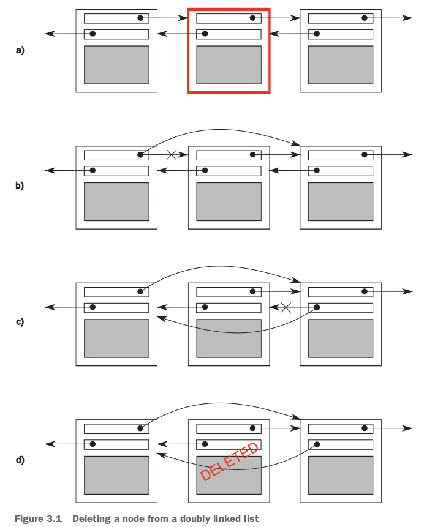

# 3.1 Problems with sharing data between threads

## *invariants*の概念及びinvariants破壊の発生、race conditionの定義

- *invariants*: **statements** that are **always true about a particular data structure**, such as "this variable contains the number of items in the list."
- broken invariants発生時：**during an update**, especially if the data structure is of any complexity or the update requires modification of more than one value.
- broken invariants発生例：**delete a node from doubly linked list**.
  - 4ステップがあって、bとcの間の状態（**intermediate states**）はbroken invariantsが発生する。
  - このdoubly linked listがthreadsにシェアされる場合、あるスレッドのupdateによって、broken invariants状態になるとき、他のスレッドにアクセスされると問題発生。*race condition*という。



- race conditionの定義：anything where the **outcome depends** on the **relative ordering** of execution of operations on **two or more threads**; the threads race to perform their respective operations.
- **Problematic race conditions** typically occur where completing an operation requires **modification of two or more distinct pieces of data**, such as the two link pointers in上記例。
- race conditionは**timing-sensitive**、なので再現しにくい。debuggerにもタイミングが影響されるので、debugできないかも。

## problematic race conditionsを避ける3種類対策

- 対策１：shared dataを保護する. data-protection.
  - Wrap your data structure with a protection mechanism to ensure that **only the thread performing a modification can see** the **intermediate states where the invariants are broken**.
- 対策２：*lock-free programming*
  - Modify the design of your data structure and its invariants so that **modifications are done as a series of indivisible changes**, each of which preserves the invariants. むずい。
- 対策３：dataへのupdateを*transaction*化する
  - Handle the **updates to the data structure as a *transaction***, just as updates to a **database** are done within a transaction. databaseのtransactionと似てる。
  - *transaction*化：The required series of **data modifications and reads**, is stored in a transaction log and then **committed in a single step** .
    - If the commit can't proceed because the data structure has been modified by another thread, the transaction is **restarted**.
  - *software transactional memory (STM)*という。まだC++にサポートされてない。しかし**active research area**.

# 3.2 Protecting shared data with mutexes 

# 3.2.1 Using mutexes in C++

## RAII mutex wrapper: `std::lock_guard`

- mutexをconstructorにlock、destructorにunlockする。

  ```c++
  std::list<int> some_list;
  std::mutex some_mutex;
  void add_to_list(int new_value){
      std::lock_guard<std::mutex> guard(some_mutex);
      some_list.push_back(new_value);
  }
  
  bool list_contains(int value_to_find){
      // some_listをreadするだけでもlockが必要。update中listの中間状態を見れないように。
      std::lock_guard<std::mutex> guard(some_mutex);
      return std::find(some_list.begin(),some_list.end(),value_to_find)
          != some_list.end();
  }
  ```

  - C++17での改善：i. `std::lock_guard guard(some_mutex)`もできる。class template argument deductionという。ii. **増強版lock guard：`std::scoped_lock guard(some_mutex)`**. `std::scoped_lock`を使えれば、`std::lock_guard`を忘れてもOK。
  - `std::scoped_lock`の増強したところ、多分同時に**複数mutexesを取得**できる機能でしょう。そうすると、dead lockは解決できる。

## mutexとprotected dataを紐付けるために、クラス化の課題

- クラス化：上記の例だと、`add_to_list` and `list_contains` functions would become member functions of the class, and the mutex and protected data would both become `private` members of the class.
- 課題：もしmember functionsが**protected dataのpointerまたはreference**をリターンしたら、mutexは無効になっちゃう。pointerまたはreferenceでデータを変更できるから。

## mutexとprotected dataをクラスにする場合の厳守ルール（mutexでdataをprotectする場合の厳守ルール）（大事）

Don't pass **pointers and references to protected data** *outside the scope of the lock*, whether by 

- returning them from a function,

- storing them in externally visible memory,

- **passing them as arguments to user-supplied functions**.

  ```c++
  class data_wrapper{
  private:
      some_data data;
      std::mutex m;
  public:
      template<typename Function>
      void process_data(Function func){
          std::lock_guard<std::mutex> l(m);
          func(data); // pass "protected" data to user-supplied function.
      }
  }
  ```

# 3.2.3 Spotting race conditions inherent in interfaces

## classのinterface設計によって、race conditionは固有になる（interfaceを利用時）

- つまりクラスの実現にmutexを使っても、そのクラスを利用する時、race conditionは発生する。これはクラスの**設計上の問題**です。

- 今C++のstackを例として

  ```c++
  stack<int> s;
  if(!s.empty()){
      int const value=s.top();
      s.pop();
      do_something(value);
  }
  ```

  - `s.empty(), s.top(), s.pop()`の中にちゃんどmutexでstackを保護しても、このコードで２つrace conditionは発生する。
  - 1つ目：`s.empty()`の結果を信じられない。`s.top()`や`s.pop()`を実行するとき、`s`が既に空になっちゃうかもしれない。
  - 2つ目：２つスレッドA, Bが上記`s.top()`や`s.pop()`を実行すると、stackから２つ要素が出されたが、１つだけ2回処理されて、もう１つはただ捨てられたことは可能。
    - One of the two values on the stack is discarded without ever having been read, whereas the other is processed twice.

- 解決方法は設計を変えること。（利用時lockしてもいいけど、programmerに任せちゃう。クラスとしてはthread-safeではない）

  - 例えば`pop()`のなかに`empty()`もう一度チェックする。`top()`や`pop()`を合併するなど。具体的には下記のサンプルコードを参考：https://github.com/anthonywilliams/ccia_code_samples/blob/master/listings/listing_3.5.cpp
  - 今のstackの**interfaceの設計によって、lockの粒度は細かすぎる**。粒度（りゅうど）。
    - 逆にlockの粒度が粗すぎても（粗い、あらい）、performanceの問題にもなる。

# 3.2.4 Deadlock: the problem and a solution

## always lock two mutexes in the same orderは簡単じゃない

Sometimes this is straightforward, because the mutexes are serving different purposes, but other times it's not so simple, such as **when the mutexes are each protecting a separate instance of the same class**. この場合は、mutexの順番特にないですね。

## なぜ`std::lock()`のあとまた`std::lock_guard()`?

- C++17では`std::scoped_lock()`で十分。簡単、優先。

- C++14まで複数mutexes同時に取る方法は下記の例：`X` classのmember function

  ```c++
  friend void swap(X& lhs, X& rhs){
      if(&lhs==&rhs)
          return;
      std::lock(lhs.m,rhs.m);
      std::lock_guard<std::mutex> lock_a(lhs.m, std::adopt_lock);
      std::lock_guard<std::mutex> lock_b(rhs.m, std::adopt_lock);
      swap(lhs.some_detail, rhs.some_detail);
  }
  ```

  - `std::lock()`のあとまた`std::lock_guard()`の理由は、`std::lock()`はlockしただけだから。`std::lock_guard()`がないと、unlockしないよ。
  - `std::adopt_lock`の意味は、mutexはもうlockされたから、2度lockしないね。

## mutexesをseparately取得する場合は役に立てない

Although `std::lock` can help you avoid deadlock in those cases where you need to acquire two or more locks together, **it doesn't help if they're acquired separately**.

# 3.2.5 Further guidelines for avoiding deadlock（５つ）

- Avoid nested locks. don't acquire a lock if you already hold one.
- Avoid calling user-supplied code while holding a lock. しかしlockしたままuser-supplied codeを呼び出すのはやむを得ないかも。特にgeneric codeを書くとき。
- Acquire locks in a fixed order. これも難しい。例えば**threads traversing a list in opposite orders**.

## 同時にmutexesを取得できず、固定順番でmutexesを取得できない例：opposite list traversal

- list traversalだから、current nodeのlockを持ったまま、next nodeのlockを取ろうとする。next nodeのlockを取れたら、next nodeに行って、prev nodeのlockを解放する。同時にmutexesを取るのができない。
- ２つスレッドが逆方向でlistをtraverseするとき、thread 1がnode Aのlockを持って、next node Bのlockを取ろうとしている。thread 2がnode Bのlockを持って、prev node Aのlockを取ろうとする状況はある。deadlockが発生。

## Use a lock hierarchy: hierarchy-mutexの実現（mutexes themselves enforce the lock ordering）

- mutexにidをつける。最初はどのmutexも取れる。もしスレッドが既にmutex Aを持っていれば、mutex Aのidより低いidのmutexしかとれない。逆にmutex Aのidより高いidのmutexを取ろうとすると、runtime error！C++にはまだないけど、実現は面白い、下記。

  ```c++
  class hierarchical_mutex{
      std::mutex internal_mutex;
      unsigned long const hierarchy_value; // 本mutexのvalue。constructor内userが指定。
      unsigned long previous_hierarchy_value; // unlock時必要。unlock時本mutexのvalueを消す
      // thread毎自分のコピーがある。lock,unlock時更新。各mutexが共有（スレッド単位に）。
      static thread_local unsigned long this_thread_hierarchy_value;
      
      void check_for_hierarchy_violation(){
          if(this_thread_hierarchy_value <= hierarchy_value){
              throw std::logic_error("mutex hierarchy violated");
          }
      }
      
      void update_hierarchy_value(){
          previous_hierarchy_value = this_thread_hierarchy_value;
          this_thread_hierarchy_value = hierarchy_value;
      }
      
  public:
      explicit hierarchical_mutex(unsigned long value):
      	hierarchy_value(value),previous_hierarchy_value(0){}
      
      void lock(){
          check_for_hierarchy_violation();
          // 先にlock、また更新
          internal_mutex.lock();
          update_hierarchy_value();
      }
      
      void unlock(){
          // out-of-order unlockingを防ぐため！
          if(this_thread_hierarchy_value != hierarchy_value){
              throw std::logic_error("mutex hierarchy violated");
          }
          // 先に更新、またunlock
          this_thread_hierarchy_value = previous_hierarchy_value;
          internal_mutex.unlock();
      }
      
      bool try_lock(){
          check_for_hierarchy_violation();
          if(!internal_mutex.try_lock())
              return false;
          update_hierarchy_value();
          return true;
      }
  };
  
  // hierarchical_mutex::this_thread_hierarchy_valueの定義が必須
  thread_local unsigned long
      hierarchical_mutex::this_thread_hierarchy_value(ULONG_MAX);
  ```

  - 自分で定義したmutexは`lock(),unlock(),try_lock()`の３つinterfaceを実現すれば、`std::lock_guard`に使える！
  - キーポイントは`static thread_local`です！
  - `unlock()`のなかの判定は、順番的なunlockingを保証するため！

## 補足：Thread-local variables

- 3種類変数が`thread_local`になれる：variables at namespace scope, **static data members of classes**, local variables.

  ```c++
  thread_local int x;
  class X{
      static thread_local std::string s; // a thread_local
  };
  static thread_local std::string X::s; // the definition of X::s is required.
  void foo(){
      thread_local std::vector<int> v; // a thread_local local variable.
  }
  ```

- `thread_local`が実際作られるタイミング：
  - 前の2種類：Some implementations may construct thread_local variables when the thread is started; others may construct them **immediately before their first use** on each threadなど
    - Indeed, if none of the thread-local variables from a given translation unit is used, there's no guarantee that they will be constructed at all.
    - translation unitの定義：https://en.wikipedia.org/wiki/Translation_unit_(programming)
  - local variableの場合：初めて使う時作る。**local static variables**と同じ。もう１つ同じなところ：**zero-initialized** prior to any further initialization.
- threadのデータなので、多分`std::thread`のlifetimeと関係ない。threadのlifetimeと一致する。

## Extending these guidelines beyond locks: lockを使わなくてもwait cycleさえあれば、deadlockが発生する

- 例：**having each thread call `join()` on the `std::thread` object for the other**. つまり、２つスレッドA, Bを起動して、thread Aの中に`std::thread` Bの`join()`を呼び出して、thread Bの中に`std::thread` Aの`join()`を呼び出す。
  - 対策：ensure that your threads are **joined in the same function that started them**.
- *avoid nested locks*の拡大：It's a bad idea to wait for a thread while holding a lock, because that thread might need to acquire the lock in order to proceed.
- *use a lock hierarchy*の拡大：If you're going to wait for a thread to finish, it might be worth identifying a thread hierarchy, so that a thread waits only for threads lower down the hierarchy.

# 3.2.7 Transferring mutex ownership between scopes: `std::unique_lock`の応用

- `std::unique_lock`の特徴：非常に**柔軟なlocking**。`mutex`を持っていなくていい。scopeを出る前に何度も`unlock()`また`lock()`また`unlock()`できる。

  - 僕の理解：`std::unique_lock`は`mutex`のwrapperですが。多分RAII以外は、完全に`mutex`です。例えば、`mutex`と同じように`std::lock`にlockされることも可能。また、`mutex`と同じように`lock(),unlock(),try_lock()`できる。RAIIというのは、もし壊すとき、まだ`mutex`を持っていれば、`unlock()`、もう持っていなければ、何もしない。
  - `mutex`を持っているかのflagが必要。`owns_lock()`でチェックできる。

- `std::unique_lock`に`mutex`を持たせない方法：2番め引数を`std::defer_lock`にする。`std::unique_lock<std::mutex> lock(some_mutex, std::defer_lock)`。

- `mutex`は`std::unique_lock`のリソースです。**move-only**タイプだ！scopes間`mutex`のownershipを移管できる！

  - だから`std::unique_ptr`と同じような名前だ。
  - **`std::mutex`自体はmoveできない**し、copyも当然できない。

  ```c++
  std::unique_lock<std::mutex> get_lock(){
      extern std::mutex some_mutex;
      std::unique_lock<std::mutex> lk(some_mutex); // ここでlockする。std::defer_lockない。
      prepare_data();
      return lk;
  }
  
  void process_data(){
      std::unique_lock<std::mutex> lk(get_lock());
      do_something();
  }
  ```

# 3.2.8 Locking at an appropriate granularity

## `std::unique_lock`の柔軟なlockingで達成

```c++
void get_and_process_data(){
    std::unique_lock<std::mutex> my_lock(the_mutex);
    some_class data_to_process = get_next_data_chunk();
    my_lock.unlock(); // don't need mutex locked across call to process()
    result_type result = process(data_to_process);
    my_lock.lock(); // relock mutex to write result
    write_result(data_to_process,result);
}
```

## appropriate granularityの2つ方面の意味

- the amount of data locked.
- how long the lock is held and what operations are performed while the lock is held.
  - time-consuming operations such as **acquiring another lock** (even if you know it won't deadlock) or **waiting for I/O to complete** shouldn't be done while holding a lock unless absolutely necessary.

# 3.3 Alternative facilities for protecting shared data

# 3.3.1 Protecting shared data during initialization

- 対象：初期化の時のみ保護が必要。初期化は時間かかる。

## thread-safe lazy initializationの悪い実装や原因分析

```c++
std::shared_ptr<some_resource> resource_ptr;
std::mutex resource_mutex;
void foo(){
    std::unique_lock<std::mutex> lk(resource_mutex); // all threads are serialized here
    if(!resource_ptr){
        resource_ptr.reset(new some_resource); // only the initialization needs protection
    }
    lk.unlock();
    resource_ptr->do_something();
}
```

- 問題：全部のスレッドの`!resource_ptr`はserialになっちゃう。本当は初期化後はserialチェックはいらない。
- しかし、if文に入ってからlockするのも問題。なぜなら、`resource_ptr.reset(new some_resource)`と`!resource_ptr`はそもそも同期しないといけない（**初期化中の`!resource_ptr`は`undefined behavior`だ**！）。`!resource_ptr`と`!resource_ptr`も同期しないといけない（複数初期化が発生しないように）。
- もう１つ悪い実装は*double-checked locking*、2層if文チェック、2層めでlock。全初期化中の`!resource_ptr`を防げない。

## C++のthread-safe lazy initializationサポート：`std::call_once`や`std::once_flag`

- 名前の通り、`std::call_once`は、例えば、上記の初期化関数を、1回のみ呼び出されることを保証する。

- `std::once_flag`はcall-onceの保証のための同期データでしょう。

  - An object of type `std::once_flag` that is **passed to multiple calls to `std::call_once`**  allows those calls to **coordinate with each other** such that only one of the calls will actually run to completion.

- `std::call_once`でのthread-safe lazy initialization

  ```c++
  std::shared_ptr<some_resource> resource_ptr;
  std::once_flag resource_flag;
  
  void init_resource(){
      resource_ptr.reset(new some_resource);
  }
  
  void foo(){
      std::call_once(resource_flag, init_resource); // Initialization is called exactly once.
      resource_ptr->do_something();
  }
  ```

  - `!resource_ptr`はいらなくなった！`!resource_ptr`の目的はそもそも初期化を一回のみすることだから。今`std::call_once`で既に保証できたから。

# 3.3.2 Protecting rarely updated data structures: *read-writer* mutex: `std::shared_mutex`

- 例えばDNSのentryの更新や訪問。
- 以前既にメモした（reader-writer lockの実現：`shared_mutex`, `shared_lock`, `unique_lock`）。https://github.com/youngsend/LearningCpp11Cpp14/blob/master/A-Tour-of-C%2B%2B_Second-Edition/c15-Concurrency.md
- writerは`std::lock_guard<std::shared_mutex>`または`std::unique_lock<std::shared_mutex>`でlock。
- readerは`std::shared_lock<std::shared_mutex>`でlock。

# 3.3.3 Recursive locking: 利用したい時は多分設計を改善すべき

- recursive lockingを使いたいcase: classのmember function Aの中にmember function Bをcallしていて、member function A, B両方同じmutexをlockしようとする。`std::recursive_mutex`を使わないと、member function Bのlockingは`undefined behavior`になっちゃう。
- 設計を改善すべき理由：In particular, the **class invariants are typically broken while the lock is held**, which means that **the second member function needs to work even when called with the invariants broken**.

# 復習項目

- how problematic race condition can be disastrous when sharing data between threads.
  - how to use `std::mutex` and **careful interface design** to avoid them.
- mutexes aren't a panacea and do have their own problems in the form of deadlock.
  - though C++ provides a tool to help avoid that in the form of `std::lock()`.
- further techniques for avoiding deadlock.
- transferring lock ownership.
- issues surrounding choosing the appropriate granularity for locking.
- alternative data-protection facilities provided for specific scenarios, such as `std::call_once()` and `std::shared_mutex`.