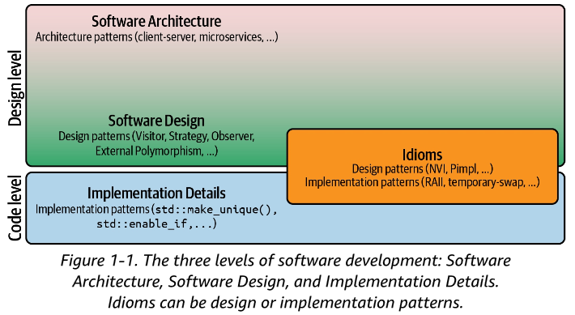

# Guideline 1: understand the importance of software design

- **Minimization of dependencies** is the goal of software architecture and design. 特にartificial dependencies.
  - Artificial dependenciesのディメリット：they make it harder to understand our software, change software, add new features, and write tests.
- software developmentの３つレベル：

# Guideline 2: design for change

- One of the best and proven solutions to reduce artificial dependencies and simplify change is to **separate concerns**: split, segregate, or extract pieces of functionality. (more **modular** software)

- SOLID: SRP(single-responsibility principle: a class should have only one reason to change. everything should do just one thing. **group only those things that truly belong together, and separate everything that does not strictly belong**. **separate those things that change for different reasons**.) , OCP, LSP, ISP, DIP.
- variation pointを特定しろ：some aspect in your code where changes are expected. These variation points should be **extracted, isolated, and wrapped**, such that there are no longer any dependencies on these variations.

- 著者がよく参加している会議：CppCon, Meeting C++, C++ on Sea.
- Takeaways:
  - Avoid combining unrelated, orthogonal aspects to prevent coupling.
  - adhere to the single-responsibility principle (SRP) to separate concerns.
  - follow the don't repeat yourself (DRY) principle to minimize duplication.
  - **avoid premature abstraction if you are not sure about the next change**.

# Guideline 3: separate interfaces to avoid artificial coupling

- ISP (interface segregation principle): clients should not be forced to depend on methods that they do not use. 共通アーキに関係する原則だ。共通クラスに本当に共通の処理以外は入れない。
- Takeaways:
  - consider the ISP as a special case of the single-responsibility principle (SRP).
  - understand that the ISP helps for both **inheritance hierarchies and templates**.

# Guideline 4: design for testability

- テストを書けるように、your software must be written in a way that it is possible, and in the best case even easily possible, to add tests.
- friend classでテストする方法のディメリット：**By actively changing the production code to introduce the friend declaration, the production code now knows about the test code**. 大事！！
  - And while the test code should of course know about the production code (that's the point of the test code), the production code should not have to know about the test code.
  - This introduces a cyclic dependency, which is an unfortunate and artificial dependency.
  - Of course, exceptions can be made for the good friends, the ones you cannot live without, such as hidden friends, or idiomatic uses of friend, such as the Passkey idiom. A test is more like a friend on social media, so declaring a test a friend does not sound like a good choice.

- **Inheritance is rarely the answer**.

- 著者の案：素晴らしいと思うが、難易度高い。著者の意味からすると、全部のprivate関数をテストする必要があるわけではない。本当にテストしたいprivate関数はなんだろう。確かに、普通はpublic関数に対してテストを書けばいいよね！！

  - 元々のコード：

    ```c++
    class Widget {
      // ...
      private:
        void updateCollection( /* some arguments needed to update the collection */ );
        std::vector<Blob> blobs_;
        /* Potentially other data members */
    }
    ```

  - Separate concerns: 下記のように改造すると、friend class使わなくてもテストできる。ますます下記こそ共通アーキに似てきた。

    ```c++
    namespace widgetDetails {
    class BlobCollection {
      public:
        void updateCollection( /* some arguments needed to update the collection */ );
      private:
        std::vector<Blob> blobs_;
    }
    }  // namespace widgetDetails
    
    class Widget {
      // ...
      private:
        widgetDetails::BlobCollection blobs_;
        /* Other data members */
    }
    ```

  - 内部データを持たない場合（引数にするとか）はクラス化さえ不要、関数を外に出すだけ。これはmember関数をstaticで宣言することのもう一歩先だね。

    ```c++
    void updateCollection(std::vector<Blob>& blobs, /* some arguments needed to update the collection */);
    
    class Widget {
      // ...
      private: std::vector<Blob> blobs_;
      /* Potentially other data members */
    }
    ```

  - If the `updateCollection()` function is important enough that we want to test it in isolation, then apparently it changes for a reason other than Widget.
  - Scott MeyersのEffective C++より、**Extracting functions from a class is a step toward increasing encapsulation.** According to Meyers, **you should generally prefer nonmember non-friend functions to member functions**. **This is because every member function has full access to every member of a class, even the private members**. 最後は圧倒的な理由！！！
  - I merely suggested you take a closer look at those functions that need to be tested but are placed in the private section of your class.

- Takeaways:
  - consider private member functions that need testing to be misplaced.
  - prefer nonmember non-friend functions to member functions.

# Guideline 5: design for extension

- OCP (open-closed principle): the extension should be easy and, in the best case, possible by just adding new code. In other words, we shouldn't have to modify existing code (closed for modification).

- Takeaways:
  - design for code additions by means of base classes, templates, function overloading, or template specialization.
  - avoid premature abstraction if you are not sure about the next addition.