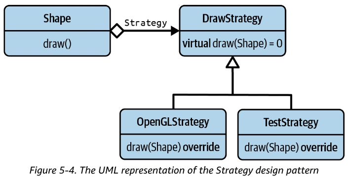

# Guideline 19: use strategy to isolate how things are done



- Strategyのメリット：it allows you to reduce the dependencies on a particular **implementation detail** by **introducing an abstraction for that detail**.
- ディメリットの１つ：性能：if you implement Strategy **by means of a base class**, the performance will certainly take a hit by the additional runtime indirection. The performance is also affected by the many manual allocations (the `std::make_unique()` calls), the resulting memory fragmentation, and the various indirections due to numerous pointers.
  - **If you implement Strategy using templates, this disadvantage is of no concern**. 大事、これを伝えないといけない！

- a small number of implementation detailsを隔離させたい場合は、Strategyが一番良さそうが、大量のoperationsを抽出したい場合は、ほかの方法を考えたほうが良い

- Takeaways:
  - understand that inheritance is rarely the answer.
  - **apply the Strategy design pattern with intent to extract the implementation details of a cohesive set of functions**.
  - **implement one Strategy for each operation to avoid artificial coupling**.
  - **consider policy-based design as the compile-time form of the Strategy design pattern**.

# Guideline 20: favor composition over inheritance

- 継承に関するよくある誤解：**first and foremost, inheritance is always described as simplifying reusability**.
  - 真実：**Inheritance is not about reusing code in a base class; instead, it is about being reused by other code that uses the base class polymorphically**.

- **Real reusability is created by the polymorphic use of a type, not by polymorphic types**

  ```c++
  class Shape {
    public:
      virtual ~Shape() = default;
      
      virtual void translate( /*some arguments */ ) = 0;
      virtual void rotate( /*some arguments */ ) = 0;
      
      virtual void draw( /*some arguments */ ) const = 0;
      virtual void serialize( /*some arguments */ ) const = 0;
  };
  
  void rotateAroundPoint( Shape& shape );
  void mergeShapes( Shape& s1, Shape& s2 );
  void writeToFile( Shape const& shape );
  void sendViaRPC( Shape const& shape );
  ```

  - 下の４つ関数こそ完璧なコード再利用。

- In many situations, inheritance is neither the right approach nor the right tool. Most of the time it is preferable to use composition instead.
  - **Composition is the reason the OO form of the Strategy design pattern works so well, not inheritance**.

- Takeaways:
  - understand that inheritance is often overused and sometimes even misused.
  - keep in mind that **inheritance creates a tight coupling**.
  - realize that many design patterns are enabled by composition, not by inheritance.