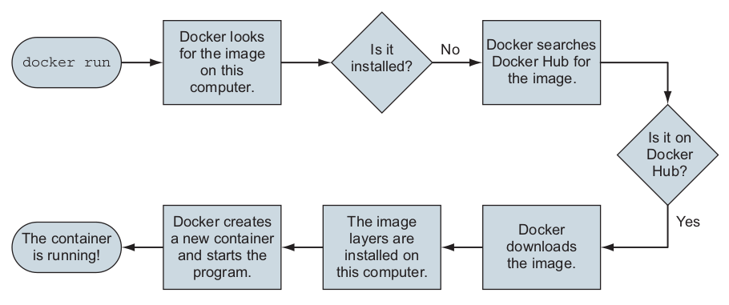
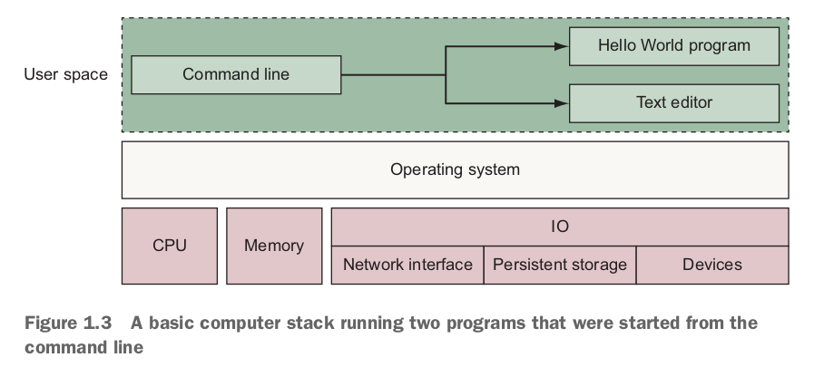
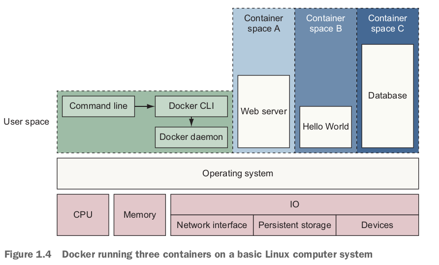
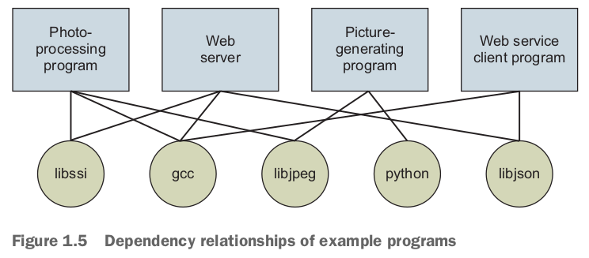
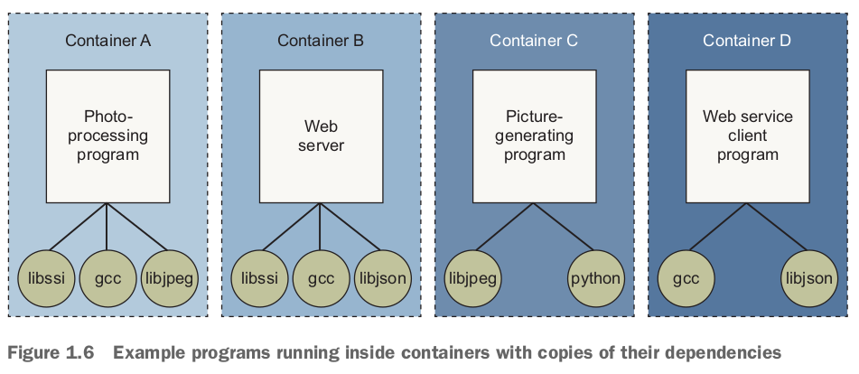
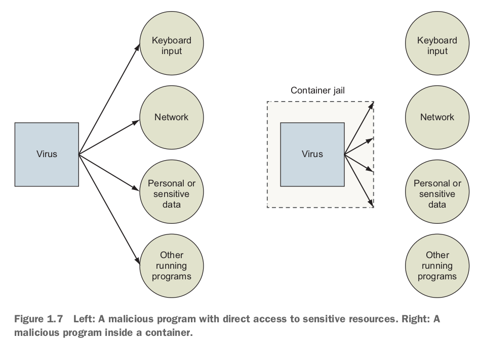

- If your team uses Docker to **model local development environments**（これは僕やりたいこと）, you will decrease member onboarding time and eliminate the inconsistencies that slow you down.
- Software authors usually know how to install and configure their software with sensible defaults and required dependencies.
  - If you write software, **distributing that software with Docker** will make it easier for your users to install and run it.

- Whereas software authors understand dependencies, installation, and packaging, it is system administrators who understand the systems where the software will run.
  - Docker provides an expressive language for running software in containers.
  - That language lets system administrators **inject environment-specific configuration and tightly control access to system resources**.

# 1.1 What is Docker?

- It is a command-line program, a background process, and a set of **remote services** that take a logistical approach to solving common software problems and simplifying your experience installing, running, publishing, and removing software.
  - It accomplishes this by using an **operating system technology** called *container*.
- Install Docker Engine on Ubuntu: https://docs.docker.com/engine/install/ubuntu/
  - The contents of `/var/lib/docker/`, including images, containers, volumes, and networks, are preserved. The **Docker Engine package is now called `docker-ce`**.
- `docker run dockerinaction/hello_world`の後発生したこと：
  - `dockerinaction/hello_world`は*image/repository name*.
    - The **image** itself is a **collection of files and metadata**.
    - **Metadata** includes the **specific program to execute** and other relevant configuration details.
  - Docker makes a call to Docker Hub.
    - *Docker Hub* is a public **registry** provided by Docker Inc.
    - Docker Hub replies to Docker running on your computer to indicate where the image can be found, and Docker starts the download.
  - If a program is running, the container is running.
    - If the program is stopped, the container is stopped.

## Containers

- Any software run with Docker is run inside a container.

## Containers are not virtualization

- Unlike virtual machines, Docker containers don't use any hardware virtualization.
  - Programs running inside Docker containers **interface directly with the host's Linux kernel**.
- Docker for Mac and Windows users, and almost all cloud computing users, will **run Docker inside virtual machines**.

## Running software in containers for isolation

- Docker uses **Linux namespaces and cgroups**, which have been part of Linux since 2007.
  - Docker **doesn't provide the container technology**, but it specifically makes it simpler to use.





- Each container is running as a **child process of the Docker engine**, wrapped with a container, and the delegate process is running in its own **memory subspace** of the user space.

## Docker builds containers using 10 major system features

- PID namespace: Process identifiers and capabilities.
- UTS namespace: **Host and domain name**.
- MNT namespace: **Filesystem** access and structure.
- IPC namespace: **Process communication** over shared memory.
- NET namespace: **network** access and structure.
- USR namespace: user names and identifiers.
- `chroot` syscall: controls the location of the filesystem root.
- **cgroups: resource protection**.
- CAP drop: operating system feature restrictions.
- Security modules: mandatory access controls.

## Shipping containers: *image*

- Docker completes the traditional container metaphor（隠喩、いんゆ） by including a way to package and distribute software.
  - **The component that fills the shipping container role is called an *image***.

- Docker image is a bundled（同梱、どうこん） snapshot of all the files that should be available to a program running inside a container.
  - 例えば`dockerinaction/hello_world`の例だと、imageの中身はa small executable Linux program.
- Images are the **shippable（出荷可能な） units** in the Docker ecosystem.

- Docker provides a set of infrastructure components that simplify **distributing**（分配する） Docker images.
  - These components are ***registries* and *indexes***.

# 1.2 What problems does Docker solve?

- Package managers such as APT, Homebrew, YUM, and npm（Node.jsのモジュール管理ツール） attempt to manage this (installing software), but few of those provide any degree of isolation.

## Getting organized





- At first it seems like this would introduce storage overhead by creating redundant copies of common dependencies such as gcc.
  - Chapter 3 describes how the Docker packaging system typically reduces the storage overhead.

## Improving portability

- Another software problem is that an application's dependencies typically include a specific operating system.
- At present, Docker runs natively on Linux and comes with a single virtual machine for macOS and Windows environments.
  - On macOS and Windows, Docker uses a single, small virtual machine to run all the containers.

## Protecting your computer



# 1.3 Why is Docker important

- Docker provides an *abstraction*.
  - Abstractions allow you to work with complicated things in simplified terms.

- There is significant push in the software community to adopt containers and Docker.

- Docker has accomplished for the computer what **app stores** did for **mobile devices**.
  - Docker has made software installation, compartmentalization（区画化、くかく）, and removal simple.

# 1.4 Where and when to use Docker

- If you want to run a macOS or Windows native application on your desktop, you can't yet do so with Docker.

- Beyond the added in-depth benefit of defense, using Docker for day-to-day tasks helps **keep your computer clean**.

# 1.5 Docker in the larger ecosystem

- container oechestrationの定義：https://www.redhat.com/en/topics/containers/what-is-container-orchestration
  - Container orchestration automates the deployment, management, scaling, and networking of containers.
  - Enterprises that need to deploy and manage hundreds or thousands of Linux containers and hosts can benefit from container orchestration.

- Kubernetes provides an extensible platform for **orchestrating services as containers in clustered environments**.
  - Like the Linux Kernel, **cloud providers and platform companies** are **packaging Kubernetes**.
  - Kubernetes depends on container engines such as Docker, and so the containers and images you build on your laptop will **run in Kubernetes**.
  - Most readers looking at Kubernetes should consider adopting a managed offering from a major public cloud provider before building their own. Kubernetesを使おうとしたら、cloud providerが提供したKubernetesを使った方がいい。
- This book focuses on and teaches solutions to higher-level problems using Docker alone.
  - Once you understand what the problems are and how to solve them with one tool, you're more likely to succeed in picking up more complicated tooling.

# 1.6 Getting help with the Docker command line

```bash
docker help
# Find out how to copy files from a location inside a container to a location on the host machine
docker help cp
```

## 復習

- Working with containers instead of software creates a consistent interface and enables the development of more sophisticated tools.

- Because Docker is available and supported on Linux, macOS, and Windows, most software packaged in Docker images can be used on any computer.
- Docker doesn't provide container technology; it **hides the complexity of working directly with the container software** and turns **best practice** into **reasonable defaults**.