テーマ：the goals of Docker image pipelines (Docker image pipelineは何だろう？); patterns for building images and using metadata to help consumers use your image; common approaches for testing that images are configured correctly and secure; patterns for tagging images so they can be identified and delivered to consumers (この内容はもうあった気がする); patterns for publishing images to **runtime environments** and registries (publish images to runtime environmentsの意味分かっていない).

- image build pipeline (普通だが): prepare image material, build an image, test, publish images to registries.

# 10.1 Goals of an image build pipeline

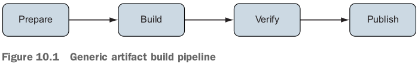

- **continuous integration (CI)** practices.
- People often automate build pipelines with **continuous integration systems** such as **Jenkins, Travis CI, or Drone**.

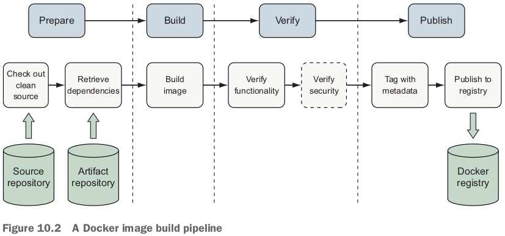

- Artifact repositoryについて説明：
  - *Application artifacts* are the runtime scripts, binaries (.exe, .tgz, .zip), and configuration files produced by software authors.
  - This image build process assumes the application artifacts have already been built, tested, and **published to an artifact repository for inclusion in an image**. 
  - The application artifact may be **built inside a container**, and this is how many modern CI systems operate.

# 10.2 Patterns for building images

- Prepare + Buildの部分でしょう。

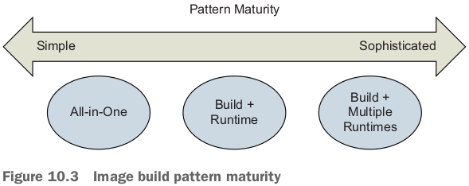

- Build + Runtimeはp160 multi-stage buildの時使った例でしょう。（8.4 Creating maintainable Dockerfiles）builder + runtime. builderはapplicationを作る。runtimeはscratch, applicationのexecutableだけ利用する。outputのimageサイズがだいぶ小さくなれる。

## All-in-one images

- especially useful when containerizing a **development environment** or "legacy" application that has many dependencies.

- 例：build a Java web server using Spring Boot framework (https://github.com/dockerinaction/ch10_patterns-for-building-images.git).

  ```dockerfile
  FROM maven:3.6-jdk-11
  
  ENV WORKDIR=/project
  RUN mkdir -p ${WORKDIR}
  COPY . ${WORKDIR}
  WORKDIR ${WORKDIR}
  RUN mvn -f pom.xml clean verify
  RUN cp ${WORKDIR}/target/ch10-0.1.0.jar /app.jar
  
  ENTRYPOINT ["java","-jar","/app.jar"]
  ```

- all-in-oneのデメリット：Because all-in-one images contain **more tools than are necessary** to run the application (applicationのbuildには必要だが、runには必要がない。なので、buildやrunを分けましょう), attackers have more options to exploit an application, and images may **need to update more frequently** to accommodate change from a broad set of development and operational requirements.

## Separate build and runtime images

- 上記の例だと、まずbuild the application with a Maven **container**. (containerの中にapplicationをbuildして、buildしたapplicationをimageにコピーする)

  ```bash
  docker container run -it --rm \
    -v "$(pwd)":/project/ \
    -w /project/ \
    maven:3.6-jdk-11 \
    mvn clean verify
  ```

  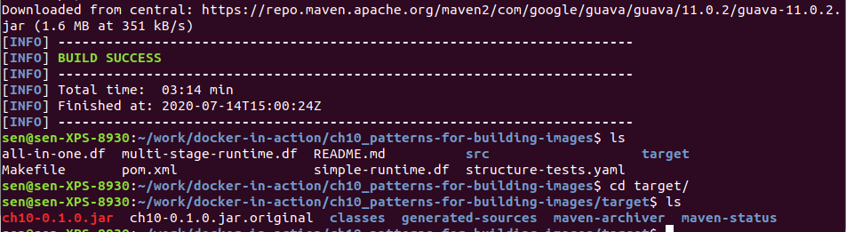

  - The application artifact is **output to the host filesystem** via the volume mount instead of storing it in the build image as in the All-in-One pattern.

- runtime image: 

  ```dockerfile
  FROM openjdk:11-jdk-slim
  
  COPY target/ch10-0.1.0.jar /app.jar
  
  ENTRYPOINT ["java","-jar","/app.jar"]
  ```

  - All-in-Oneの例には`maven:3.6-jdk-11`の中に既に`openjdk:11-jdk-slim`を含めた。

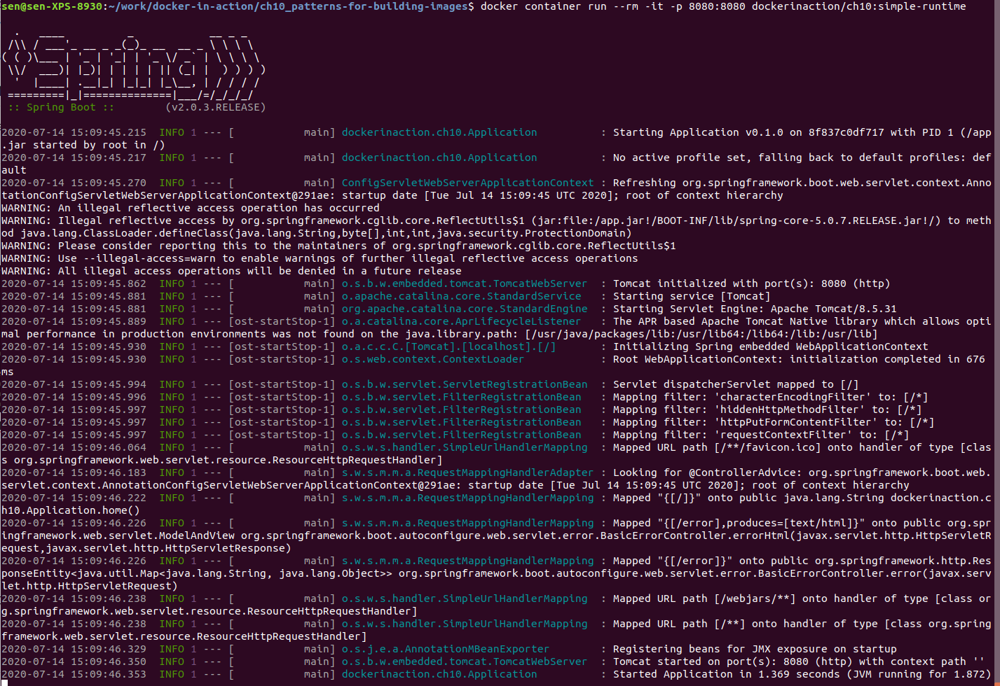

- all-in-oneのimageは716MB, simple-runtimeのimageは418MB.

- This pattern is now supported and encouraged by many CI tools.
  - The support usually comes in the ability to specify a Docker image to use as a hygienic (衛生的) execution environment for a step (openjdk:11-jdk-slimみたいでしょう。このexecution environment imageからFROMして、applicationを入れて、imageを出す) or the ability to run containerized build agents（build agentsはapplicationをbuild用でしょう、mavenみたいでしょう） and assign steps to them.

## Variations of runtime image via multi-stage builds（大事！）

- Multi-stage builds can be used to keep the specialized image **synchronized with** the application image and **avoid duplication of image definitions**.

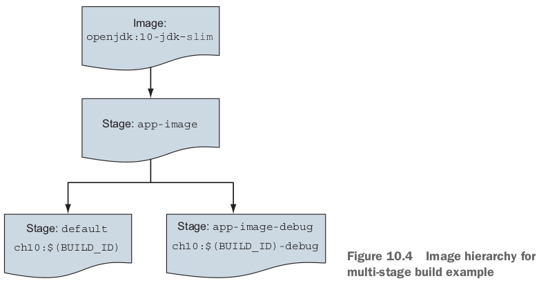

```dockerfile
# The app-image build target defines the application image
FROM openjdk:11-jdk-slim as app-image

ARG BUILD_ID=unknown
ARG BUILD_DATE=unknown
ARG VCS_REF=unknown

LABEL org.label-schema.version="${BUILD_ID}" \
      org.label-schema.build-date="${BUILD_DATE}" \
      org.label-schema.vcs-ref="${VCS_REF}" \
      org.label-schema.name="ch10" \
      org.label-schema.schema-version="1.0rc1"

# どうしてdockerfileをコピーする？単純にconsumerに展開したいでしょう。
COPY multi-stage-runtime.df /Dockerfile

COPY target/ch10-0.1.0.jar /app.jar

ENTRYPOINT ["java","-jar","/app.jar"]

# The app-image-debug build target demonstrates how to supplement the app-image 
# with debugging tools and configuration
FROM app-image as app-image-debug
#COPY needed debugging tools into image
ENTRYPOINT ["sh"]

# Ensure app-image is the default image built with this Dockerfile
FROM app-image as default
```

- `FROM`の`as`はpythonのimport ... as ... の意味と違うと思う。`FROM`の`as`の後ろの名前はbuild (stage)の名前です。ベースimageの名前じゃない。
- Dockerfileのoutput imageは必ず１つしかない。でもYou can use the build command's `--target` option to **select the stage to build the image**.
  - ここからstage nameの目的が分かる！stage nameがあったら、build processes can build a stage by specifying that name as a **build target**. stage名を指定すれば、そのstage imageを出せる！

- なので、上記のDockerfileから３つimageをbuildできる（defaultやapp-imageは同じだけど）：

  ```bash
  docker image build -t dockerinaction/ch10:multi-stage-runtime-debug -f multi-stage-runtime.df --target=app-image-debug .
  
  docker image build -t dockerinaction/ch10:multi-stage-runtime-default -f multi-stage-runtime.df --target=default .
  
  docker image build -t dockerinaction/ch10:multi-stage-runtime-base -f multi-stage-runtime.df --target=app-image .
  ```

- `--target`を指定しなかったら、一番最後のstageをbuildする。
- `VCS`はversion-control system.

# 10.3 Record metadata at image build time

- `LABEL`の話。
- `LABEL`以外、上記の例のように、Dockerfileやsoftware package manifest（jarファイル）もimage filesystemにコピーすべきだ。

## Orchestrating the build with `make`（大事）

- Build process authors describe each step in a Makefile that `make` interprets and executes to complete the build.
  - gather metadata, build application artifacts (container内でbuild), build image（Dockerfileをbuild）は全部Makefileに書く。
- The primary advantage of `make` over a standard shell script is that users **declare dependencies** between steps rather than directly implementing the flow of control between steps.

```makefile
# target identifies the rule with a logical name or filename produced by the rule.
# prerequisites is an optional list of targets to build before this target.
# The recipe section contains the list of commands used to build the target.
target ... : prerequisites ...
		recipe command 1
		recipe command 2
		...
```

- このtarget, prerequisites, recipe単位は**rule**という。Makefileの例：gather metadata, build, test, tag the application artifact and images.

```makefile
# if BUILD_ID is unset, compute metadata that will be used in builds
ifeq ($(strip $(BUILD_ID)),)
	VCS_REF := $(shell git rev-parse --short HEAD)
	BUILD_TIME_EPOCH := $(shell date +"%s")
	BUILD_TIME_RFC_3339 := \
		$(shell date -u -d @$(BUILD_TIME_EPOCH) '+%Y-%m-%dT%I:%M:%SZ')
	BUILD_TIME_UTC := \
		$(shell date -u -d @$(BUILD_TIME_EPOCH) +'%Y%m%d-%H%M%S')
	BUILD_ID := $(BUILD_TIME_UTC)-$(VCS_REF)
endif

ifeq ($(strip $(TAG)),)
	TAG := unknown
endif 

.PHONY: clean
clean:
	@echo "Cleaning"
	rm -rf target

.PHONY: metadata
metadata:
	@echo "Gathering Metadata"
	@echo BUILD_TIME_EPOCH IS $(BUILD_TIME_EPOCH)
	@echo BUILD_TIME_RFC_3339 IS $(BUILD_TIME_RFC_3339)
	@echo BUILD_TIME_UTC IS $(BUILD_TIME_UTC)
	@echo BUILD_ID IS $(BUILD_ID)

target/ch10-0.1.0.jar:
	@echo "Building App Artifacts"
	docker run -it --rm  -v "$(shell pwd)":/project/ -w /project/ \
    maven:3.6-jdk-11 \
    mvn clean verify

.PHONY: app-artifacts
app-artifacts: target/ch10-0.1.0.jar

.PHONY: lint-dockerfile
lint-dockerfile:
	@set -e
	@echo "Linting Dockerfile"
	docker container run --rm -i hadolint/hadolint:v1.15.0 < \
		multi-stage-runtime.df

.PHONY: app-image
app-image: app-artifacts metadata lint-dockerfile
	@echo "Building App Image"
	docker image build -t dockerinaction/ch10:$(BUILD_ID) \
	-f multi-stage-runtime.df \
	--build-arg BUILD_ID='$(BUILD_ID)' \
	--build-arg BUILD_DATE='$(BUILD_TIME_RFC_3339)' \
	--build-arg VCS_REF='$(VCS_REF)' \
	.
	@echo "Built App Image. BUILD_ID: $(BUILD_ID)"

.PHONY: app-image-debug
app-image-debug: app-image
	@echo "Building Debug App Image"
	docker image build -t dockerinaction/ch10:$(BUILD_ID)-debug \
	-f multi-stage-runtime.df \
	--target=app-image-debug \
	--build-arg BUILD_ID='$(BUILD_ID)' \
	--build-arg BUILD_DATE='$(BUILD_TIME_RFC_3339)' \
	--build-arg VCS_REF='$(VCS_REF)' \
	.
	@echo "Built Debug App Image. BUILD_ID: $(BUILD_ID)"

.PHONY: image-tests
image-tests:
	@echo "Testing image structure"
	docker container run --rm -it \
	-v /var/run/docker.sock:/var/run/docker.sock \
	-v $(shell pwd)/structure-tests.yaml:/structure-tests.yaml \
	gcr.io/gcp-runtimes/container-structure-test:v1.6.0 test \
	--image dockerinaction/ch10:$(BUILD_ID) \
	--config /structure-tests.yaml

# jqをインストールする必要がある
.PHONY: inspect-image-labels
inspect-image-labels:
	docker image inspect --format '{{ json .Config.Labels }}' \
		dockerinaction/ch10:$(BUILD_ID) | jq

.PHONY: tag
tag:
	@echo "Tagging Image"
	docker image tag dockerinaction/ch10:$(BUILD_ID) \
		dockerinaction/ch10:$(TAG)

.PHONY: all
all: app-artifacts app-image image-tests
```

- image-testsの時`structure-tests.yaml`を使っている：

  ```yaml
  schemaVersion: "2.0.0"
  
  # Verify the expected version of Java is available and executable
  commandTests:
    - name: "java version"
      command: "java"
      args: ["-version"]
      exitCode: 0
      # OpenJDK java -version stderr will include a line like:
      # OpenJDK Runtime Environment 18.9 (build 11.0.3+7)
      expectedError: ["OpenJDK Runtime Environment.*build 11\\..*"]
  
  # Verify the application archive is readable and owned by root
  fileExistenceTests:
  - name: 'application archive'
    path: '/app.jar'
    shouldExist: true
    permissions: '-rw-r--r--'
    uid: 0
    gid: 0
  ```

- multi-stage Dockerfileと同じようにtargetを指定できる。例えば`make all`, `make app-image`. carlaのmakeを思い出した！`make launch, make PythonAPI`なども全部Makefileのtargetだ！
- dateに関する変更はhttps://unix.stackexchange.com/questions/2987/how-do-i-convert-an-epoch-timestamp-to-a-human-readable-format-on-the-cli
  - `-r epoch`から`-d @epoch`に変更した。変更しないと、通れなかった。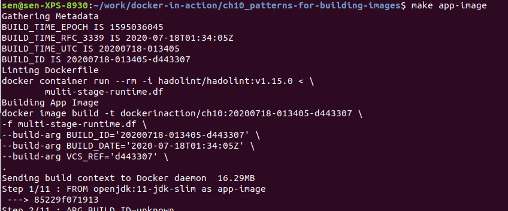

- `hadolint`: check Dockerfiles to verify that they follow best practices and identify common mistakes.

# 10.4 Testing images in a build pipeline

- 上記のMakefileの説明の続き。image-testsの部分の話。

- One popular tool for verifying the construction of a Docker image is the Container Structure Test tool (CST) from Google.
  - CSTの強み：operate on arbitrary images without requiring any tooling or libraries to be included inside the image.

- container-structure-testの結果（commandTests, fileExistenceTests）：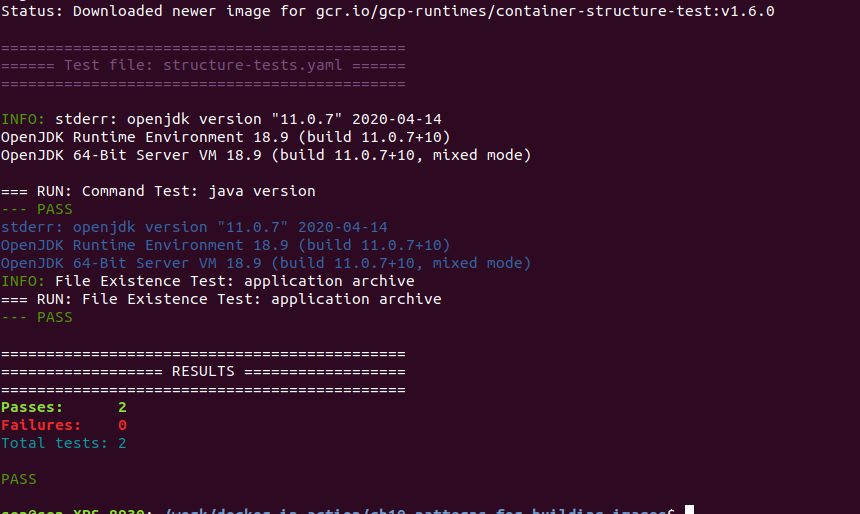
  - file permissionの意味：https://help.ubuntu.com/community/FilePermissions
    - owner + group + other.

# 10.5 Patterns for tagging images

## Continuous delivery with unique tags

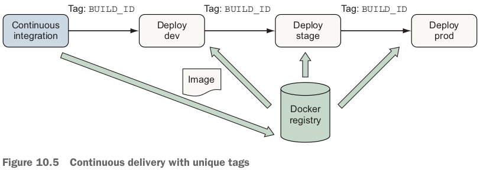

- The main disadvantage of this scheme is that people must deal with precise build identifiers instead of being able to use a `latest` or a `dev` tag.

## Configuration image per deployment stage

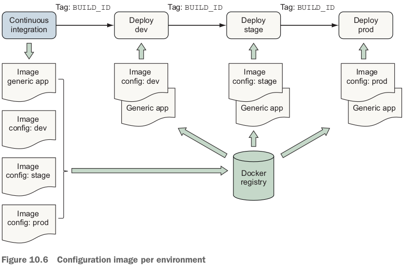

- 各Deployに２つcontainerが動く：configuration container & application container.
  - application container mounts the config container's filesystem as a volume.
- 各Deploy環境に同じgeneric, environment-agnostic application imageを使用。
- **Consuming environment-specific files from a config container's filesystem is a popular application orchestration pattern** and a variation of 12-factor application principles (https://12factor.net/).

## Semantic versioning

- https://semver.org/
- `Major.Minor.Patch`. それぞれあげるタイミング：
  - Major version when making **incompatible** API changes.
  - Minor version when adding functionality in a **backward-compatible** manner.
  - Patch version when making backward-compatible bug fixes.

- Semantic versioning is a good choice for images that many people depend on as a **base operating system, language runtime, database**. 

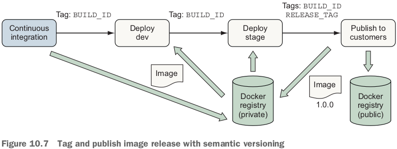

```bash
make tag BUILD_ID=$BUILD_ID TAG=1.0.0
```

# 復習項目

1. Pipelines for building images have the same structure and goals for ensuring quality of Docker images as other software and infrastructure build pipelines.
2. Tools for detecting bugs, security problems, and other image construction problems exist and can easily be incorporated into image build pipelines. CSTだろう。
3. **Codify the image build process by using a build tool such as make and use that process in local development and CI/CD processes**.
4. Several patterns exist for organizing Docker image **definitions**. These patterns provide trade-offs in managing application build and deployment concerns, such as attack surface and image size versus sophistication (複雑さの面でtrade-offを言ってるでしょう).
5. Information about the source and build process of an image should be recorded as image metadata to support traceability, debugging, and orchestration activities when deploying images.
6. Docker image tags provide a foundation for delivering software to consumers by using styles ranging from continuous delivery in a private service deployment to publishing long-lived releases via semantic versioning to the public.