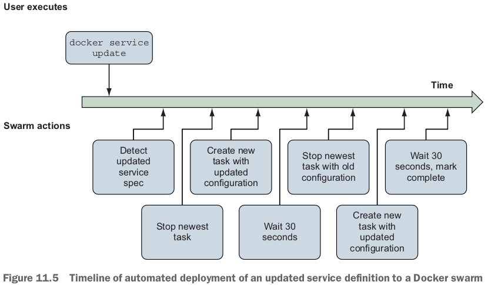
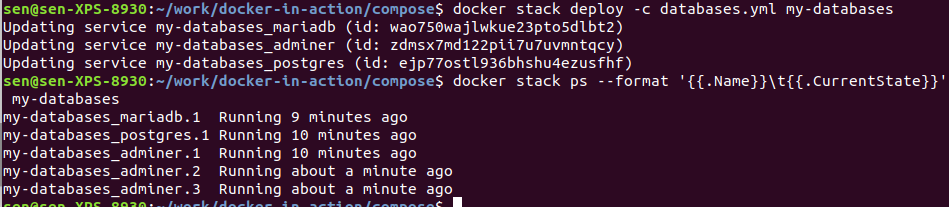
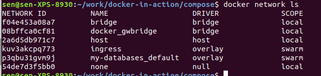

テーマ：**Understanding services** and how they relate to containers; Basic service administration with **Docker Swarm**; Building **declarative environments** with **Docker Compose and YAML**; Iterating projects with Compose and the `deploy` command (iterate projectsはどういう意味だろう); Scaling services and cleaning up.

- Today most of the software we run is designed to interact with other programs, not human users.
- serviceの定義：**Any processes, functionality, or data that must be discoverable and available over a network is called a *service***.
  - **an abstraction**.
- The same concepts, problems, and fundamental tooling are provided by all of the container orchestration systems including **Kubernetes**.

# 11.1 A service "Hello World!"

- service起動の例：
  - `1/1: running`と`verify: Service converged`の間結構時間かかった。普通かな？
- **Unlike containers, Docker services are available only when Docker is running in swarm mode**. 
  - Initializing swarm mode starts an **internal database** as well as a long-running loop in the Docker Engine that performs service orchestration.

- `docker service create`でserviceを定義する：
- `localhost:8080`にserviceが立ち上がった：
  - A *task* is a swarm concept that represents a unit of work.
  - Each task has one associated container.
  - Swarm works only with tasks.
  - The underlying components transform task definitions into containers. 
    - containerはDocker engineの上に。serviceはswarmの上に。

- serviceはcontainerの力で生きている。なので、１つcontainer今も動いている。しかも、このcontainerを停止しても、すぐ再実行される（container idが変わる）：

## Automated resurrection(復活) and replication


- serviceのcontainerをstopしてから、新しいcontainerが立ち上がった：
  - stopされたcontainerの名前も変わった！
  - Autonomous orchestrators (例えばSwarm components in Docker) track two things: **desired state** and **current state**.
    - Orchestrators track these two descriptions of state and reconcile(調停する、仲直りさせる、和解させる) the two by changing the system.

- Orchestratorの定義：Orchestrators remember how a system should be operating and manipulate it without being asked to do so by a user.
  - So, in order to use orchestrators effectively, you need to **understand how to describe systems and their operation**.

- hello-world serviceのinspect結果：

  ```bash
  [
      {
          "ID": "eeapkuty2i9d06rk5ahbdup72",
          "Version": {
              "Index": 13
          },
          "CreatedAt": "2020-07-18T12:26:26.821224012Z",
          "UpdatedAt": "2020-07-18T12:26:27.477844546Z",
          "Spec": {
              "Name": "hello-world",
              "Labels": {},
              "TaskTemplate": {
                  "ContainerSpec": {
                      "Image": "dockerinaction/ch11_service_hw:v1@sha256:4f92ec42207773b4ea97afe03469ff30598d08dd2ec4a28e05550b3ba4bc5fd5",
                      "Init": false,
                      "StopGracePeriod": 10000000000,
                      "DNSConfig": {},
                      "Isolation": "default"
                  },
                  "Resources": {
                      "Limits": {},
                      "Reservations": {}
                  },
                  "RestartPolicy": {
                      "Condition": "any",
                      "Delay": 5000000000,
                      "MaxAttempts": 0
                  },
                  "Placement": {
                      "Platforms": [
                          {
                              "Architecture": "amd64",
                              "OS": "linux"
                          }
                      ]
                  },
                  "ForceUpdate": 0,
                  "Runtime": "container"
              },
              "Mode": {
                  "Replicated": {
                      "Replicas": 1
                  }
              },
              "UpdateConfig": {
                  "Parallelism": 1,
                  "FailureAction": "pause",
                  "Monitor": 5000000000,
                  "MaxFailureRatio": 0,
                  "Order": "stop-first"
              },
              "RollbackConfig": {
                  "Parallelism": 1,
                  "FailureAction": "pause",
                  "Monitor": 5000000000,
                  "MaxFailureRatio": 0,
                  "Order": "stop-first"
              },
              "EndpointSpec": {
                  "Mode": "vip",
                  "Ports": [
                      {
                          "Protocol": "tcp",
                          "TargetPort": 80,
                          "PublishedPort": 8080,
                          "PublishMode": "ingress"
                      }
                  ]
              }
          },
          "Endpoint": {
              "Spec": {
                  "Mode": "vip",
                  "Ports": [
                      {
                          "Protocol": "tcp",
                          "TargetPort": 80,
                          "PublishedPort": 8080,
                          "PublishMode": "ingress"
                      }
                  ]
              },
              "Ports": [
                  {
                      "Protocol": "tcp",
                      "TargetPort": 80,
                      "PublishedPort": 8080,
                      "PublishMode": "ingress"
                  }
              ],
              "VirtualIPs": [
                  {
                      "NetworkID": "kuv3akcpq773urcpp0c9j10ch",
                      "Addr": "10.0.0.3/24"
                  }
              ]
          }
      }
  ]
  ```

  - **A template for the container workloads**: `TaskTemplate`.
  - A replication mode: `Mode`.
    - ２つmode: replicated and global.
    - `replicated`: create and maintain a **fixed number** of replicas.
    - **replicasを３にしたら**：
    - namingが面白い、またreplicasを減らす時、大きいnumberの名前のcontainerが先に消される：
    - `global`: tell Docker to run one replica on **each node** in the **swarm cluster**.
  - Rollout(意味分からない、service updateの意味) parameters and similar rollback parameters: `UpdateConfig`, `RollbackConfig`.
  - A description of the service endpoint: `EndpointSpec` or `Endpoint`? どう違う？

- The **difficulty** of running a service is more about managing **availability** of something on a network.
  - なのでserviceの定義の殆どの部分はhow to run replicas, manage changes to the software, and route requests to the service endpoint to that software.

## Automated rollout (製品投入): service updateの話

- 上記inspect結果の説明の続き。
- Rolling out a **new version** of replicated service software. service更新の話。
- Docker swarm's actions when **deploying an update**: 
  - どうして2回Create new task with updated configuration? replicasが２だから？多分そうです。

- 上記図のコマンドは：
  - ３つdeployment characteristicsが設定された：
    - only one replica should be updated at a time (`--update-parallelism 1`); 
    - wait for 30 seconds between updating each batch of replicas (`--update-delay 30s`); 
      - allow new service instances to become stable before starting (and to make sure that the underlying platform remains stable).
    - each replica should be stopped before its replacement is started (`--update-order stop-first`, でもstop-firstなら一瞬availabilityがなくなるぞ).
  - 今更だけど、*Converged* is a technical way to say that current state of the service is the same as the desired state described by the command.

## Service health and rollback

- Although Docker can be sure that a stopped container is unhealthy, there is no universal and accurate definition of service health.

- updateが失敗した場合：
  - By default, Docker will pause the deployment after the **first replica fails to start**.
  - もう少し待つと、1番めのcontainerがずっと３状態に繰り返している：足りない、またFailed, Readyも出ている。
  - 事象：**Two of the replicas remain on the old version of the service, and the other replica keeps cycling through starting and failed states**. これはしょうがないな。replicasが２だから、swarmは今一生懸命もう１つcontainerを起動したいんだ！かわいそう！

- 修正：`--rollback`. 
- **automate rollback when the deployment fails (大事): `--update-failure-action`**.
  - should also explicitly tell Swarm **which conditions should be considered a failure**: `--update-max-failure-ratio`.
  - 失敗したcontainerの状態（rollbackする前）はnew, preparing, ready, assigned, starting, pending, acceptedの中に変わっていた。
  - 事象：The first one will retry a few times **before the delay expires** and the next replica deployment starts. ２つ失敗したら、failure ratioが0.6に超えるので、自動rollback.
    - Immediately after the second replica fails, the whole deployment will be marked as failed and a rollback will be initiated.
  - 質問：どうやってゴミを整理する？

- service imageに`HEALTHCHECK`があれば、containerの健康状態は表示できる。なければ、表示できない。でもservice update時改めて指定できる。指定したら、またcontainerの健康状態が表示される。実験不成功。。。失敗したのはp228の`docker service update --health-cmd /bin/httpping --health-interval 10s hello-world`. 何度もrollbackになった。

- serviceの削除：`docker service rm hello-world`. task containerが削除されていないけど。いいえ、task containerは全部削除された！ちょっと時間がかかっただけ！
- 次の課題：serviceの管理やパラメタ設定を全部command lineでやるのはしんどい。**declarative tooling**を使いましょう。

# 11.2 Declarative(宣言的) service environments with Compose V3

- *imperative pattern*の概念
  - Imperative(命令的)-style tools carry out commands **issued by a user**.
  - **Programming language and command-line tools** follow an imperative pattern.

- **Docker services are declarative abstractions**. 
  - When we create a service, we declare that we want a certain number of replicas of that service, and Docker takes care of the individual commands required to maintain them.
  - **Declarative tools** enable users to **describe the new state of a system**, rather than the steps required to change from the current state to the new state.

- These **environments** are described using the Docker Compose V3 file format. 例えばhello-world serviceの例（YAML file）：Composeは複雑なservice環境（イメージ）を描画する機能だ。

  ```yaml
  version: "3.7"
  services:
  	hello-world:
  		image: dockerinaction/ch11_service_hw:v1
  		ports:
  			- 8080:80
  		deploy:
  			replicas: 3
  ```

  - **Compose files use Yet Another Markup Language (YAML)**.

## A YAML primer

- YAML is used to describe **structured documents**, which are made up of structures, **lists, maps, and scalar values**.

- **Comment support is one of the most popular reasons to adopt YAML instead of JSON today**.

- YAML uses three types of data and two styles of describing that data, block and flow.

  - list of strings in the flow style: `["PersonA", "PersonB"]`.

  - maps: key/value.

    ```yaml
    image: "alpine"
    command: echo hello world
    ```

    - 1st: *double quote style*.
    - 2nd: *plain style*. plain styleを使うときいろんなルールがある。

  - Lists (or block sequences), denoted by a leading hyphen (`-`):

    ```yaml
    - item 1
    - item 2
    - item 3
    - # an empty item
    - item 4
    ```

- YAML 1.2 specification: https://yaml.org/spec/1.2/spec.html
  - 2009年、結構古いね。

## Collections of services with Compose V3

- **Compose files describe every first-class Docker resource type: services, volumes, networks, secrets, and configs**.

- Compose fileの例：

  ```yaml
  version: "3.7"
  services:
          postgres:
                  image: dockerinaction/postgres:11-alpine
                  environment:
                          POSTGRES_PASSWORD: example
          mariadb:
                  image: dockerinaction/mariadb:10-bionic
                  environment:
                          MYSQL_ROOT_PASSWORD: example
          adminer:
                  image: dockerinaction/adminer:4
                  ports:
                          - 8080:8080
  ```

  - all of the properties with the same indentation belong to the **same map**.
  - `8080:8080`: route requests to port 8080 on the host to port 8080 in the service container.

## Creating and updating a stack

- stackの概念：a Docker stack is a named collection of services, volumes, networks, secrets, and configs.

- 上記のCompose fileをdeployすると：

- compose fileを変更して：

  ```yaml
  version: "3.7"
  services:
          postgres:
                  image: dockerinaction/postgres:11-alpine
                  environment:
                          POSTGRES_PASSWORD: example
          mariadb:
                  image: dockerinaction/mariadb:10-bionic
                  environment:
                          MYSQL_ROOT_PASSWORD: example
          adminer:
                  image: dockerinaction/adminer:4
                  ports:
                          - 8080:8080
                  deploy:
                          replicas: 3
  ```

- 再度deployすると：
  - Updating serviceって書いてあるけど、実はnone of the original service containers were touched during the new deployment.

## Scaling down and removing services

- Compose yamlを変更して、`mariadb` serviceを削除して、`adminer`のreplicasを２にする。

  ```yaml
  version: "3.7"
  services:
          postgres:
                  image: dockerinaction/postgres:11-alpine
                  environment:
                          POSTGRES_PASSWORD: example
          adminer:
                  image: dockerinaction/adminer:4
                  ports:
                          - 8080:8080
                  deploy:
                          replicas: 2 
  ```

- 再度deployすると：
  - `mariadb`は消されていない、原因：The Compose file you provided to the `stack deploy` command did not have any reference to the `mariadb` service, so Docker did not make any changes to that service.

- service (or other objects)を削除する方法：compose yamlに削除＋`--prune` deploy. 
  - `--prune`を利用時要注意：The `--prune` flag will clean up any resource in the stack that isn't explicitly referenced in the Compose file used for the deploy operation.
    - For that reason, it is important to keep a Compose file that represents **the entire environment**.
    - Otherwise, you might accidentally delete absent services or volumes, networks, secrets, and configs. 危ない！

# 11.3 Stateful services and preserving data

- volumeをCompose yamlに入れる話。

- volumeを宣言して、postgresからmountする：

  ```yaml
  version: "3.7"
  volumes:
          pgdata: # empty definition uses volume defaults
  services:
          postgres:
                  image: dockerinaction/postgres:11-alpine
                  volumes:
                          - type: volume
                            source: pgdata # The named volume above
                            target: /var/lib/postgresql/data
                  environment:
                          POSTGRES_PASSWORD: example
          adminer:
                  image: dockerinaction/adminer:4
                  ports:
                          - 8080:8080
                  deploy:
                          replicas: 1
  ```

- 実験：localhost:8080でpostgres (system, server, username全部postgresにする)にログインして、tableを新規して、postgres serviceを削除して、再度deployして、またlocalhostでpostgresにログインすると、追加していたtableはまだ存在している（localhostのscreenshotは略）：

  - volumeを使ったからです。postgresのデータはvolumeに保存されているからです。

# 11.4 Load balancing, service discovery, and networks with Compose（大事）

- networkの話。
- **Port publishing** for a service is different from publishing a port on a container.
  - Whereas containers directly map the port on the host interface to an interface for a specific container, services might be made up of many replica containers. つまり複数replica containersが１つportを共有することになる。例えばadminer serviceがあるが、adminer containerの数が分からない。
- **Docker accommodates services by creating virtual IP (VIP) addresses and balancing requests for a specific service between all of the associated replicas**.
  - When a program attached to a Docker network looks up the name of **another service** attached to that network, Docker's built-in DNS resolver will respond with the virtual IP for that service's location on the network. 
  - compose yamlをdeployしたら、ingress networkとmy_databases_default networkが作られている(違う、ingress networkはswarm initの時作られるらしい)：
    - scopeは全部swarm、driverは全部overlayになっている。
  - When a request comes into the host interface for a published port or from an internal service, it will be routed to the target service's virtual IP address.
    - **From there, it is forwarded to one of the service replicas**.
- When you're using services, you're using at least two Docker networks.
  - `ingress`: handle **all port forwarding from the host interface to services**.
    - Created when you initialize Docker in swarm mode.
  - `ingress`をinspectすると：
    - **Every service that uses port forwarding will have an interface in this network**.
  - `default`: **shared between all of the services** in your stack.
    - All services in your stack will be attached to this network by default, and all **service-to-service communication** will go through this network.
  - `default`をinspectすると：
- Virtual IPは各serviceをinspectすると、EndpointのVirtualIPsに記載されている。

- Compose yamlを変更して、もう１つnetworkを追加して、servicesを全部この新しいnetworkにattachする：

  ```yaml
  version: "3.7"
  networks:
          foo:
                  driver: overlay
  volumes:
          pgdata: # empty definition uses volume defaults
  services:
          postgres:
                  image: dockerinaction/postgres:11-alpine
                  volumes:
                          - type: volume
                            source: pgdata # The named volume above
                            target: /var/lib/postgresql/data
                  networks:
                          - foo 
                  environment:
                          POSTGRES_PASSWORD: example
          adminer:
                  image: dockerinaction/adminer:4
                  networks:
                          - foo
                  ports:
                          - 8080:8080
                  deploy:
                          replicas: 1
  ```

- 再度deployすると、`my-databases_foo`が作られて、`my-databases_default`にattachしていたcontainerは全部なくなった。
- networksをmodelしたいシーン：
  - If you manage multiple stacks and want to communicate on a shared network. (instead of specifying the driver, you would use the `external: true` property and the network name.)
  - Suppose you have multiple groups of related services, but those services should operate **in isolation**.

# 復習項目

1. A service is any process, functionality, or data that must be discoverable and available over a network.
2. Orchestrators such as Swarm track and automatically reconcile user-provided desired state and the current state of Docker objects including services, volumes, and networks.
3. Orchestrators automate service replication, resurrection, deployments, health checking, and rollback.
4. The desired state is what the user wants the system to be doing, or what it is supposed to be doing. People can describe desired state in a declarative style by using Compose files.
5. Compose files are structured documents represented in YAML.
6. Declarative environment descriptions with Compose enable environment versioning, sharing, **iteration**, and consistency. iteration(反復)の意味はまだ分かっていない。Compose fileを改善しながら再度deployする意味？
7. Compose can model services, volumes, and networks. Consult the official Compose file reference material for a full description of its capabilities.