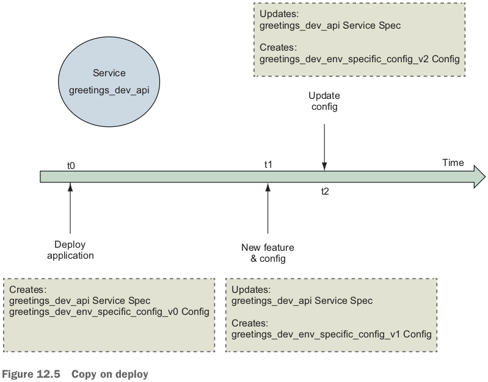

テーマ：the problems **configuration and secrets** solve and the forms those solutions take; modeling and solving configuration problems for Docker services; the challenge of delivering secrets to applications; modeling and delivering secrets to Docker services; approaches for using configurations and secrets in Docker services.

- *configuration*の定義：*Configuration* is data interpreted by an application to adapt its behavior to **support a use case**. 例えば：
  - Features to enable or disable.
  - Locations of services the application depends on.
  - Limits for internal application resources and activities such as database connection pool sizes and connection time-outs.

# 12.1 Configuration distribution and management

- The application may read its configuration from a file formatted in the ini, properties, JSON, YAML, TOML, or other format.
- Configurationはいろんなapplicationの変わるタイミングで変わるかもしれない：
- Docker service depends on Application image, Secrets, Configs. 

# 12.2 Separating application and configuration

- `greetings` serviceの例（https://github.com/dockerinaction/ch12_greetings.git）：

- `greetings`のファイル構成：

- まず、`docker-compose.yml`はapplicationのenvironment-specific configuration filesをcontainerの中にmountする（source, targetのところで）：

  ```yaml
  # Docker Compose file reference: https://docs.docker.com/compose/compose-file/
  version: '3.7'
  
  configs:
    env_specific_config:
      file: ./api/config/config.${DEPLOY_ENV:-prod}.yml
  
  services:
    api:
        image: ${IMAGE_REPOSITORY:-dockerinaction/ch12_greetings}:api
        ports:
          - '8080:8080'
          - '8443:8443'
        user: '1000'
        configs:
          #- env_specific_config # short form mounts the config file in as a file named `env_specific_config`
          - source: env_specific_config
            target: /config/config.${DEPLOY_ENV:-prod}.yml
            uid: '1000'
            gid: '1000'
            mode: 0400 #default is 0444 - readonly for all users
        secrets: []
        environment:
          DEPLOY_ENV: ${DEPLOY_ENV:-prod}
  ```

## Working with the config resource

- 上記yamlファイルの説明。
- A Docker *config resource* is a **Swarm cluster object** that deployment authors can use to store **runtime data** needed by applications. cluterは多分１つCompose(１つstack)を言っているでしょう？
  - Each config resource has a **cluster-unique name** (例えば上記yamlにある`env_specific_config`という名前) and a value of up to 500KB.
- `configs`: Docker will interpolate the filename with the value of the `DEPLOY_ENV` variable, read that file, and **store** it in a **config resource** named `env_specific_config` **inside the Swarm cluster**.
- serviceがこのconfigを使う時、自分の下の`configs`にそのconfigを自分のfilesystemにmountする。
  - The config mapping may customize the location (default pathは`/env_specific_config`, (`/<config_name>`)), ownership (default uid, gidは0), and permissions of the resulting file on the service container's filesystem.
  - なぜこんなマッピングが必要か：例えば、to accommodate a program that wants to run as a particular user and read configuration files **from predetermined locations**.

## Deploying the application

- deploy: `DEPLOY_ENV=dev docker stack deploy --compose-file docker-compose.yml greetings_dev`.

- `http://localhost:8080/greeting`で何度F5すると、違う言語のHello Worldが出る。多分`main.go`の`serveGreeting`関数がこれを対応している：

  ```go
  func serveGreeting(resp http.ResponseWriter, req *http.Request) {
  	resp.Header().Set("Content-Type", "text/plain; charset=utf-8")
  	greeting := SelectRandom(config.Greetings, r)
  	fmt.Fprintln(resp, greeting)
  }
  ```

## Managing config resources directly

- `docker config`. `greetings_dev_env_specific_config`をinspectすると、
  - `Data`はこのconfigのvalue. This data is **not encrypted**, so no confidentiality is provided here.
  - The Base64 encoding only facilitates transportation and storage within the Docker Swarm cluster.

- Docker config resources are **immutable** and cannot be updated after they are created. 
  - なので、`config.dev.yml`を変更して、再度deployすると、エラー！これは不便だな！
- 上記docker configは`ID`でgreetings serviceに参照されている：
- ではどうやってconfigファイルを更新するんだ？**Copy on deploy**: 
  - The common convention is to append a version number to the configuration resource's name. 注意：configファイルを変更しなければ大丈夫だよ。再度deployしても問題ない。

- This implementation of **immutable config resources** creates challenges for **automated deployment pipelines**.

- **注意：service, volume, config, networkなどを削除する出はなく、stackを削除！**`docker stack rm greetings_dev`. 

# 12.3 Secrets - A special kind of configuration

- secretsを扱うと難しいところ：Every point in the distribution chain needs to have robust and effective access controls to prevent leakage.
- この難しさを回避するために、あるやり方：store secrets in a secure vault(金庫室) and inject them right at the final moment of application delivery using specialized tooling (enable applications to access their secrets ***only* in the runtime environment**). 
  - *First Secret Problem*: If an application is started without secret information such as a password credential to authenticate to the secret vault(金庫室), how can the vault authorize access to the application's secrets?
- Dockerの解決策：**Swarm's built-in identity management features**（https://www.docker.com/blog/least-privilege-container-orchestration/）：
  - The Swarm secret vault is **tightly integrated** with the **cluster's identity** and service management functions that are using secure communication channels.
  - The Docker **service ID** serves as the application's identity.
  - Since service definitions can be modified by only an authorized user of Docker on the **manager node**, Swarm knows which secrets a service is authorized to use.
    - Swarm can then **deliver those secrets to nodes** that will run the service's tasks.
  - 初めてmanager nodeの概念が出た。

- Docker services solve the First Secret Problem by **using Swarm's built-in identity management features to establish trust rather than relying on a secret passed via another channel to authenticate the application's access to its secrets**.

## Using Docker secrets

- Docker provides secrets to applications as files mounted to a **container-specific, in-memory, read-only `tmpfs` filesystem**.

  - default: `/run/secrets`.

- How to tell an application where a secret or configuration file has been placed into a container: 

- secretsを利用する例：`docker-compose.prod.yml`.

  ```yaml
  # Docker Compose file reference: https://docs.docker.com/compose/compose-file/
  version: '3.7'
  
  configs:
    ch12_greetings_svc-prod-TLS_CERT_V1:
      external: true
  
  secrets:
    ch12_greetings-svc-prod-TLS_PRIVATE_KEY_V1:
      external: true
  
  services:
    api:
        environment:
          CERT_PRIVATE_KEY_FILE: '/run/secrets/cert_private_key.pem'
          CERT_FILE: '/config/svc.crt'
        configs:
          - source: ch12_greetings_svc-prod-TLS_CERT_V1
            target: /config/svc.crt
            uid: '1000'
            gid: '1000'
            mode: 0400
        secrets:
          - source: ch12_greetings-svc-prod-TLS_PRIVATE_KEY_V1
            target: cert_private_key.pem
            uid: '1000'
            gid: '1000'
            mode: 0400
  ```

- `external: true`: **the value of the secret is not defined by this deployment definition**. secretやconfigは全部コマンドで作る。
- `ch12_greetings-svc-prod-TLS_PRIVATE_KEY_V1`はmust be created by a Swarm cluster administrator using the `docker` CLI. 
  - create時、the value may be specified either by providing the location of a file, or by using the - (hyphen) character to indicate that the value will be provided via **standard input**.
  - secretをinspectすると、there is no `Data` field as there was with a config resource.
    - The secret's value is not available via the Docker tools or Docker Engine API.
    - **The secret is available only to services that use it**.

- public key configも作って、deployできた：
- service application logs: 

# 復習項目

- This chapter described the core challenges of varying application behavior at **deployment time** instead of build time.

1. Applications often must adapt their behavior to the environment they are deployed into.
2. Docker config and secret resources can be used to model and adapt application behavior to various deployment needs.
3. Secrets are a special kind of configuration data that is challenging to handle safely.
4. **Docker Swarm establishes a chain of trust** and uses Docker service identities to ensure that secrets are delivered correctly and securely to applications.
5. Docker provides config and secrets to services as files on a container-specific `tmpfs` filesystem that applications can read at startup.
6. Deployment processes must use a naming scheme for config and secret resources that enables automation to update services. confgやsecretがimmutableなので、中身を変更したら、違う名前で再度作るしかない。