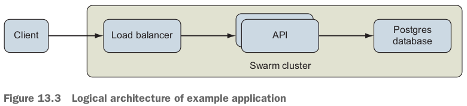
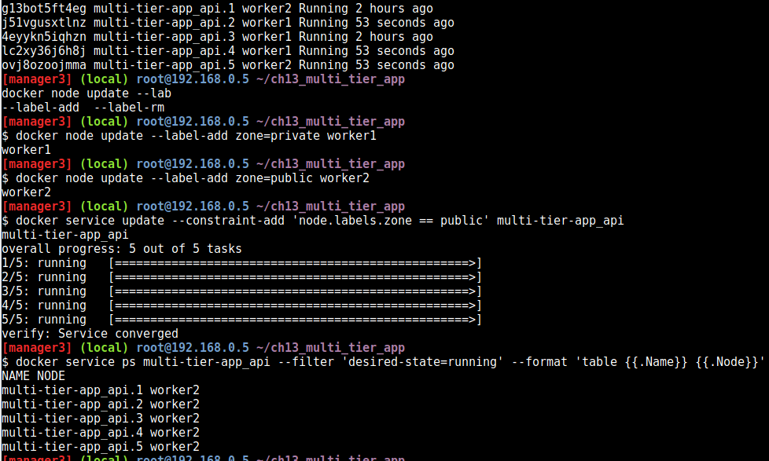

# 13.1 Clustering with Docker Swarm

- 実験できるかな？Clustering. Host一台しかない。

## Introducing Docker Swarm mode

- Swarm schedules tasks according to the application's resource requirements and machine capabilities.
- Swarm clusterの構造：
  - When you **join a Docker Engine to a Swarm cluster**, you specify whether that **machine should be a manager or a worker**.
  - **Managers listen for instructions to create, change, or remove definitions for entities such as Docker services, configuration, and secrets**.
  - The **control plane** connecting the cluster's **Docker Engines** depicts the **communication** of the **desired cluster state and events** related to realizing that state.
  - Swarm deploys and manages lightweight, dedicated **load-balancer** and network routing components to receive and transport network traffic for each published port.

- Most production Swarm deployments should have 3 or 5 nodes in the manager role.
  - Increasing the number of managers will improve availability of the Swarm control plane, but will also increase the time it takes for managers to **acknowledge** a change to the cluster.

- Swarm clusters can scale **reliably** to **hundreds of worker nodes**.

- A larger Swarm cluster can be partitioned into multiple **zones** by using labels, and then you can **place** service instances into the proper zone by using **scheduling constraints**.

## Deploying a Swarm cluster

1. Deploy at least three nodes with Docker Engine installed and running, preferably five.

2. Ensure that network traffic is permitted between the machines on the following ports and protocols:

   a. TCP port 2377 for cluster management communications.

   b. TCP and UDP port 7496 for communication among nodes.

   c. UDP port 4789 for overlay network traffic.

   bとcがどう違うかまだ分かっていない。cはbetween servicesらしい。

3. Initialize a Swarm cluster by running `docker swarm init` on a manager.
4. Record the Swarm cluster join tokens or display them again with `docker swarm join-token`. このステップの意味はまだ分かっていない。join tokenは何？
5. Join the manager and then worker nodes to the cluster with `docker swarm join`.

- The examples in this chapter were created and tested using Playing with Docker (https://labs.play-with-docker.com/).
  - It gives the experience of having a free Alpine Linux Virtual Machine in browser, where you can build and run Docker containers and even **create clusters in Docker Swarm Mode**.
  - Under the hood(フード、頭巾、ずきん), **Docker-in-Docker (DinD)** is used to give the **effect of multiple VMs/PCs**. 
  - The cluster was created using the Play with Docker template that provisions three manager and two worker nodes. 手順はここにある：https://medium.com/@JinnaBalu/play-with-docker-docker-swarm-80a77d64371f
- Play with Dockerで3 Managers and 2 Workersを配置する（レンチをクリック）：
- できたcluster: 
  - worker nodeでDocker commandできない。

# 13.2 Deploying an application to a Swarm cluster

## Introducing Docker Swarm cluster resource types


## Defining an application and its dependencies by using Docker services



- 今回exampleの`docker-compose.yml`:

  ```yaml
  # Docker Compose file reference: https://docs.docker.com/compose/compose-file/
  version: '3.7'
  
  networks:
    public:
      driver: overlay
      driver_opts:
        encrypted: 'true'
    private:
      driver: overlay
      driver_opts:
        encrypted: 'true'
      attachable: true
  
  secrets:
    ch13_multi_tier_app-POSTGRES_PASSWORD: 
      external: true
  
  volumes:
    db-data:
  
  services:
    postgres:
        image: postgres:9.6.6
        networks:
          - private
        volumes:
               - db-data:/var/lib/postgresql/data
        secrets:
          - source: ch13_multi_tier_app-POSTGRES_PASSWORD
            target: POSTGRES_PASSWORD
            # note:  the postgres user (uid: 999) managed by the container needs to read the file
            uid: '999'
            gid: '999'
            mode: 0400
        environment:
            POSTGRES_USER: 'exercise'
            POSTGRES_PASSWORD_FILE: '/run/secrets/POSTGRES_PASSWORD'
            POSTGRES_DB: 'exercise'
        deploy:
            # ensure at most a single instance of postgres is running by
            # deploying a single replica and use 'stop-first' update and rollback strategy
            replicas: 1
            update_config:
              order: 'stop-first'
            rollback_config:
              order: 'stop-first'
            resources:
              limits:
                cpus: '1.00'
                memory: 50M
              reservations:
                cpus: '0.25'
                memory: 50M
  
  
    api:
        image: ${IMAGE_REPOSITORY:-dockerinaction/ch13_multi_tier_app}:api
        networks:
          - public
          - private
        ports:
          - '8080:80'
          # https://docs.docker.com/compose/compose-file/#long-syntax-1
          #- target: 80
          #  published: 8080
          #  protocol: tcp
          #  mode: ingress
        secrets:
          - source: ch13_multi_tier_app-POSTGRES_PASSWORD
            target: POSTGRES_PASSWORD
            mode: 0400
        environment:
          POSTGRES_HOST: 'postgres'
          POSTGRES_PORT: '5432'
          POSTGRES_USER: 'exercise'
          POSTGRES_DB: 'exercise'
          POSTGRES_PASSWORD_FILE: '/run/secrets/POSTGRES_PASSWORD'
          # uncomment to print debugging statements.  note: will print DB connection info to stdout/logs, including password
          #DEBUG: 'true'
        depends_on:
          - postgres
        deploy:
            replicas: 2
            restart_policy:
                condition: on-failure
                max_attempts: 10
                delay: 5s
            update_config:
                parallelism: 1
                delay: 5s
            resources:
              limits:
                cpus: '0.50'
                memory: 15M
              reservations:
                cpus: '0.25'
                memory: 15M
  ```

- A *public* network handling requests coming from external clients, and a *private* network that is more trusted.
  - The only remaining work is to secure communications on the service's published port by using TLS.

- The volume will be local to that Swarm node and not replicated, backed up, or shared elsewhere.
  - create and manage volumes that persist and share data across nodesの方法もある、例えば、Docker Cloudstor, REX-Ray plugins.

- The PostgreSQL process switches to a user with user ID 999 when it starts up (ここは事実を述べている), so the secret file's owner is configured to be readable by that user.

- When using a Docker overlay network, applications connected to a given network will be able to communicate with each other **on *any* port**.
  - *No* firewalls exist between applications attached to a Docker network.

- `ports: - '8080:80'`: Clients of the API server issue requests to port 8080 of the cluster.
  - The Swarm network routing mesh will forward client requests from the edge of the network to a task and ultimately into an API server container on port 80.

- `max_attempts, delay`: Service authors should think through their restart strategies carefully to determine how long and how many attempts Swarm should make to start a service.

## Deploying the application

- command lineからclusterまで：
- 3 managers, 2 workers: 
  - manager2は**Leader**だ。
  - When a cluster management command is issued to `manager1`, it will be **forwarded to the leader for processing**.

- secretを作って、deployできたら、`OPEN PORT`にport numberが出た：
  - `8080`をクリックすることは、自分のHostで試した時の`localhost:8080`と同じだ。
  - You can also **use a `curl` command to issue an HTTP request** from one of the cluster nodes to port 8080: `curl http://localhost:8080`.
- When you view service logs(例えば今manager1で見ている), Docker Engine connects to the engines in the cluster where its tasks have run, retrieves the logs, and returns them to you.

- `docker service ps`はcluster全nodeのcontainerを表示する。`docker container ps`は現在nodeにあるcontainerのみリストする：
- When you make HTTP request several times, you should see **different container IDs serving your requests**: 

# 13.3 Communicating with services running on a Swarm cluster

## Routing client requests to services by using the Swarm routing mesh

- まずclientというのはcluster外部のUserノードだ。
- **The Swarm *routing mesh* provides a simple way to expose a service running on a container cluster with the outside world, which is one of Swarm's most compelling features**.

- 今回の例のnetwork構造：
  - Swarm sets up a **listener** on **each node of the cluster** for **each published service port**.
    - You can configure the port to listen for TCP, UDP, or both kinds of traffic. やり方分からない。
  - **Client applications** can connect to this port on any cluster node and issue requests.
- Swarm implements this listener with a combination of Linux `iptables` and `ipvs` features.
  - An `iptables` **rule** redirects traffic to a dedicated virtual IP (VIP) allocated for the service.
  - The **service's** dedicated VIP is **made available** across the swarm cluster by using a Linux kernel feature called *IP Virtual Server*, `ipvs`.
  - IPVS is a **transport-layer load balancer** that forwards requests for TCP or UDP services to their real endpoints.
  - IPVS is **not** an application-layer load balancer for protocols such as HTTP.
  - Swarm creates a VIP for each published Service port using `ipvs`.
  - It then **attaches the VIP to the `ingress` network**, which is **available across the Swarm cluster**. つまり上記の`db VIP`も実は`ingress` networkに直接に付いているでしょう？

- 今回の例のFlowは：When traffic reaches a cluster node on TCP port 8080, `iptables` reroutes that traffic to the `api` service VIP attached to the `ingress` network.
  - IPVS forwards traffic from the VIP to the ultimate endpoints, which are Docker service tasks.

- Swarm's routing mesh will handle the connection from the client, **connect to a healthy service task**, and forward the client's request data to the service task. 
  - If the service has been scaled to zero replicas or no healthy tasks exist, the routing mesh will **refuse to initiate the network connection**.

- `multi-tier-app_api`のPublishModeはingress. 
- Swarm routes and load-balances connections at the IP layer, it means client *connections* will be balanced across backend service tasks, not *HTTP requests*.
  - When one client issues many requests over a single connection, **all of those requests will go to a single task**, and will not be distributed across all backend service tasks as you might expect.
  - Docker Enterprise Edition supports load balancing of the HTTP protocol.

## Working with overlay networks

- *overlay network* resource: 
- まずはoverlayはdriverタイプの一つ。その他のdriverタイプは、bridge, host, null.
  - また、networkのSCOPEを見ると、ingress overlay networkのscopeのみswarmになっていて、bridge, host, nullのscopeは全部local.

## Discovering services on an overlay network

- Docker services use the Domain Name System (DNS) to discover the location of other Docker services on a Docker network that they share.
  - A program can connect to a Docker service if it knows the name of that service. 
- 今回の例だと、`api` serviceに`POSTGRES_HOST`環境変数に`'postgres'`サービス名が設定されている。
  - When an `api` task creates a connection to the PostgreSQL database, it will resolve the `postgres` name to an IP by using DNS.
- Containers attached to a Docker overlay network are automatically **configured** by Docker to perform DNS lookups via a special resolver, 127.0.0.11.
- 実験：1.`private` networkにattachして、serviceをpingする（api, postgresともにpingできた）。2. 直接にapiにHTTPをissueする、できた。3. postgresに接続する、できた：
  - postgresは何のportもpublishしていないのに、なぜpostgresに接続できた？
    - Communication between containers attached to a given Docker network is ***completely* open**.
    - Because the PostgreSQL server is listening on port 5432 and is attached to the `private` network, any other container attached to that network can connect to it.
  - `private`にattachできているのは、`private`を`attachable`に設定したから、compose yamlに。普段設定しない。

## Isolating service-to-service communication with overlay networks

- Overlay networks are lightweight and easy to create with Swarm so they can be used as a design tool to create secure **application communication topologies**.

- There is no such thing as using a network identity to authenticate and authorize traffic.

- どうやってlogging service(全てのserviceが利用するはず)をdeployする？Deploy the centralized logging service or other shared services as a Docker service that **publishes a port**.
- この考えで実験：1. 簡単なlogging serviceを作って、port 8000をpublishする。2. 任意のnodeのport 8000でlogging serviceにデータを送って、そのデータはそのままprintされる。
- また実験：1. private networkにattachして、echo logging serviceにpingして、できない：
  - これは当たり前らしい。logging serviceはprivate overlay networkにattachされていないから。つまりlogging serviceとprivate networkをisolateできた！
- **The `api` service needs to connect to the port published by the `echo` service at the cluster's edge, just like processes running outside the Swarm cluster**.

- **The only route to the `echo` service is through the `ingress` network**. (implicit `ingress` network join)

## Load balancing

# 13.4 Placing service tasks on the cluster

- 今更だけど、test Swarm cluster：

## Replicating services

- reconciliation loop: 
- rollbackは一回しかできない。2回めrollbackすると、rollbackをrollbackしちゃう。
- 普段のarchitectural goals
  - Reserve manager nodes for running the Swarm control plane so they have dedicated compute resources. 今は`api` containerがmanager nodeにも動いている。
  - **Isolate services that publish ports because they are easier to attack than `private` services**.

## Constraining where tasks run

- Docker services provide a feature called *placement constraints* that allow you to control the nodes a service's tasks can be assigned to.
- We can reconfigure the availability of nodes by using the `docker node update` command's `--availability` option.
  - nodeの3種類availability: `active, pause, drain`.
  - `pause`: existing tasks will continue to run, but no new tasks will be scheduled to the node.
  - `drain`: existing tasks will be shut down and restarted on another node, and no new tasks will be scheduled to that node.

- manager1, manager2, manager3を全部drainに設定すると、tasksは全部worker nodeに振られた：
- When a service is constrained to running in a node, we say it has *affinity* for that node.
- When it must not run on a node, we say it has *anti-affinity* for that node.

- worker1をprivate zoneにして、worker2をpublic zoneにして、apiをpublic zoneのみ（worker2）に振ると、api containerが全部worker2に移された：
- postgresをprivate zoneにする実験。updateする前に、3回`/counter` endpointにrequestする：
- postgresをprivate zoneに移して、また`/counter`にアクセスすると：
  - **The counter has been reset. Where did out data go?**
  - It was lost because **the `postgres` database used a `db-data` volume that is local to a cluster node**.
  - Strictly speaking, the data wasn't lost.

- constraintsをdocker-compose.ymlに書きたいなら（上記の課題がないように、具体的なhostにpostgresを置く）：

  ```yaml
  services:
    postgres:
      # ... snip ...
      deploy:
        # ... snip ...
          placement:
            constraints:
              - node.labels.zone == private
              - node.hostname == worker1
  ```

## Using global services for one task per node

- Deploy one service task to each node in the Swarm cluster.

- logging serviceをglobal modeに設定したら、各worker nodeに動いている：

## Deploying real applications onto real clusters

# 復習項目

1. Administrators define cluster-scoped resources such as networks, configurations, and secrets that are shared by services.
2. Services define their own service-scoped resources in addition to using cluster-scoped resources.
3. Swarm managers store and manage updates to the desired state of the cluster.
4. Swarm managers converge actual application and resource deployments to the desired state when sufficient resources are available.
5. Service tasks are ephemeral(はかない), and service updates cause tasks to be replaced with new containers.
6. Service tasks can be scaled to the desired state as long as the cluster has enough resources available on nodes that fulfill the service's placement constraints.