- The most difficult part of learning how to apply containers is in **translating the needs** of the software you are trying to isolate.
  - Containers for each of those programs will need different configurations.

- In this chapter, you'll install a web server called NGINX（エンジンエックス）.
  - *Web servers* are programs that make website files and programs accessible to web browsers over a network.
  - You're not going to build a website, but you are going to **install and start a web server with Docker**.

# 2.1 Controlling containers: Building a website monitor

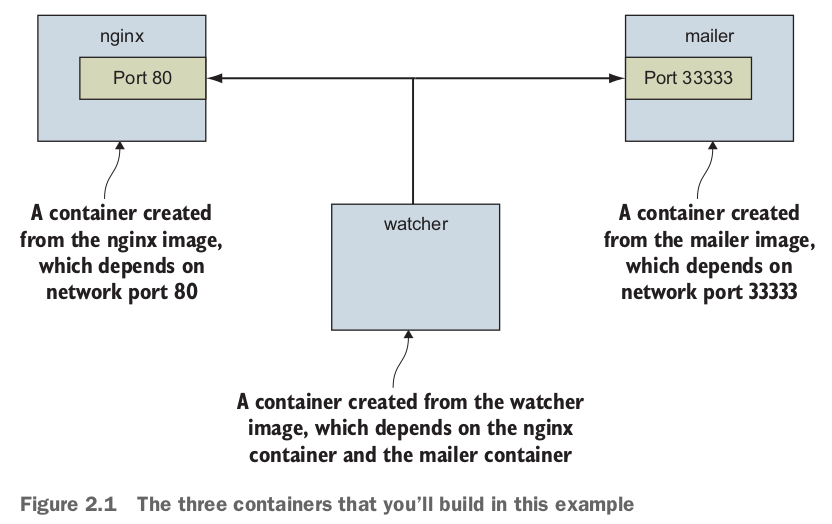

- `nginx`や`mailer` will run as **detached**（一戸建て） **containers**.
  - *Detached* means that the container will **run in the background**, without being attached to any input or output stream.
  - C++のスレッドのdetachedと似てる意味。`std::thread`と分かれたスレッドだ。確かに見た目でもdetachはattachの対義語だね。

- `watcher` runs as a monitoring agent in an **interactive container**（terminalを使う）.
- Both the mailer and watcher agent are **small scripts** created for this example.

## Creating and starting a new container

- Docker calls the collection of files and **instructions** needed to run a software program an *image*.
- Download and install an image for NGINX from Docker Hub.
  - The NGINX image is what Docker Inc. calls a ***trusted repository***.
  - Generally, the person or foundation that publishes the software controls the trusted repositories for that software.

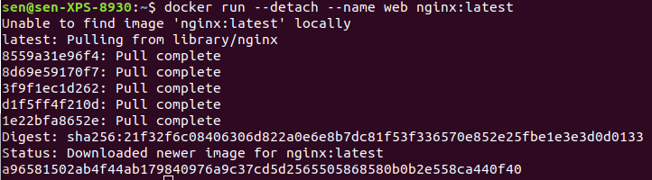

- `a96581502ab4f44ab179840976a9c37cd5d2565505868580b0b2e558ca440f40`の意味：unique identifier of the container that was just created to run NGINX.
  - It's common for users to **capture this output with a variable for use with other commands**.
- `--detach`の意味：the program started but **isn't attached to your terminal**.
  - **Server software** is generally run in detached containers because it is rare that the software depends on an attached terminal.
  - Program that sits quietly in the background: *daemon* or *service*.
    - A daemon generally interacts with other programs or humans **over a network** or some other communication channel.

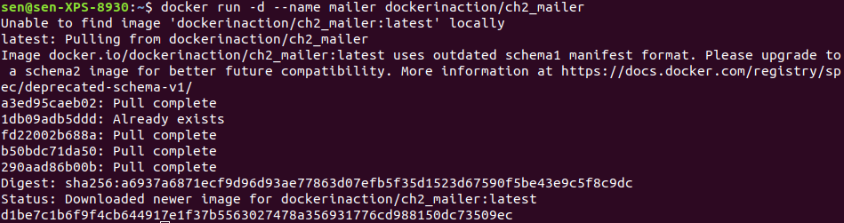

- 本にしたがってやるときはよくdeprecated（非推奨、すいしょう）メッセージが出るね。。。

## Running interactive containers

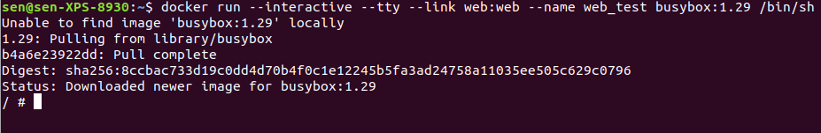

- `--interactive`: keep the standard input stream (stdin) open for the container even if no terminal is attached.
- `--tty`: allocate a virtual terminal for the container, which will allow you to pass signals to the container.

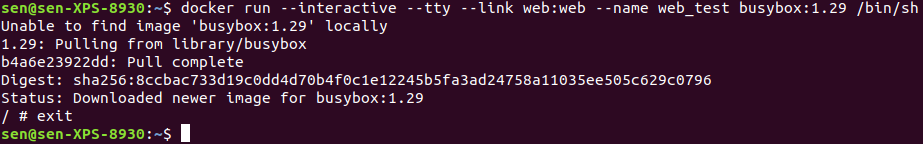

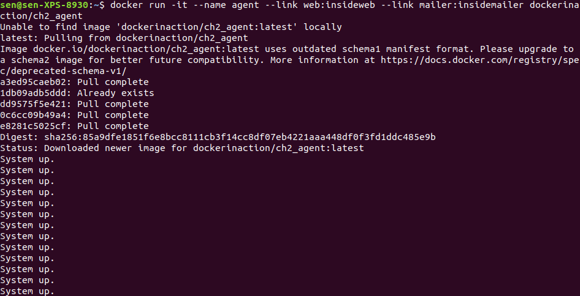

- test the web container every second and print a message.
  - Ctrlを押しながら、P, Qで**detach your terminal from the container**.

## Listing, stopping, restarting, and viewing output of containers

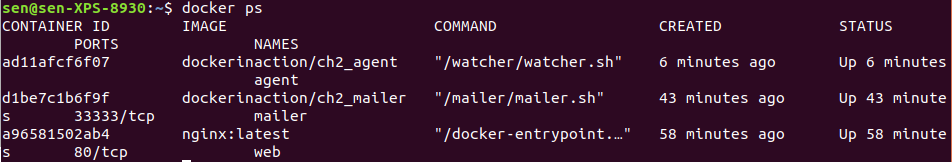

- COMMAND: The command executed in the container.
- NAMES: The name of the container.

```bash
docker restart web
docker restart mailer
docker restart agent
```

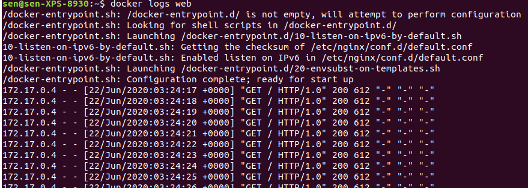

- Each time the agent tests the site, one of these lines will be written to the log.
- でもdocker logsは危ない。The log is never rotated or truncated by default, so the data written to the log for a container will remain and grow as long as the container exists.
  - **A better way to work with log data uses volumes**.

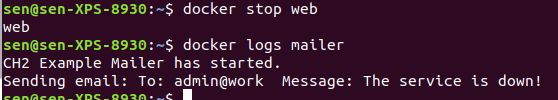

- Test that the agent will notice when the web container stops.
- The `docker stop` command tells the **program with PID 1** in the container to halt.

# 2.2 Solved problems and the PID namespace

- A *PID namespace* is a set of unique numbers that identify processes.
- A container's PID namespace isolates processes in that container from processes in other containers.

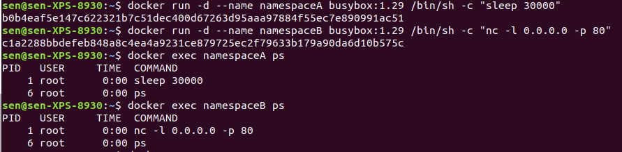

- `docker exec`: **run additional processes in a running container**.
  - In this case, the command you use is called `ps`, which shows all the running processes and their PID.

- Without a PID namespace, the process running inside a container would share the same ID space as those in other containers or on the host.

## Dockerがconflictを解決できる

- *port conflict*: 同じcomputerで2回NGINXを立ち上げることはできない。別々のcontainerにやればできる。
- common conflict problems:
  - Two programs want to use different versions of a globally installed library.
  - A second program you installed modified an environment variable that another program uses. Now the first program breaks.
- Docker solves software conflicts with such tools as Linux namespaces, resource limits, filesystem roots, and **virtualized network components**.

# 2.3 Eliminating metaconflicts: Building a website farm

- *metaconflicts*: conflicts between containers in the Docker layer. 例えばcontainerのnameは重複しちゃダメ。

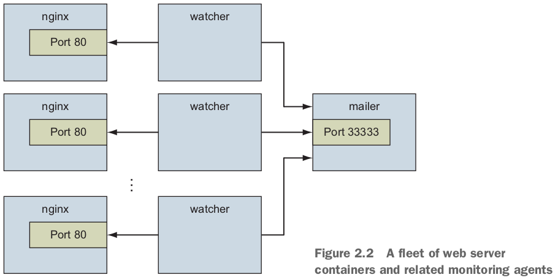

## Flexible container identification

- create a containerでもstartしない：`docker create`.

- Write the ID of a new container to a known file.

  ```bash
  docker create --cidfile /tmp/web.cid nginx
  cat /tmp/web.cid
  ```

  - One reason to use CID files instead of names is that CID files can be shared with containers easily and renamed(?) for that container.

- Get the truncated ID of the last created container.

  ```bash
  CID=$(docker ps --latest --quiet)
  echo $CID
  
  CID=$(docker ps -l -q)
  echo $CID
  ```

- Docker also generates human-readable names for each container.
  - The naming convention uses a personal adjective; an underscore; and the last name of an influential scientist, engineer, inventor, or other such thought leader（ソートリーダー、思想的リーダー）.
  - 例えば、`compassionate（思いやりのある、哀れみ深い（あわれみぶかい）、情け深い）_swartz（Aaron Swartz）, hungry_goodall, distracted（気が散る、そらされた）_turing`。

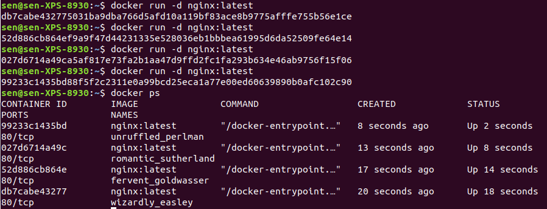

- `unruffled(騒ぎ立てない、平穏な)_perlman(Itzhak Perlman、ヴァイオリニスト、指揮者、音楽指導者), romantic_sutherland, fervent(強烈な、熱烈な)_goldwasser(Shafrira Goldwasser), wizardly_easley`.

## Container state and dependencies

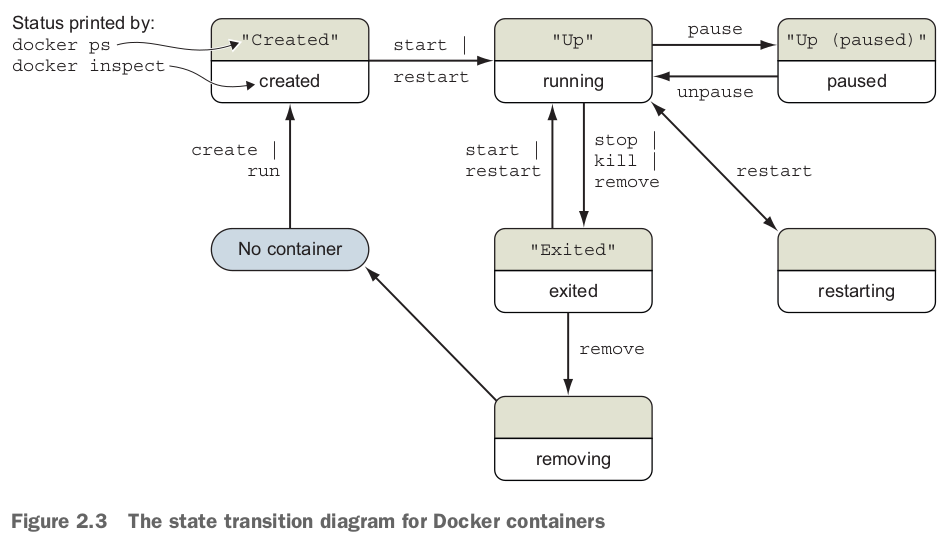

- `docker ps` shows only **running containers** by default.
- To see all the containers: `docker ps -a`.

# 2.4 Building environment-agnostic(不可知論者) systems

- computing environmentのspecialization:
  - global-scoped dependencies (for example, known host filesystem locations).
  - hardcoded deployment architectures (environment checks in code or configuration).
  - data locality (data stored on a particular computer outside the deployment architecture).
  - 目標：**strive to minimize these things**. **build low-maintenance systems**.
- Dockerがenvironment-agnostic systemsをbuildする３つ手法：
  - **Read-only filesystems**.
  - **Environment variable injection**.
  - **Volumes**. *Chapter 4*.
- Situation: WordPress uses MySQL to store most of its data, so it's a good idea to provide the container running WordPress with a read-only filesystem to ensure **data is written only to the database**. データが全部MySQLに保存されるので、filesystemに書き込む必要がない。

## Read-only filesystems

- read-only filesystemsを利用するメリット：
  - The container **won't be specialized** (特殊化する) from **changes to the files** it contains.

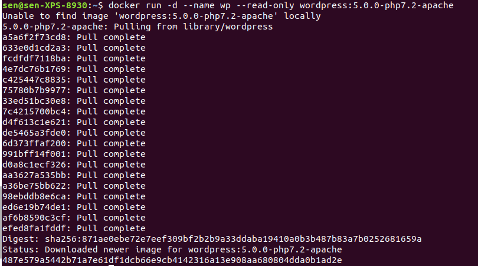

- Check if the container is running: `docker inspect --format "{{.State.Running}}" wp`. 結果false.
  - The `docker inspect` command will display all the metadata (a JSON document) that Docker maintains for a container.
  - 動いていない理由：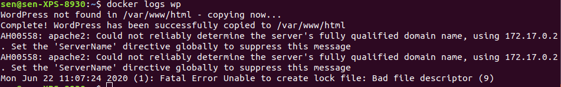

- Run a WordPress container with a writable filesystem so that Apache is free to write where it wants: `docker run -d --name wp_writable wordpress:5.0.0-php7.2-apache`.
  - Check where Apache changed the container's filesystem: 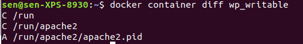
  - filesystemというのは、containerのfilesystem!
  - Since this is an expected part of normal application operation, make an exception to the `read-only` filesystem. 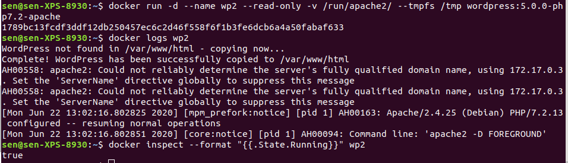
    - Allow the container to write to `/run/apache2` by using a **writable volume mounted from the host**. まだ分かっていないが、volumeを勉強したら、理解できるでしょう。
    - Supply a temporary, in-memory, filesystem to the container at `/tmp` since Apache requires a writable temporary directory.

- Install MySQL by using Docker.
- Create a different WordPress container that's linked to this new database container: 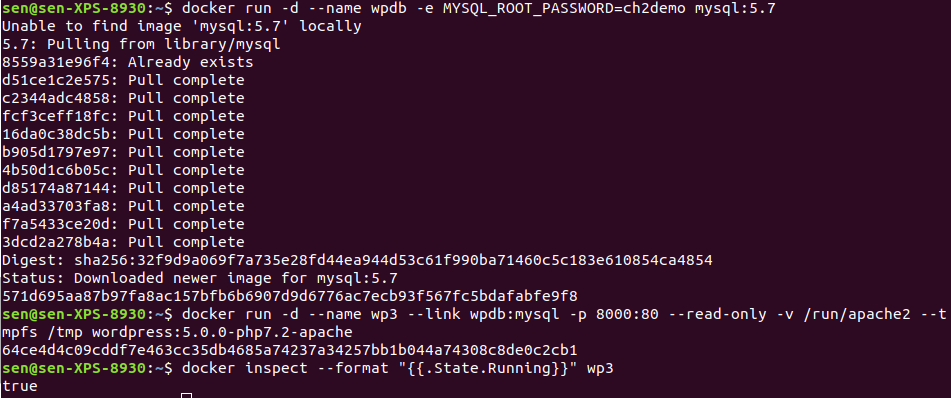
  - `-p 8000:80`: **Directs traffic from host port 8000 to container port 80**.

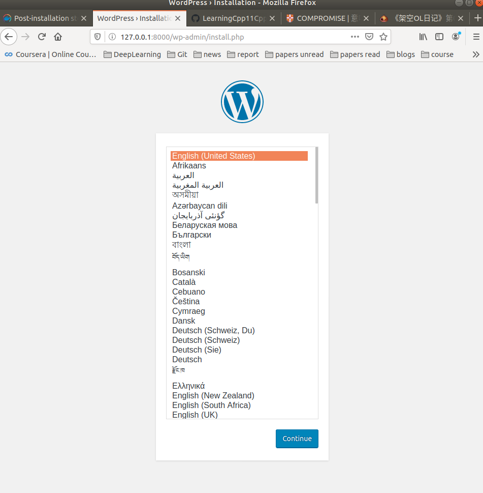

- 最終的に下記のbashになる（mailer, agentを加えて）

  ```bash
  #!/bin/sh
  
  DB_CID=$(docker create -e MYSQL_ROOT_PASSWORD=ch2demo mysql:5.7)
  docker start $DB_CID
  
  MAILER_CID=$(docker create dockerinaction/ch2_mailer)
  docker start $MAILER_CID
  
  WP_CID=$(docker create --link $DB_CID:mysql -p 80 \
  	--read-only -v /run/apache2/ --tmpfs /tmp \
  	wordpress:5.0.0-php7.2-apache)
  docker start $WP_CID
  
  AGENT_CID=$(docker create --link $WP_CIP:insideweb \
  	--link $MAILER_CID:insidemailer \
  	dockerinaction/ch2_agent)
  docker start $AGENT_CID
  ```

  - databaseを起動して、mailerを起動して、wordpressをdatabaseにlinkしてから起動して、agentはwordpressやmailerにlinkして、起動する。

- By using a read-only filesystem and linking WordPress to another container running a database, you can be sure that the **container running the WordPress image will never change**.
  
  - This means that if there is ever something wrong with the computer running a client's WordPress blog, you should be able to start up another copy of that container elsewhere with no problems.

## Environment variable injection

- Environment variables are key/value pairs that are made available to programs through their **execution context**. ここで使うのは多分containerのenvironment variablesだ。
- Programs that know to expect important information through environment variables can be configured at container-creation time.
- Rather than using linking to satisfy WordPress's database dependency, inject a value for the `WORDPRESS_DB_HOST` variable.

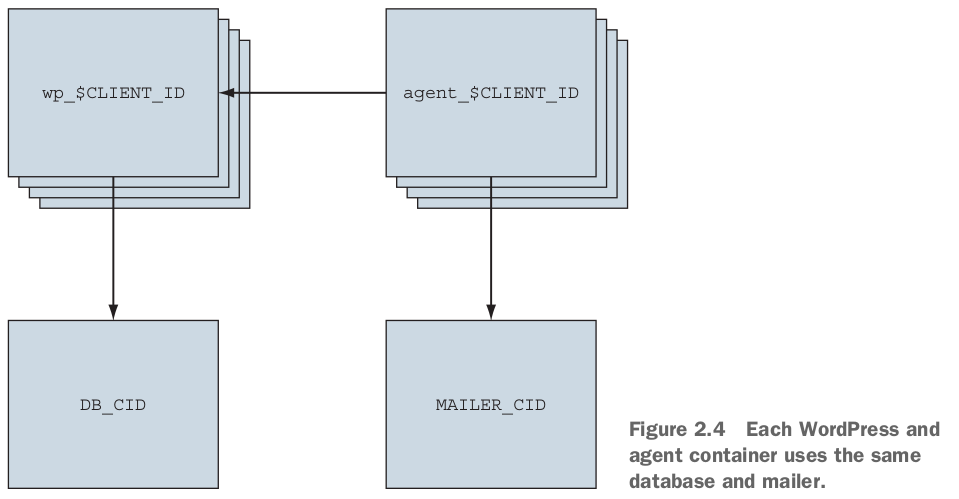

- 上記図の結果を得るように、`CLIENT_ID`を受けるbashを作る。また、`DB_CID, MAILER_CID`はbashを実行する前にexportする。`wo_$CLIENT_ID, agent_$CLIENT_ID`を新規するコマンドは大体前sessionのbashと同じ。ただ`MYSQL_ROOT_PASSWORD, WORDPRESS_DB_NAME`などのenvironment variable injectionも入る。

# 2.5 Building durable containers

## Automatically restarting containers

- `--restart`。
- dockerの再起動strategyは**exponential backoff** strategy.
  - double the previous time spent waiting on each successive attempt. 
  - containerが待っている時なんのコマンドも実行できない。That could be a problem if you need to run diagnostic programs in a broken container.

## Using PID 1 and init systems

- *init system*の定義：a program used to **launch** and maintain the **state** of **other programs**.
  - Any process with **PID 1** is treated like an init process by the Linux kernel (even if it is not technically an init system).
  - It is common practice to use real init systems inside containers when that container will run multiple processes or if the program being run uses child processes.
- Docker provides an image that **contains a full LAMP (Linux, Apache, MySQL, PHP) stack** inside a **single container**.
  - このcontainerが利用しているinit systemは`supervisord`.
  - lampを起動する：`docker run -d -p 80:80 --name lamp-test tutum/lamp`
  - 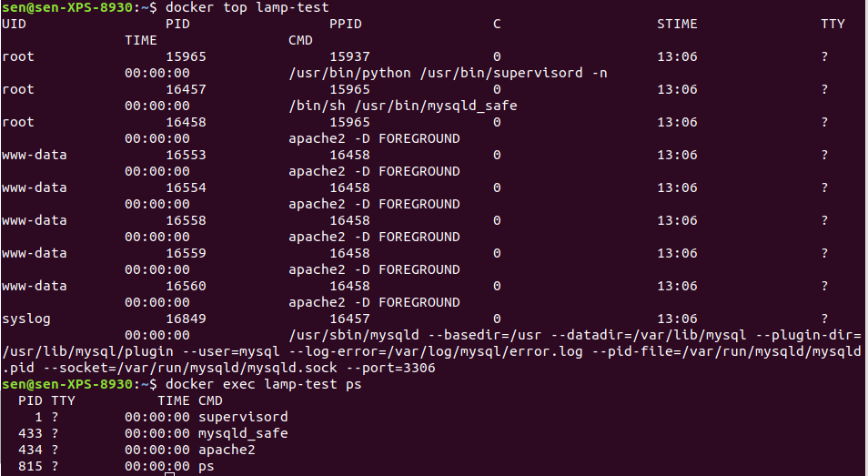

- apache2をkillしてみると、`supervisord`が自動的に`apache2`を再起動する（logの最後の3行）：
  - 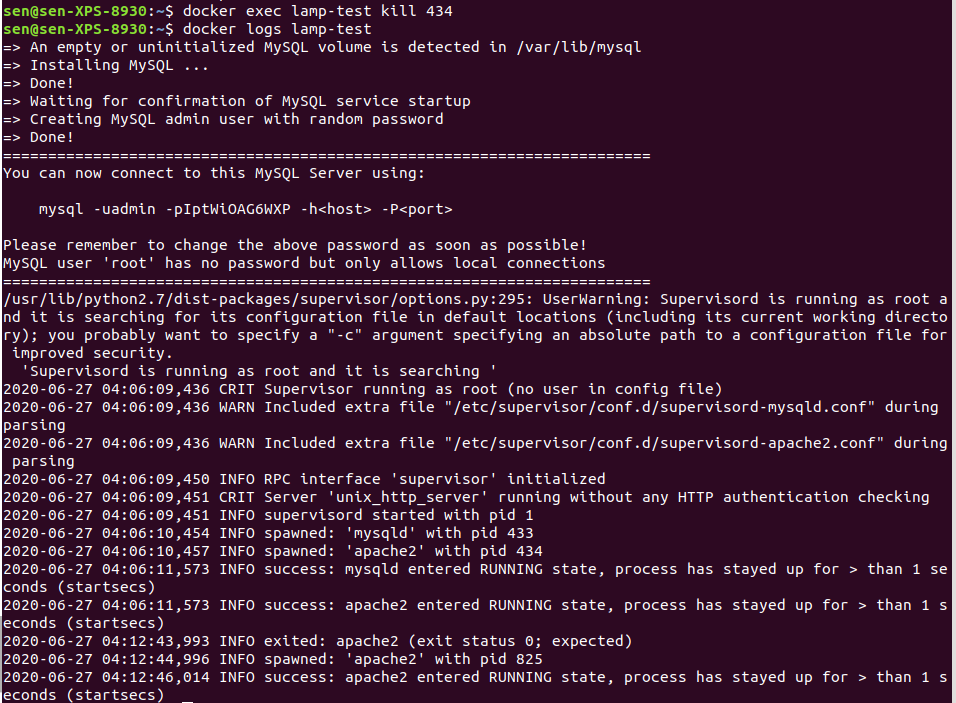

- unit systemのalternative: startup script. Docker上、これは*entrypoint*という。

# 2.6 Cleaning up

- **Ease of cleanup is one of the strongest reasons to use containers and Docker**.
- 不要なcontainerを削除すべき理由：All **containers** use **hard drive space** to store logs, container metadata, and files that have been written to the container filesystem.
  - All containers also consume resources in the global namespace such as container names and **host port mapping**.
- `docker rm -f`（`SIG_KILL`）より、優先的に`docker stop`（`SIG_HUP`）を使う。
- `--rm`: automatically remove the container as soon as it enters the exited state.

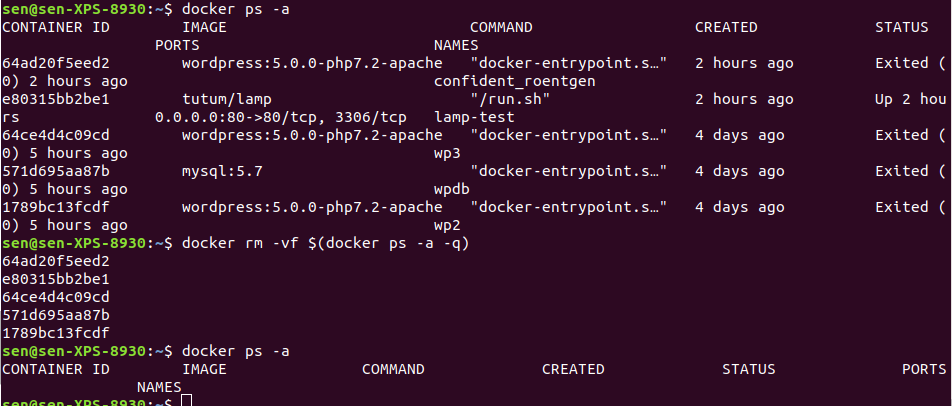

# 復習項目

- Containers can be run with virtual terminals attached to the user's shell or in detached mode.
- By default, every Docker container has its own PID namespace, isolating process information for each container.
- Docker identifies every container by its generated container ID, abbreviated container ID, or its human-friendly name（指定するか、指定しない場合はDockerが作る）
- All containers are in any one of six distinct states: created, running, restarting, paused, removing, or exited.
- The `docker exec` command can be used to run additional processes inside a running container.
- A user can **pass input or provide additional configuration** to a process in a container by specifying **environment variables** at container-creation time.
- Using the `--read-only` flag at container-creation time will mount the container filesystem as read-only and prevent specialization of the container.
- A container restart policy, set with the `--restart` flag at container-creation time, will help your systems automatically recover in the event of a failure. 再起動までの待つ時間はexponential backoff.
- Docker makes cleaning up containers with the `docker rm` command as simple as creating them.