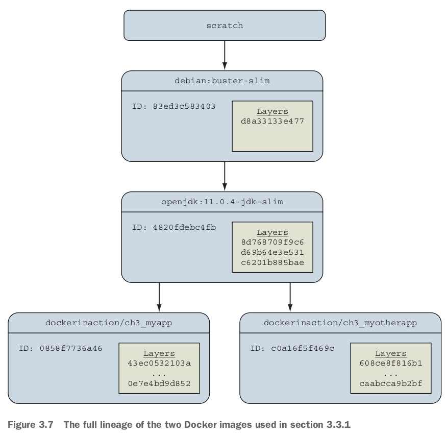

- Identifying software,
  - Software is distributed using images. **Repositories hold images**. Repositories and tags are used to identify images.
- Finding and installing software with Docker Hub, Installing software from alternative sources, Understanding **filesystem isolation**, Working with images and **layers** (an important concept when dealing with images).

- Docker imagesをinstallする3方法！
  - Using **Docker registries**.
  - Using **image files with `docker save` and `docker load`**.
  - **Building images with Dockerfiles**.

# 3.1 Identifying Software

## What is a named repository?

- A repository can hold several images.
- Each image in a repository is **identified uniquely with tags**.
  - 例えば、In chapter 2, you installed an image from the NGINX repository on Docker Hub that was identified with the `latest` tag. （`nginx:latest`, 前章メモを参考）
  - `nginx:latest`は*composite key*という。

# 3.2 Finding and installing software

- ***Indexes***: search engines that catalog repositories.
  - by default, `docker` is integrated with **an index named Docker Hub**.
- Docker Hub is located at the host `docker.io`.

## Working with Docker registries from the command line

- imageをregistry（例えばDocker Hub）にpublishする方法：
  - Use the command line to **push images** that they built independently and on their own systems.
  - **Make a Dockerfile publicly available** and use a continuous **build system** to publish images.
  - 後者のほうがいい！理由：Dockerfile is available for examination prior to installing the image.

- Most registries will require **image authors** to authenticate before publishing and enforce authorization checks on the repository they are updating. Git（GitHub）と一緒のところは多い！
  - `docker login, docker logout`.

## Using alternative registries

- Docker Hubを使うのと同じ、例えば：`docker pull quay.io/dockerinaction/ch3_hello_registry:latest`.

## Working with images as files

- `docker save`でimageからimage fileを作れる：

- `docker save`: if you omit the `-o` flag, the resulting file will be streamed to the terminal.
- `docker load`: if without `-i`, Docker will use the standard input stream instead of reading the archive from a file.

- Dockerfileに関するwarm up: Another popular project distribution pattern uses **bundles of files with installation scripts**.
  - This approach is popular with **open source projects** that use **public version-control repositories for distribution**.
  - In these cases, you work with a file, but the file is not an image; it is a Dockerfile.

## Installing from a Dockerfile

- A ***Dockerfile*** is a **script** that describe **steps** for Docker to take to **build a new image**.
- A common pattern is to **distribute a Dockerfile with software from common version-control systems like Git or Mercurial**.

- `-t`: the repository where you want to install the image. （docker imagesの結果を参考）
- このbuild方法は２つデメリットがある：
  - the build process might take some time.
  - dependencies may drift between the time when the Dockerfile was authored and when an image is built on a user's computer. これは良く分かっていない。Dockerfileが更新されてないこと？
  - These issues make distributing build files less than an ideal experience for a user.

## Using Docker Hub from the website

- https://hub.docker.com/
- accountを作った。

# 3.3 Installation files and isolation

- *layer*の概念と*image*の概念：
  - Most of the time what we've been calling an image is **actually a collection of image layers**.
  - A *layer* is **set of files and file metadata** that is packaged and distributed as an **atomic unit**.
  - Internally, **Docker treats each layer like an image**, and layers are often called *intermediate images*.
  - **Most layers build upon a parent layer by applying filesystem changes to the parent**.
    - For example, a layer might update the software in an image with a package manager by using `apt-get update`. The resulting image contains the combined set of files from the parent and the layer that was added.

## Image layers in action

- 2番めのpullは1番めよりめっちゃ早い。理由：2番めimageをpullする時、先頭の４つlayerは**Already exists**!

- From the perspective of a software or image author, **this ability should play a major factor in your image design**.

## Layer relationships

- imageが複数layersを含んでいる。またimage idとlayer idは全然関係ない。また、違うimageの中にも同じlayersは存在しない！

- Because **Docker uniquely identifies images and layers**, it is able to recognize **shared image dependencies between applications** and avoid downloading those dependencies again.
  - This is done without requiring any coordination between applications at runtime, **only build time**.

## Container filesystem abstraction and isolation

- ３つツールで達成：union filesystem, `chroot`, MNT namespace.
- **Programs running inside containers know nothing about image layers**.
- From the perspective of the container, it has exclusive copies of the files provided by the image.
  - by *union filesystem (UFS)*.

- The filesystem is used to **create mount points on your host's filesystem that abstract the use of layers**.
- When Docker creates a container, that new container will have its own MNT namespace, and a new **mount point** will be created for the container to the image.

- `chroot` is used to make the root of the image filesystem the root in the container's context.

## Benefits of this toolset and filesystem structure

- 最大メリット：Common layers need to be installed only once. virtual machineより非常に強いところ。
  - By contrast, most virtual machine technologies will store the same files as many times as you have redundant virtual machines on a computer.

- Layers provide a coarse tool for managing dependencies and separating concerns.
  - This is especially handy for software authors.
- Easy to create software specializations when you can layer minor changes on top of a basic image.
  - Providing specialized images helps users get exactly what they need from software with minimal customization. **This is one of the best reasons to use Docker**.

## Weaknesses of union filesystems

- Union filesystems are in a position where they oftenn need to **translate between the rules of different filesystems**. 時々できない。
- Union filesystems use a pattern called *copy-on-write*, and that makes implementing memory-mapped files (the `mmap` system call) difficult.

# 復習項目

- Human users of Docker use repository names to communicate which software they would like Docker to install.
- Docker Hub is the default Docker registry. You can find software on Docker Hub through either the website or the `docker` command-line program（この探す方法はまだ分かっていない）.
- The `docker` command-line program makes it simple to install software that's distributed through alternative registries or in other forms.
- The image repository specification includes a registry host field.
- The `docker load` and `docker save` commands can be used to load and save images from TAR archives.
- Distributing a Dockerfile with a project simplifies image builds on user machines.
- Images are usually related to other images in parent/child relationships.
  - These relationships form layers.
  - When we say that we have installed an image, we are saying that we have installed a target image and each image layer in its lineage.
- **Structuring images with layers enables layer reuse and saves bandwidth during distribution and storage space on your computer and image distribution servers**.