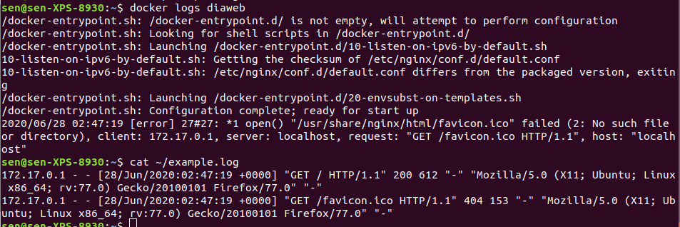
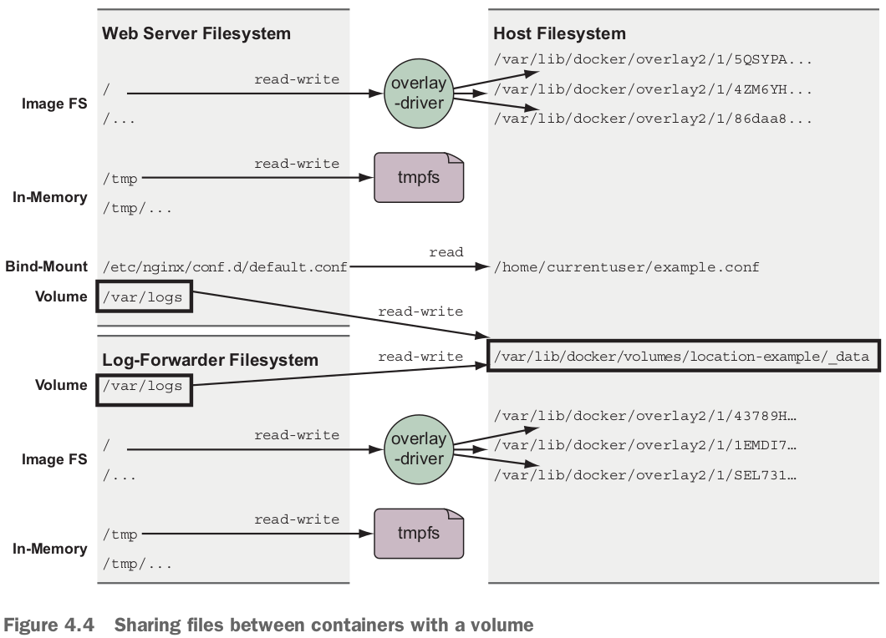

テーマ：**mount points**, **share data between the host and a container**, **share data between containers**, temporary, in-memory filesystems, **managing data with volumes**. dataを扱う！

- The union filesystem is not appropriate for working with **long-lived data** or sharing data between containers, or a container and the host.

# 4.1 File trees and mount points

- Unlike other operating systems, **Linux unifies all storage into a single tree**.
  - **Storage devices such as disk partitions or USB disk partitions are attached to specific locations in that tree**.
  - **These locations are called *mount points***.
  - A mount point defined the location in the tree, the access properties to the data at that point (writability), and the **source of data mounted** at that point (a specific hard disk, USB device, memory-backed virtual disk).

- Mount points allow software and users to use the file tree in a Linux environment **without knowing exactly how that tree is mapped into specific storage devices**.
- The **image** that a container is created from is **mounted at that container's file tree root**, or at the `/` point, and that every container has a different set of mount points.
  - container file treeの概念は大事！

- Mount **nonimage-related** storage at other points in a container file tree. つまりimage-related storageと違うmount pointでmountする。
- Three most common types of storage **mounted into containers**:
  - Bind mounts.
  - In-memory storage.
  - Docker volumes.

- starts with the files from the image, adds an in-memory `tmpfs` at `/tmp`, bind-mounts a configuration file from the host, and writes logs into a **Docker volume on the host**.
  - Image FSやVolumeは全部dockerのmount pointにある。
  - In-Memoryはhostのfile treeと関係ない。
  - Bind-Mountはhostのどのmount pointにもアクセスできる。
- All three types of mount points can be created using the `--mount` flag on `docker run, docker create`.

# 4.2 Bind mounts

- When working with containers, bind mounts attach a user-specified location on the host filesystem to a specific point in a container file tree.
- 例：running a web server that depends on sensitive configuration on the host and emits access logs that need to be forwarded by log-shipping system. 

- hostにconfigファイルやlogファイル（空）を用意して、bind mountでcontainerのfilesystemと繋げる：
  - config fileの意味：Server will offer the NGINX default site at `http://localhost/`, and access logs for that site（例えば次のFirefoxでのアクセス）will be written to a file **in the container** at `/var/log/nginx/custom.host.access.log`.
  - `src` and `dst` define the source location on the **host file tree** and the destination location on the **container file tree**.

- 今example.logはまだ空です。localhostをアクセスする：

- 今docker logsとexample.logの内容を見比べると：
  - Firefoxでnginx hello-world pageにアクセスlogは全部example.logに流れた！docker logsは記録していない。

- Make mount points read-only: 
  - mount pointsがread-only, つまりcontainer file tree側のファイルがread-onlyになる。
  - sedはlisten 80をlisten 8080に変更しよう、エラー。

- Bind mountの問題：
  - host file treeの方のパスはportable（ポータブル）ではない。
  - create an opportunity for **conflict with other containers**.

# 4.3 In-memory storage

- **memory-based filesystem**!

- コマンドの意味：
  - **Create an empty `tmpfs` device** and attaches it to the new container's file tree at `/tmp` .
    - Any files created under this file tree will be **written to memory instead of disk**.

- `tmpfs on /tmp type tmpfs (rw,nosuid,nodev,noexec,relatime)`の一行の意味：
  - `nosuid`: `suid` bits will be ignored on all files in this tree.
  - `nodev`: No files in this tree will be interpreted as special devices.
  - `noexec`: No files in this tree will be executable.
  - `relatime`: File access times will be updated if they are older than the current modify or change time.
- 今の`tmpfs`はno size limits and world-writable (file permission `1777`).
  - 制限するために、`tmpfs-size, tmpfs-mode`を使う。

# 4.4 Docker volumes

- Docker volumes are **named filesystem trees** managed by Docker.
  - They can be implemented with disk storage on the host filesystem, or **cloud storage**. つまりvolumeのおかげでデータとプログラムはdecouple（切り離す）できた！データとhostもdecoupleできた！もしかしてvolumeもglobal unique idあるの？？
- Using volumes is a method of **decoupling storage from specialized locations on the filesystem** that you might specify with bind mounts.

- bind-mountの例と違うところはただHost Filesystemでのlog dataの保存位置。
  - bind-mountでは`/home/currentuser/example.log`.
  - volumeでは`/var/lib/docker/volumes/location-example/_data`.

- volumeのcreateやinspect: 
  - `--driver local`: specify the "local" plugin. pluginの意味はまだ分かっていない。labelの意味もまだ分かっていない。
    - 「Using volumes with a NoSQL database」で：Adding label metadata to your volumes can help you organize and clean up volumes later.
    - labelの形はkey=valueです。
  - 多分pluginはどこにvolumeを置くかを決める。

- By using Docker volumes, you're simply stating, "I need a place to put some data that I'm working with."
  - This is a requirement that Docker can fill on **any machine with Docker installed**.

- タスク：Share volumes between containers without exposing the exact location of managed containers.

## Volumes provide container-independent data management

- imagesやvolumesの役割：images are appropriate for packaging and distributing **relatively static files** such as programs; volumes hold **dynamic data or specializations**.
  - メリット：Allow application or image authors to implement advanced **patterns** such as **polymorphic（ポリモーフィズム、多態性） and composable tools**.

- *polymorphic* tool: one that maintains a **consistent interface** but might have **several implementations** that do different things.

- Docker alone has no way to take advantage of host-specific facilities like mounted network storage or mixed spinning and solid-state hard drives.
  - But a user with knowledge of the host can use volumes to **map directories in a container to appropriate storage on that host**.

## Using volumes with a NoSQL database

- The **Apache Cassandra** project provides a **column database** with built-in clustering, eventual consistency, and linear write scalability.
  - Cassandra is like other databases in that it stores its data in files on disk.
- タスク：Create a single-node Cassandra cluster, create a keyspace, delete the container, recover that keyspace on a new node in another container.

- 上の図のステップ：
  - Cassandra database filesを保存するvolumeを作る。
  - Cassandra containerを作って、mounts the volume into the container.
  - Run a Cassandra client tool (**CQLSH**) and connect to the running server.
    - CQLSHでdatabaseを変更。変更はcass-shared volumeに書き込まれたはず。

- cass1を削除して、cass2を立ち上げて（cass-shared volumeをmount）、CQLSHでdocker_hello_worldを探すと、当たった！データを回復した！

# 4.5 Shared mount points and sharing files

- bind mountより大きい強み：Unlike shared based on bind mounts, named volumes enable containers to share files **without any knowledge of the underlying host filesystem**.
  - もしvolumeがまだ存在しなければ、Docker will automatically create volumes named in `run, create` commands by using the defaults.

## Anonymous volumes and the volumes-from flag

- volume nameを指定すると、name conflictが発生しやすい。そのため、anonymous volumesや`--volumes-from`を使う。
- `--volumes-from`: copy the **mount (point) definitions** from one or more containers to the new container.

- `--volumes-from`を使えない3シーン：
  - If the container you're building needs a shared volume **mounted to a different location**. つまり**remapping**できない！
  - When the **volume sources** conflict with each other or a new volume specification. つまり複数volumeが同じmount pointにmountすると、その中の１つvolumeだけ新containerに使われる。
    - 注意：`--mount`を使う時、mount pointはdstで指定する。`--volume`を使うとき、valueはmount pointだ。
    - A real-world example of this limitation may occur if you copy the volumes of several web servers into a single container for inspection.
  - When you need to change the write permission of a volume.

# 4.6 Cleaning up volumes

- Anonymous volumes are automatically deleted when the container they were created for are automatically cleaned up.
  - `docker run --rm`や`docker rm -v`の場合だけらしい。証拠：今container全部削除したけど、anonymous volumeはまだ残っている。

- No volume attached to any container in any state can be deleted.

- `docker volume prune`: prompt you for confirmation and delete all volumes that can be deleted.

- 次の課題：In many cases using volumes on local disks can create problems.
  - containerが移動されたら、このvolumeにアクセスできなくなる。
  - 解決策：**volume plugin**s.

# 4.7 Advanced storage with volume plugins

- 残念ですが、Docker plugins are always environment specific and difficult to demonstrate without using paid resources or endorsing（支持する） specific cloud providers.

- REX-Ray (https://github.com/rexray/rexray) is a popular open source project that provides volumes on several cloud and on-premises（オンプレミス、自社運用） storage platforms.

# 復習項目

- Mount points allow many filesystems from many devices to be attached to a single file tree.
  - Every container has its own file tree.
- Containers can use bind mounts to attach parts of the host filesystem into a container.
- In-memory filesystems can be attached to a container file tree so that **sensitive or temporary data** is not written to disk.
- Docker provides anonymous or named storage references called *volumes*.
- **Volumes are parts of the host filesystem** that Docker mounts into containers at specified locations.
- Docker can provide volumes backed by network storage or other more sophisticated tools if the appropriate volume plugin is installed.