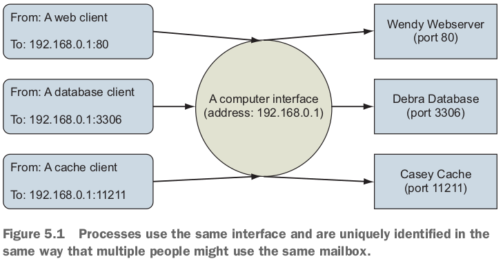
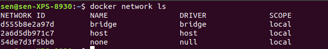

テーマ：networking background, creating Docker container networks, network-less and host-mode containers, publishing services on the ingress（進入） network, container network caveats（警告）.

# 5.1 Networking background (for beginners)

## Basics: Protocols, interfaces, and ports

- A *protocol* with respect to communication and networking is a sort of **language**.
- A network *interface* has an address and represents a location.
- It's common for computers to have two kinds of *interfaces*: an **Ethernet interface** and a **loopback interface**.
  - loopback interfaceが役に立つシーン：it's often useful to be able to **use network protocols** to communicate with **other programs on the same computer**.

- People who created standards for protocols, or companies that own a particular product, decide which port number should be used for specific purposes.
  - MySQL serves its protocol on port 3306 by default.
  - Memcached, a fast cache technology, provides its protocol on port 11211.
- **Ports are written on TCP messages** just as names are written on envelopes.

## Bigger picture: Networks, NAT, and port forwarding

- 第5章is about two specific networks and the way containers are attached to them.
  - the one that your computer is connected to.
  - a **virtual network** that Docker creates to **connect all of the running containers to the network that the computer is connected to**.
    - *bridge*という。

- A bridge is an **interface** that **connects multiple networks** so that they can **function as a single network**. 

- Bridges work by **selectively forwarding** traffic between the connected networks **based on another type of network address**.

# 5.2 Docker container networking

- **Docker abstracts the underlying host-attached network from containers**.
  - **A container attached to a Docker network will get a unique IP address that is routable from other containers attached to the same Docker network**.

- この方法の課題：No easy way for any software running inside a container to determine the **IP address of the host** where the container is running.
  - This inhibits（阻害する、そがい） a container from advertising its service endpoint to other **services outside the container network**.

- **Docker also treats networks as first-class entities**.
  - This means that they have **their own life cycle** and are **not bound to any other objects**.

- Dockerのdefault 3ネットワーク：
  - The `bridge` driver provides **intercontainer connectivity** for all containers **running on the same machine**.
    - The default `bridge` networkを使うのは**not recommended**! なので、まず自分の`bridge` networkを作ろう！
  - Containers on the `host` network **interact with the host's network** stack **like uncontained processes**.
  - Containers attached to the `none` network will not have any network connectivity outside themselves.

- *scope*の3種類：
  - `local`: constrained to the machine where the network exists.
  - `global`: **should be created on every node in a cluster** but **not route between them**.
  - `swarm`: seamlessly（シームレスに、継ぎ目なく） spans all of the hosts participating in a **Docker swarm**（群れ） (multi-host or cluster-wide).

## Creating a user-defined bridge network

- The Docker `bridge` network driver uses Linux namespaces, **virtual Ethernet devices**, and the Linux firewall to build a specific and customizable virtual network topology called a *bridge*.
  - The resulting virtual network is **local to the machine** where Docker is installed and creates routes between participating containers and **the wider network where the host is attached**. 

- Container 1のprivate interface (virtual Ethernet interface)とhost's namespaceにあるContainer 1のvirtual interfaceが、form a link between the host's network and the container.

- bridge networkを作る：
  - `--attachable`: allows you to attach and detach containers to the network at any time.
  - `--ip-range 10.0.42.128/25`: 最後のoctet（オクテット）は1000 0000 ~ 1111 1111 (128 ~ 255).

## Exploring a bridge network

- containerを作って、上記のbridge networkにattachさせる。
  - containerは2つ**network device**を持っている。loopback interface (localhost)とeth0 (a virtual Ethernet device, connected to bridge).
    - eth0のipはbridgeのip-range以内にある。このIP address is the one that any other container on this bridge network would use to communicate with services you run in this container.
  - **Detach the terminal from the running container: press Ctrl-P and then Ctrl-Q**.
- もう１つbridge networkを作って、上記のcontainerをattachする：
  - 今containerはeth0, eth1を持っている。
  - `nmap`で２つ**network address range**にrunningホストを探して、彼らに動いているserviceを表示すると：2つbridge networkにはそれぞれ２つdeviceが付いている。1つ目は、bridge networkのgateway adapter。2つ目は、container自分。
    - the **gateway adapters created by the bridge network driver**.
    - the **currently running container**.

- もう１つcontainerを作って、user-network2にattachさせて、またnetwork scanを実施：
  - lighthouse containerが表示されているので、つまりnetwork-explorer containerからlighthouse containerにアクセスできる。
  - When you scanned the network, you discovered the new node by its IP address, and nmap was able to resolve that IP address to a name.

## Beyond bridge networks

- bridge networkは同machine内のcontainer間の通信ができるが、machine間の通信はできない。
- Linuxだったら、`macvlan, ipvlan`を利用。（underlay network）
  - containerにfirst-class network addressを配る。
- **Overlay network**: the most popular multihost container network option.
  - **swarm mode**ならDockerで使える。

# 5.3 Special container networks: `host` and `none`

- 上記の`docker network ls`の結果に`host`と`none`がある。
  - Not really networks. They are **network attachment** types with special meaning.
- `--network host`: tell Docker to create a new container **without any special network adapters or network namespace**.
  - Whatever software is running inside the resulting container will **have the same degree of access to the host network** as it would running outside the container.
  - Containers running on the host network are able to **access host services running on localhost** and are able to **see and bind to any of the host network interfaces**.

- List all of the available network interfaces from inside a container on the host network. interfaceの意味は良く分かっていないが。

- しかし、in the spirit of building systems of least privilege, you should use the `none` network whenever possible.
  - `--network none`: instruct Docker not to provision any connected virtual Ethernet adapters for the new container.
  - loopback interfaceしか持ってない（bound to 127.0.0.1）：
    - つまりcontainer内のinterprocess通信しかできない。
  - `none`にattachしたcontainer内のprogramはcontainer以外に通信できない：（Cloudflare's public DNS serviceにpingしてみる）
  - The `none` network should be used when the need for network isolation is the highest or whenever a program doesn't require network access.

# 5.4 Handling inbound traffic with NodePort publishing

- Since container networks are connected to the broader network via **network address translation**, you have to specifically tell Docker how to forward traffic from the external network interfaces.
  - You need to specify a **TCP or UDP port on the host interface** and a **target container and container port**, similar to forwarding traffic through a **NAT barrier** on your home network. 僕の理解：hostが受信したpackageをどうやってcontainerに渡すという課題。別の言い方だと、containerは特定のhost portに送信されたpackageが自分のpackageだとhostに伝えてる。

- `-p` or `--publish`: specify the host interface, the port on the host to forward, the target port, the port protocol. 次の３つは同じ意味：`0.0.0.0:8080:8080/tcp`, `8080:8080/tcp`, `8080:8080`.
  - forward TCP port 8080 from all host interfaces to TCP port 8080 in the new container.
  - `-p`のいろんな動作パターン：
    - 1つ目の意味：host operating system will select a **random host port**, and traffic will be routed to port 8080 in the container.
    - この任意でhost OSに選ばれたpostは`docker port`でチェックできる！また、複数portを指定する場合はport numberで絞ることもできる！

# 5.5 Container networking caveats (警告) and customizations

## No firewalls or network policies

- Always deploy containers with appropriate **application-level access-control mechanisms** because containers on the same container network will have mutual unrestricted network access.

## Custom DNS configuration

- 背景：Typically, containers on the bridge network and other computers on your network have **private IP addresses** that aren't publicly routable.
  - This means that unless you're running your own DNS server, you can't refer to them by a name.
- `--hostname`: set the container hostname.
  - 自動的に**hostnameとcontainer's bridge IP address**を繋ぐentryをDNS override system inside the containerに追加する。
  - でも他のcontainerはこのhostname知らないので、大した役に立たない。But if you use an external DNS server, you can share those hostnames.

- `--dns`: **specify one or more DNS servers to use**.

- `--dns-search=[]`: specify a DNS search domain, which is like a **default hostname suffix**.
  - 下記の例では`hub.docker.com`のipを探している。Docker Hubの3つbackup(?)は全部AWSにある。なぜpingできない？
  - It works by manipulating `/etc/resolv.conf`.
  - 利用シーン：shortcut names for internal corporate networks.

- `--dns`や`--dns-search`は全部can be set when you start up the Docker engine that runs in the background to **provide defaults for every container created**.

- `--add-host=[]`: override the DNS system (`--hostname`が使ったDNS system)
  - Effectively block targeted hostnames by mapping them to a known IP address such as 127.0.0.1.
  - Route traffic for a particular destination through a proxy.
    - This is often used to route unsecure traffic through secure channels such as an SSH tunnel.
    - Adding these overrides is a trick that has been used for years by web developers who run their own local copies of a web application.
  - `/etc/hosts`をいじっている。

- **DNS is a powerful system for changing behavior**.
- If DNS is your best tool for changing outbound traffic behavior, then the **firewall and network topology** is your best tool for **controlling inbound traffic**.

## Externalizing（外面化する） network management

- 外面化というのは、Dockerの外でやるでしょう。
- **direct management** of container network configuration, service discovery, and other network-related resourcesが必要な場合。やりかた：
  - Create containers by using the Docker `none` network.
  - Use some other container-aware tooling to create and manage the container network interfaces, manage NodePort publishing, register containers with service-discovery systems, and integrate with upstream load-balancing systems. 言ってることわからないが、凄そうです。

- **Kubernetes** has a whole ecosystem of networking providers. Kubernetesを勉強しよう！

# 復習項目

1. Docker networks are first-class entities that can be created, listed, and removed just like containers, volumes, and images.
2. Bridge networks are a special kind of network that allows direct intercontainer network communication with **built-in** container name resolution. この話はDNSの話と関係ある？
3. Docker provides two other special networks by default: `host` and `none`.
4. Networks created with the `none` driver will isolate attached containers from the network.
5. A container on a `host` network will have full access to the network facilities and interfaces on the host.
6. **Forward network traffic to a host port into a target container and port with NodePort publishing**.
7. Docker bridge networks do not provide any network firewall or access-control functionality.
8. The **network name-resolution stack** can be **customized for each container**. Custom DNS servers, search domains, and static hosts can be defined. 2番めのbuilt-in container name resolutionとここのname-resolution stackは同じ話でしょう？
9. Network management can be externalized with third-party tooling and by using the Docker `none`  network.