テーマ：Setting resource limits; **Sharing container memory**; Setting users, permissions, and administrative privileges, Granting access to specific Linux features, Working with SELinux (Security-Enhanced) and AppArmor (各プログラムにセキュリティプロファイルを結びつけ、プログラムのできることに制限をかけるプログラムである)

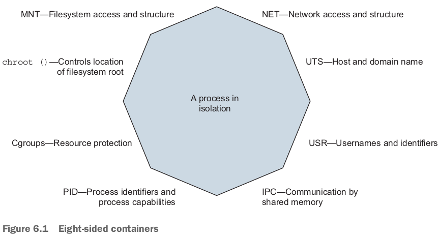

# 6.1 Setting resource allowances

- By default, Docker containers may use unlimited CPU, memory, and device I/O resources.

## Memory limits

- `-m` or `--memory`で制限：`<number><optinal unit>` where unit = `b, k, m, g`.

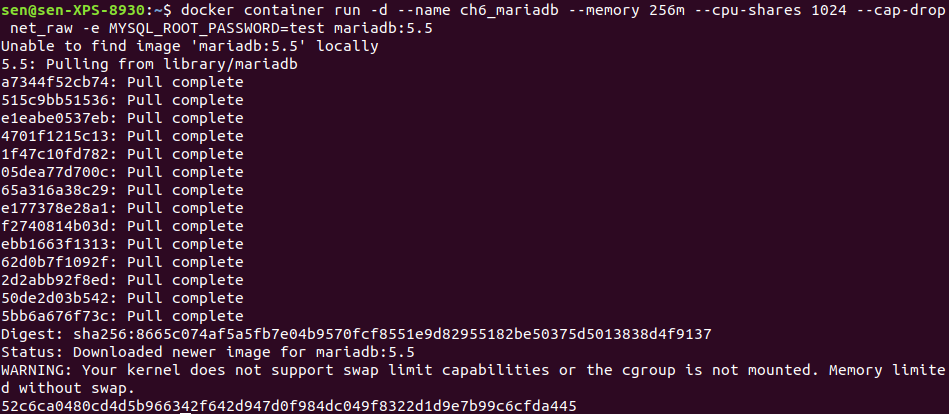

- Warningが出ている。Memory limited without swapでもまだ大丈夫でしょう。
- **Memory limits are not reservations**.

## CPU

- **Processing time** is just as scarce as memory, but the effect of starvation is performance degradation instead of failure.
  - A slow process may be worse than a failing one if it's running an important latency-sensitive data-processing program, a revenue(収益)-generating web application, or a backend service for your app.

- ２つCPUを制限する方法：
  - 方法1：Specify the relative weight of a container to other containers.
    - Linux uses this to determine **the percentage of CPU time** the container should use relative to other running containers.
    - The percentage is for the **sum** of the computing cycles of **all processors** available to the container.
    - `--cpu-shares`: 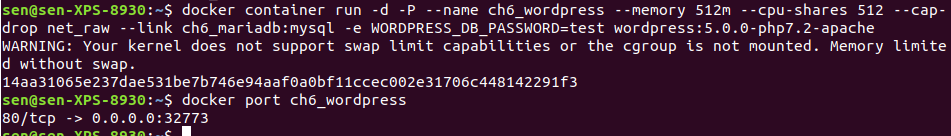
    - このwordpressは今`http://localhost:32773`で動いている。
  - 今MariaDBとWordPressの割合は：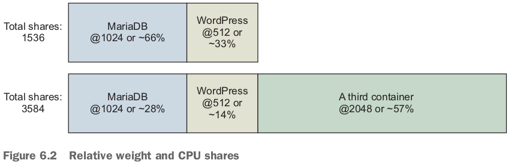
  - CPU shares are enforced only when **there is contention for time on the CPU**.
    - If other processes and containers are idle, the container may burst well beyond its limits.
    - The intent of this tool is to prevent one or a set of processors from overwhelming a computer, not to hinder performance of those processes.
  - 方法２：`--cpus`. **number of CPU cores**. 例えば`--cpus 0.75`.
    - The CPU quota(クォータ、割り当て) is allocated, enforced, and ultimately refreshed every 100ms by default.
      - If a container uses all of its CPU quota, its CPU usage will be throttled(抑える、抑圧する) until the next measurement period begins.

- `--cpuset-cpus`: limit a container to execute only on a specific set of CPU cores.

## Access to devices

- `--device`. specify a set of devices to mount into the new container.
  - value: a map between the device file on the host operating system and the location inside the new container.

# 6.2 Sharing memory

- Sharing memoryはプロセス間通信の1種だ。
- This form of interprocess communication (IPC) performs at memory speeds.
  - It's often used when the latency associated with network or pipe-based IPC drags software performance down below requirements. つまりsharing memoryは早い方だ。
  - The **best examples** of **shared memory-based IPC** use are in **scientific computing** and some popular database technologies such as **PostgreSQL**.

- Docker creates a unique **IPC namespace** for each container by default.
  - The IPC namespace prevents processes in one container from accessing the memory on the host or in other containers. (Sharing memoryなしの場合)
  - The Linux IPC namespace partitions share **memory primitives** such as named shared memory blocks and semaphores(セマフォ). (Sharing memoryの場合)

## Sharing IPC primitives between containers

- If you need to run programs that communicate with shared memory in different containers, then you'll need to **join their IPC namespaces** with the `--ipc` flag.
  - `--network`のやり方と似てる。
- producerやconsumerの例：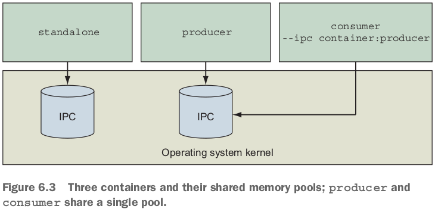

- 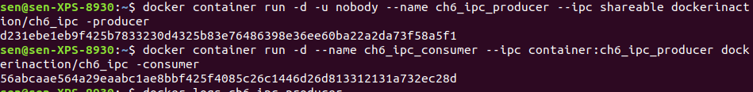
  - `--ipc shareable`や`--ipc container:ch6_ipc_producer`で２つcontainerが同じmessage queueをシェアできる。

# 6.3 Understanding users

## Working with the run-as user

- `docker image inspect`の結果にContainerConfigやConfig両方ある。Configの方を見てる。Userは""、つまりthe container will default to running as the root user。

- しかし、the run-as user might be changed by the **entrypoint** or command the image uses to start up. 起動時のuserチェック：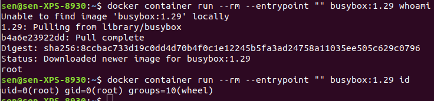
- containerがroot権限を持つ場合のリスク：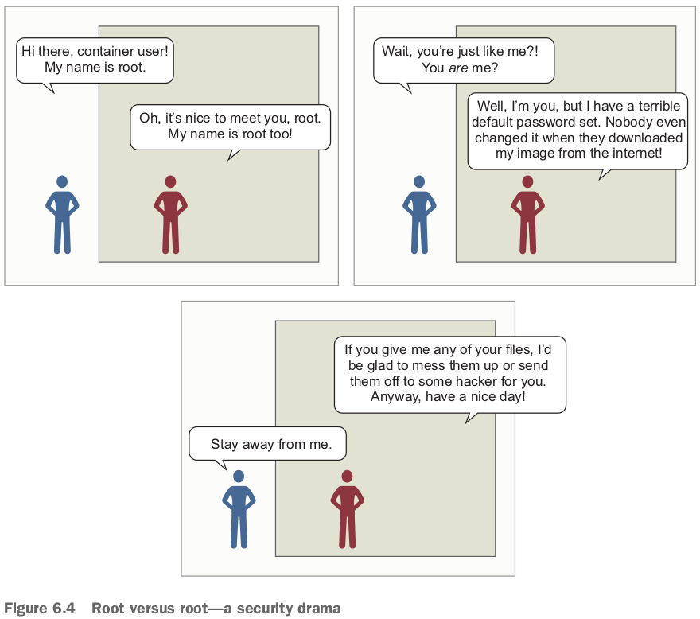
- containerを起動時、userを変えられるが、そのuserはimageに存在しないといけない。imageの**user list**は：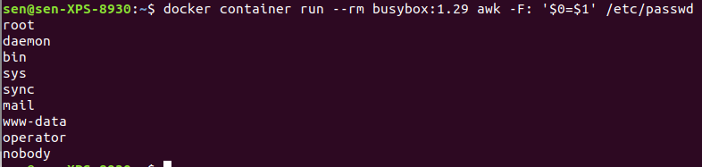
  - この中の`nobody`は前に使ってた。

- user, groupだけじゃなく、直接にuid, gidも指定できる！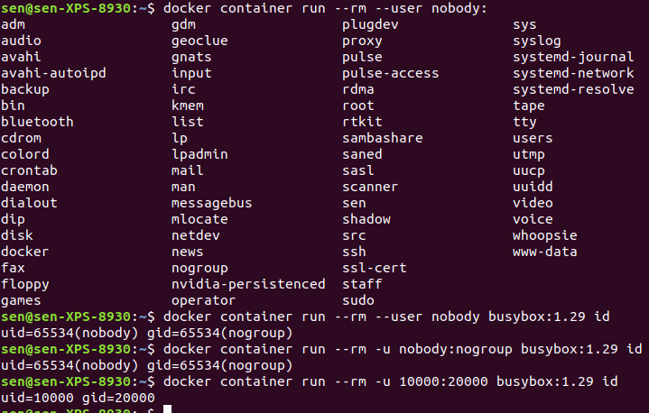
  - 存在しないuid, gidを指定しているが、all file permissions will work as if the user and group did exist.
- Fortunately, Docker images can be purpose-built to support the application that needs to be run with everything else left out.
  - Chapter 7, 8, 10 cover how to create **minimal application images**.

## Users and volumes

- hostやcontainerが共有するvolumesにあるファイルの権限も、hostやcontainerに共有されていること。
- あるhostのファイルのownerがrootだったら、このファイルをcontainerにmountするとき、containerはuserがrootじゃないとこのファイルにアクセスできない：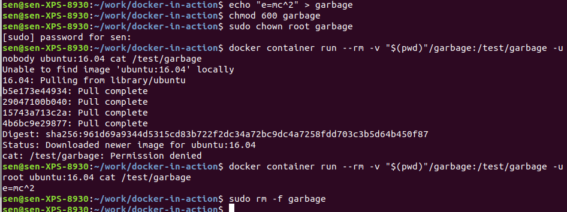
  - `chmod 600 garbage`: make file readable only by its owner. 3数字はそれぞれowner(user), group, other権限。
  - `sudo chown root garbage`: make file owned by root.
- 上記の例から分かったこと：**the user ID space is shared**.
  - File permissions on files **in volumes** are **respected** inside the container.
  - Both root on the host and root in the container have user ID 0.

- volumesのlog filesもuid:gidで管理できる。log fileと同じuid:gidのcontainerだったら、write/readできる。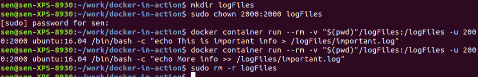
- Manage or monitor containersのprogramsはDocker daemon APIのread/write権限が必要、そのために、user or group that has permission to read or write to `docker.sock` (root) + `/var/run/docker.sock`のmountが必要：`docker container run --rm -it -v /var/run/docker.sock:/var/run/docker.sock:ro -u root monitoringtool`. リスク高い。
  - `ro`: read-only.

## Introduction to the Linux user namespace and UID remapping

- UID remappingの意味：For example, UID remapping could be configured to map container UIDs to the host starting with host UID 5000 and a range of 1000UIDs.
  - The result is that UID 0 in containers would be mapped to host UID 5000, container UID 1 to host UID 5001, and so on for 1000 UIDs.
  - 効果：Since UID 5000 is an unprivileged user from Linux' perspective and doesn't have permissions to modify the host system files, the **risk of running with `uid=0` in the container** is greatly reduced.
- Linux user namespaceは正にこのremappingを担当する。
- 本の例は良く分からなかった。p113~114.

# 6.4 Adjusting OS feature access with capabilities

- In Linux, these feature authorizations are called *capabilities*. 例えばopening a network socketができるかどうか。

- When you create a new container, Docker drops all capabilities except for an explicit list of capabilities that are necessary and safe to run most applications.

- `--cap-drop`: drop capabilities from a container.

- `--cap-drop, --cap-add`でcontainerのcapabilitiesを調整：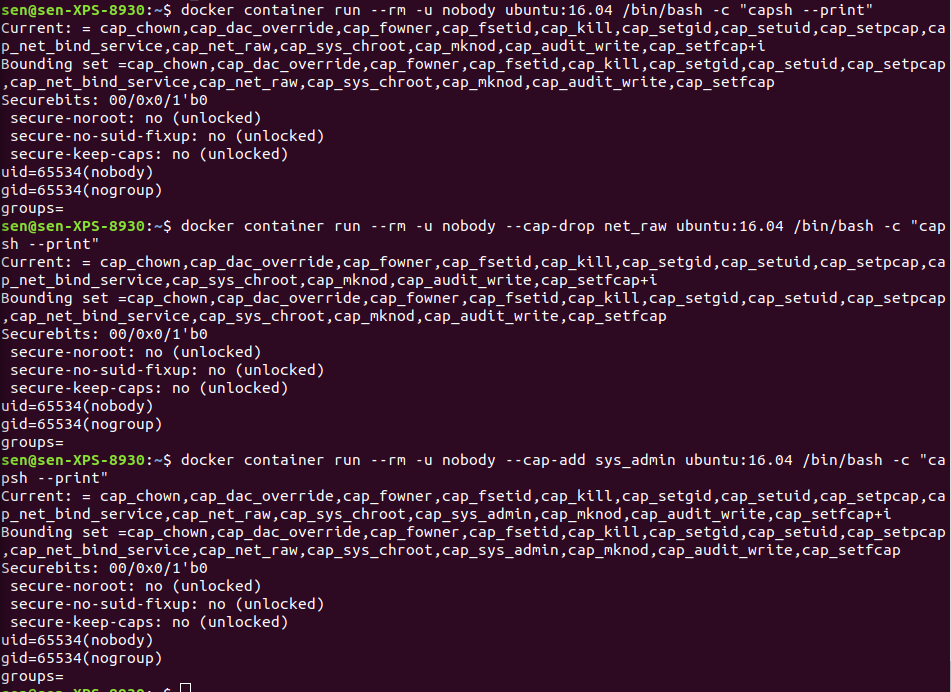

# 6.5 Running a container with full privileges

- `--privileged`. privileged containerのid, capabilities, network configuration, (mounted devices, 全然収まれてない)を見てみると：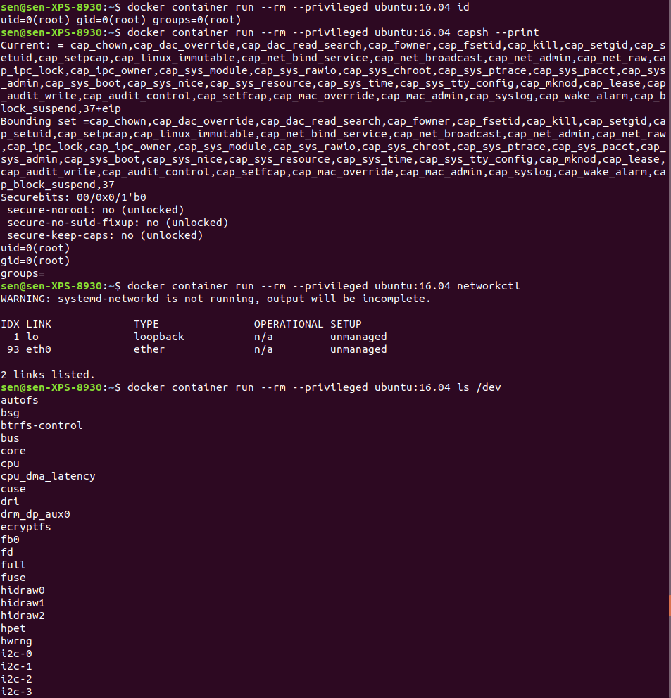

# 6.6 Strengthening containers with enhanced tools

- Tools you can use to harden your containers include custom **seccomp** (secure computing mode) profiles, AppArmor, and SELinux.

## Specifying additional security options

- `--security-opt`: configure Linux's seccomp and Linux Security Modules (LSM) features.
- Seccomp configures which Linux system calls a process may invoke.
- Changing Docker's default seccomp profile is not recommended.
- seccomp profileの例：https://github.com/moby/moby/blob/master/profiles/seccomp/default.json
- *Linux Security Modules* is a framework Linux adopted to act as an interface layer between the operating system and security providers.
  - AppArmor and SELinux are LSM providers.

- SELinux is a **labeling system**. SElinux user, role, type, level label.
  - A similar set of labels is **applied to every user and process**.
  - At runtime, when a process attempts to interact with a file or system resource, the sets of labels are evaluated against a set of allowed rules.
- AppArmor is frequently substituted for SELinux because it works with file paths instead of labels and has a **training mode** that you can use to passively build profiles based on observed application behavior.

# 6.7 Building use-case-appropriate containers

## Applications

1. Make sure the application is running as a user with limited permissions. hostのfilesystemを保護する。
2. Limit the system capabilities.
3. Set limits on CPU and memory. Keep the system responsive.
4. Specifically whitelist devices that it can access.
   - Keep snoops(うろうろのぞき回る、詮索する) off your webcam, USB, and the like.

## High-level system services

- Not part of the operating system.
- Typically sit alongside applications outside the operating system, but they often require privileged access to the operating system to operate correctly.
- Examples: `cron, syslogd, dnsmasq, sshd, docker`.
- Do things like keep system logs, run scheduled commands, and provide a way to get a secure shell on the system **from the network** (sshdだろう), and docker manages containers. 

## Low-level system services

- Control things like **devices** or the system's **network stack**.
  - 例えば、firewall software needs administrative access to the network stack.
- It's **rare to see these run inside containers**.
  - The **best exceptions** are **short-running configuration containers**.

# 復習項目

1. Docker uses **cgroups**, which let a user set memory limits, CPU weight, limits, and core restrictions (`--cpus`) as well as restrict access to specific devices (`--device`).
2. Docker containers each have their own **IPC namespace** that can be shared with other containers or the host in order to facilitate communication over shared memory.
3. Docker supports isolating the USR namespace.
   1. **By default, user and group IDs inside a container are equivalent to the same IDs on the host machine**.
   2. **When the user namespace is enabled, user and group IDs in the container are remapped to IDs that do not exist on the host**. どうやってuser namespaceをenableするのかまだ分かっていない。
4. You can and should use the `-u` option to run containers as **nonroot users**.
5. Avoid running containers in privileged mode whenever possible.
6. Linux capabilities provide operating system feature authorization. Docker drops certain capabilities in order to provide reasonably isolating defaults.
   1. The capabilities granted to any container can be set wit the `--cap-add` and `--cap-drop` flags.
7. Docker provides tooling for **integrating easily** with enhanced isolation technologies such as seccomp, SELinux, and AppArmor. These are powerful tools that security-conscious Docker adopters should investigate.