テーマ：manual image construction and practices; images from a packaging perspective; working with **flat images**, image **versioning** best practices.

# 7.1 Building Docker images from a container

- A *union filesystem (UFS)* mount provides a container's filesystem.
- Any changes that you make to the filesystem inside a container will be written as **new layers** owned by the container that created them.

## Packaging "Hello World"

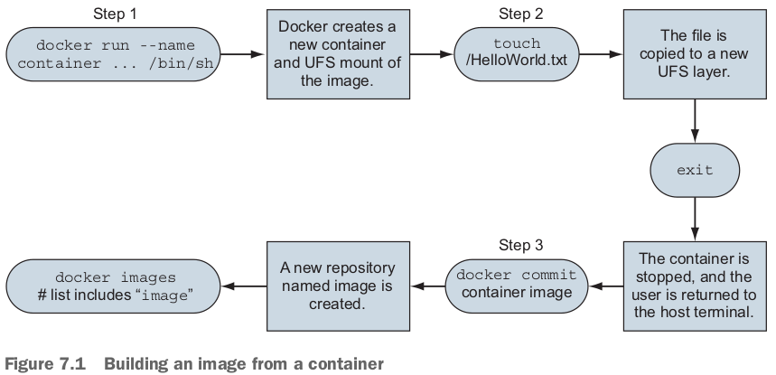

- この3ステップでやってみる：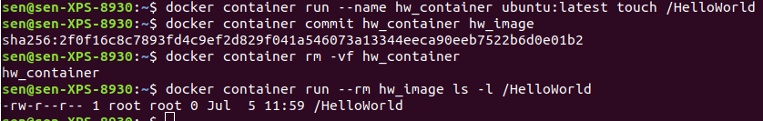
  - 今思っていることは、まずcommitは既にあったimageにもcommitできるでしょう。

## Preparing packaging for Git

- ubuntu:latest imageからcontainerを作って、gitをインストールする：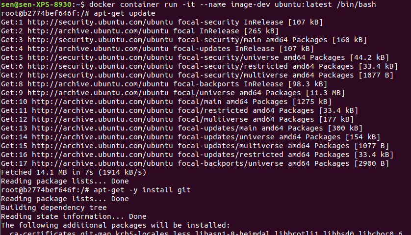
- Packages tools like `apt-get` provide **no isolation** to the software, and **dependency conflicts often occur**.

## Reviewing filesystem changes

- `docker container diff image-dev`: outputが長すぎる。

## Committing a new image

- 上記のgitをインストールしたubuntu containerをcommitする：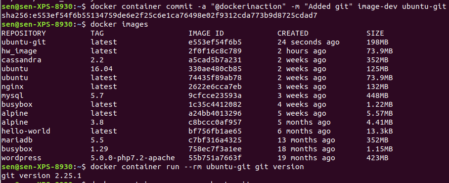
  - このimageから作ったcontainerは自動的に/bin/bashを起動するんだ。上の上のscreenshotから分かる。だから、最後にgit versionを直接に渡せるんだ。
  - gitも省略したければ、`--entrypoint`を追加して、同じimageにcommitする：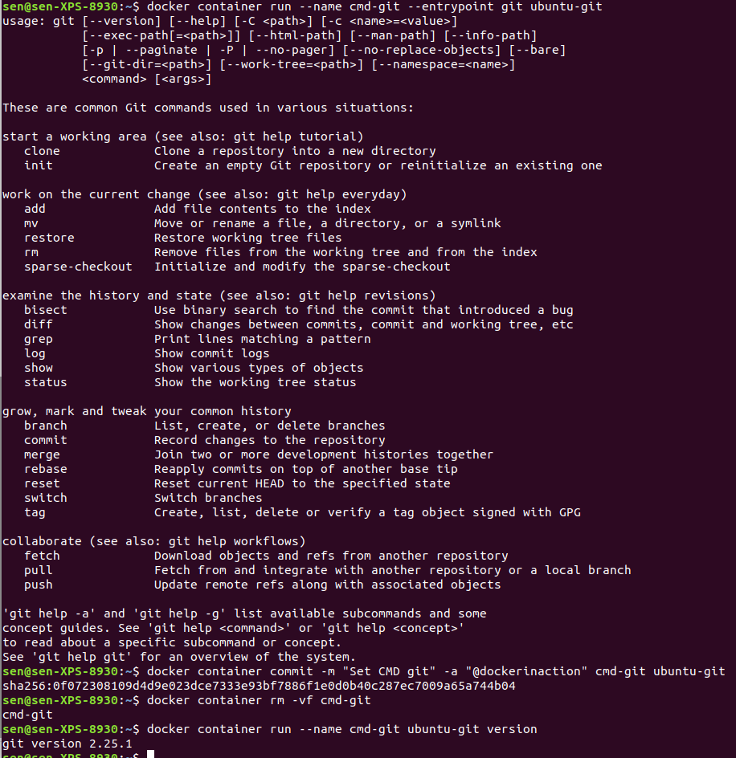

## Configuring image attributes

- commit時、下記の情報全部imageに記録される：
  - All environment variables; The working directory; The set of exposed ports; All volume definitions; The container entrypoint; Command and arguments. 最後の２つは上に既に見た。

# 7.2 Going deep on Docker images and layers（Gitと同じな気がする）

## Exploring union filesystems

- A union filesystem is made up of layers.

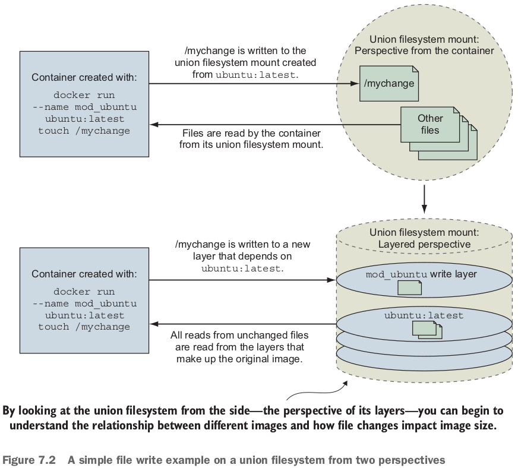

- Fileは必ずtop layerにあるとは限らない：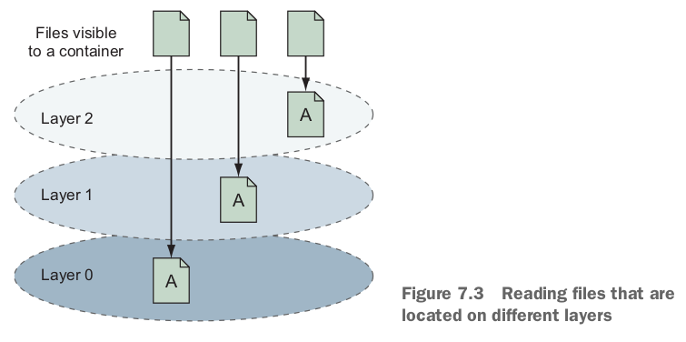
  - If a file was not created or changed on the top layer, the read will fall through the layers until it reaches a layer where that file does exist.

- Like additions, both file changes and deletions work by modifying the top layer.
- If a file nested five levels deep were changed, there would be a line for each level of the tree.

- Most union filesystems use something called *copy-on-write*, which is easier to understand if you think of it as **copy-on-change**.
  - When a file in a **read-only layer** (not the top layer) is modified, the whole file is first copied from the read-only layer into the **writable layer** before the change is made. 

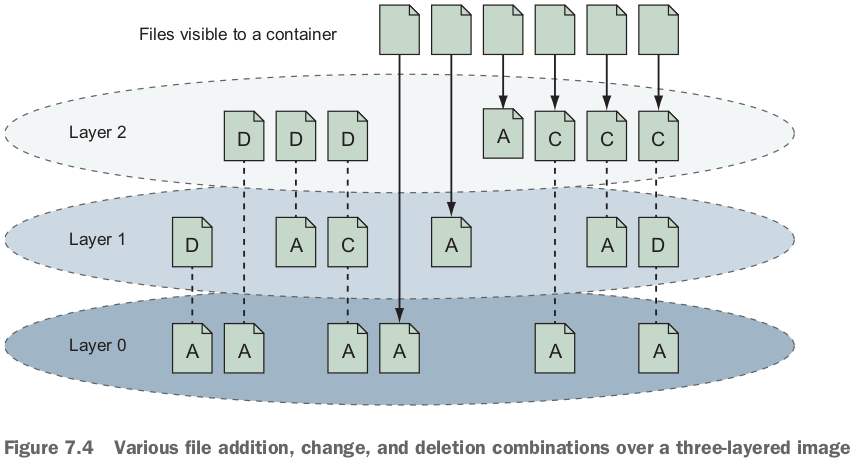

## Reintroducing images, layers, repositories, and tags

- The **metadata for a layer** includes that generated identifier, **the identifier of the layer below it (parent)**, and the **execution context** of the container that the layer was created from.
- An image is the stack of layers that you get by **starting** with a given top layer and then following all the **links** defined by the parent ID in each layer's metadata. 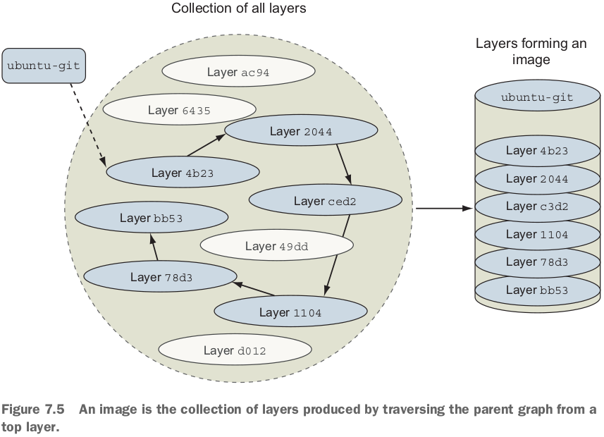
  - この**collection of all layers**は一番気になる！Dockerが持っている全てのimagesのlayers? 確かにそうすれば、重複するlayerは絶対ないよね！

- Repositories are location/name pairs that point to a set of specific layer identifiers. 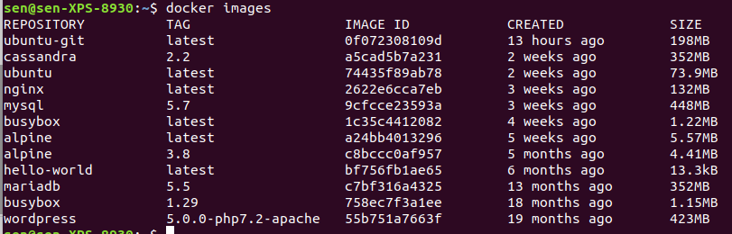
- 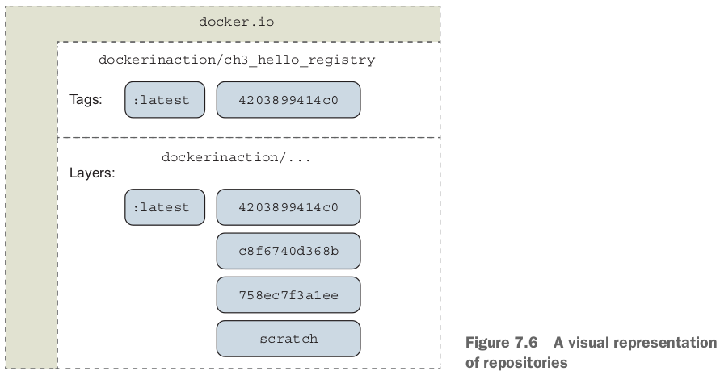
- Repositories and tags are created with the `docker tag, docker container commit, docker build`.
- Commit with repository:tag: `docker container commit mod_ubuntu myuser/myfirstrepo:mytag`.
- Tagを作る：`docker tag myuser/myfirstrepo:mytag myuser/mod_ubuntu`.（:latestは省略）
  - ここはtagからtagを作っているが、layer idからもきっとtagを作れるでしょう。

- All layers below the writable layer created for a container are **immutable** (不変), meaning they can never be modified.
  - This property makes it possible to share access to images instead of creating independent copies for every container. 

## Managing image size and layer limits

- imageからソフトを削除しても、image sizeは減らない：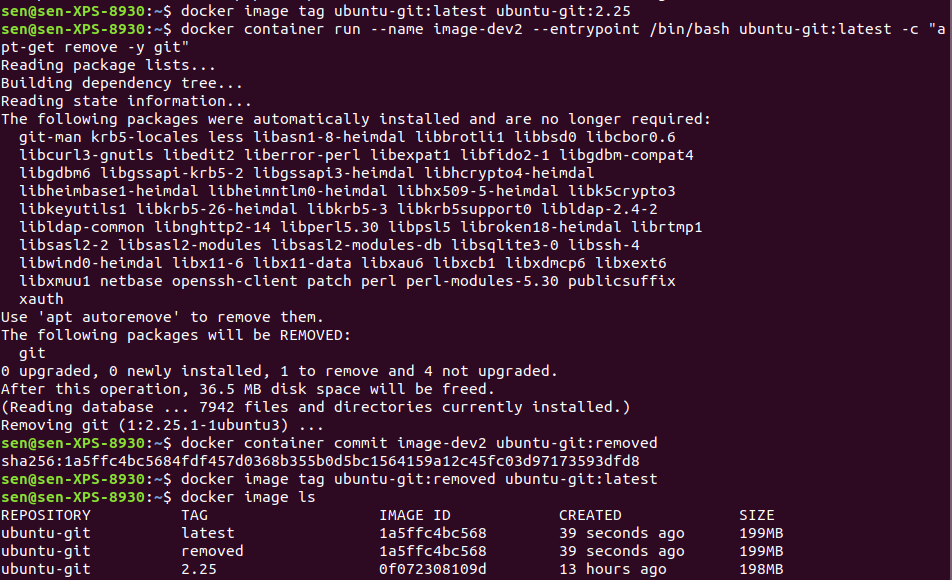
  - UFS will mark a file as deleted by actually adding a file to the top layer.
- **It's important to minimize image size for the sake of the people and systems that will be consuming your images**.

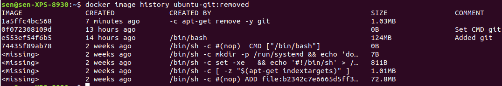

- You can **flatten** images by saving the image to a TAR file with `docker image save`, and then importing the contents of that filesystem back into Docker with `docker image import`. これは`.git`を削除するみたい。
  - The smarter thing to do in this case is to **create a branch**. つまりubuntu-gitからgitを削除する出はなく、gitをインストールしてないubuntu image（ubuntu-gitの親）から改めてbranchを作る。

- Branching increases the likelihood that you'll need to **repeat steps** that were accomplished in peer branches.
  - Doing that work by hand is prone to error.
  - **Automating image builds with Dockerfiles** is a better idea.
- `scratch` imageも作成できる！
  - Docker provides special handling for the `scratch` image that tells the build process to make the next command the first layer of the resulting image.
  - This practice can be beneficial if your goal is to keep images small and if you're working with technologies that **have few dependencies such as the Go or Rust programming languages**. GoやRustを勉強しよう！

# 7.3 Exporting and importing flat filesystems

- The `docker container export` command will stream the full contents of the flattened union filesystem to stdout or an output file as a tarball. つまりcontainer/imageはなくなる。これは`save`との違うところ。

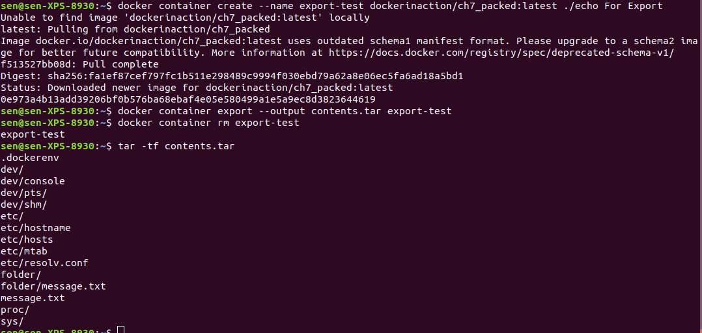

- `-o` or `--output`がなければstdoutにexport: Streaming the contents to stdout makes the `export` command useful for **chaining** with other **shell** programs that work with tarballs.
- The `docker import` command will stream the content of a tarball into a new image.
- Go版hello world. Goを学びましょう！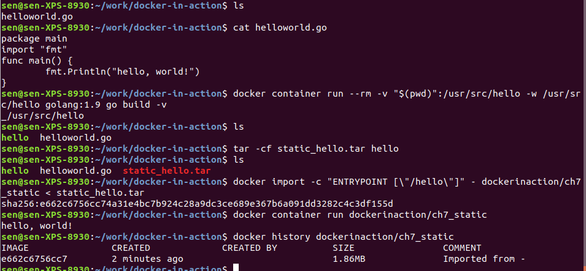
  - Docker will pull an image containing the Go compiler, compile and **statically link the code (which means it can run all by itself)**, and place that program back into your folder. `./hello`でhostで実行できる（Goをインストールしてない）。
  - import時の`-c` flag specifies a Dockerfile command. `-`: the contents of the tarball will be streamed through stdin. つまりhelloを実行するよう、entrypointを設定している。
  - importで作ったimageなので、layerは1つしかない。

# 7.4 Versioning best practices

- tagging schemeの比較：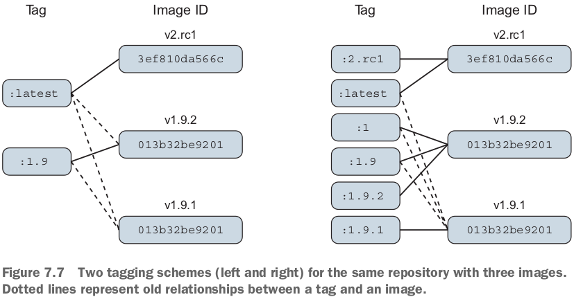
  - 左スキームの課題1: poor adoption flexibility. v1.9.1を使えなくなる。
  - 課題２：`latest` currently points to an image that's not otherwise tagged.
  - 課題３：`latest` is adopted more frequently than it should be.
    - A responsible repository maintainer should always make sure that its repository's `latest` refers to the **latest *stable* build** of its software **instead of the true latest**.

- When software dependencies change, or the software needs to be distributed on top of **multiple bases**, then those dependencies should be included with your tagging scheme.

# 復習項目

1. New images are created when changes to a container are committed using the `docker container commit` command.
2. When a container is committed, the **configuration it was started with** will be encoded into the configuration for the resulting image.
3. An image is a stack of layers that's **identified by its top layer**.
4. An image's size on disk is the sum of the sizes of its component layers. そうだけど、layerは共有できるので、同じlayerを依頼するimagesをダウンロードしたら、そのlayerは一度だけdownloadされる。
5. Images can be exported to and imported from a flat tarball representation by using the `docker container export` and `docker image import` commands.
6. The `docker image tag` command can be used to **assign several tags to a single repository**.
7. Repository maintainers should keep pragmatic (実用的な、実用本位の) tags to ease user adoption and migration control.
8. Tag your latest *stable* build with the *latest* tag.
9. Provide fine-grained and overlapping tags so that adopters have control of the scope of their dependency version creep (腹ばうこと、徐行).