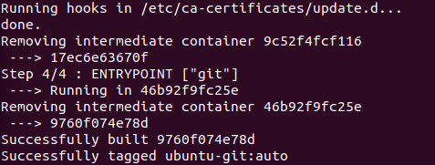

テーマ：Automated image packaging with Dockerfiles; **Metadata and filesystem instructions**; **Creating maintainable image builds with arguments and multiple stages**; **Packaging for multiprocess and durable containers**; **Reducing the image attack surface and building trust**.

- A *Dockerfile* is a text file that contains **instructions** for building an image.

- Building images from Dockerfiles makes tasks like adding files to a container from your computer simple one-line instructions.
- Dockerfiles are the **most common way to describe how to build a Docker image**.

- **Once an image's build is defined in code, it is simple to track changes in version control, share with team members, optimize, and secure**.

# 8.1 Packaging Git with a Dockerfile

```dockerfile
# An example Dockerfile for installing Git on Ubuntu
FROM ubuntu:latest
LABEL maintainer="dia@allingeek.com"
RUN apt-get update && apt-get install -y git
ENTRYPOINT ["git"]
```

```bash
docker image build --tag ubuntu-git:auto .
```

- The only special rule about Dockerfiles is that the first instruction must be `FROM`. 特にfromがなくても、from `scratch`.

- Each instruction triggers the creation of a **new container** with the specified modification.
  - After the modification has been made, the builder **commits the layer** and **moves on to the next instruction** and container created from the fresh layer.
  - 意外です。１つcontainerしかないと思った。instruction毎にlayerが作られたんだ。もったいなくない？
  - construction毎にcontainerが作られた証拠：
    - `Removing intermediate container ...`.

- build process outputがいらない時：`-q` or `--quiet`.

- **If a problem with the build script occurs after several other steps, the builder can restart from the same position after the problem has been fixed**. 凄い！！！
  - Steps 1 through 4 were skipped because they were already built during your last build.
  - Step 5の間違いを修正すると：
  - 1回めのbuildで作られた各layerをそのまま使っている！多分これはinstruction毎にlayerを作っている理由だ！素晴らしい！これも改めてlayerの共有を証明しているんだ！
  - The use of caching during the build can save time if the build includes downloading material, compiling programs, or anything else that is time-intensive.
- full rebuildが必要なら：`--no-cache`. これは必要ないでしょう。
- This short example uses 4 of the **18 Dockerfile instructions**.

# 8.2 A Dockerfile primer (入門)

- Maintaining multiple versions of an image is as simple as maintaining multiple Dockerfiles.
- The Dockerfile build process itself uses extensive caching to aid rapid development and iteration.
- They **integrate easily with existing build systems** and many continuous integration tools. これの意味はまだ分かっていない。

## Metadata instructions

- One of the best reasons to use Dockerfile builds is that they simplify copying files from your computer into an image.
- First thing: define which files should never be copied into any images. 例えばDockerfileは絶対コピーしないでしょう！
  - by **`.dockerignore`**. Gitの`.gitignore`と似てるでしょう。

- **Instructions should be combined whenever possible** because the builder won't perform any optimization.

- 仕事１：`.dockerignore`を定義。
  - `.dockerignore`自分や３つdockerfileを全部無視する。
- 仕事２：`mailer-base.df`の編集やビルド。
  - 1つ`ENVで`３つ環境変数を設定している。That could have been accomplished with 3 subsequent `ENV` instructions, though doing so would result in the creation of 3 layers.
  - `EXPOSE 33333`: open TCP port 33333.
  - The `ENTRYPOINT` instruction has two forms: the **shell** form and an **exec** form.
    - `ENTRYPOINT ["/app/mailer.sh"]`を翻訳すると、`/bin/sh -c 'exec ./mailer.sh'`.
    - **shell form** ENTRYPOINTの欠点：all other arguments provided by the CMD instruction or at runtime as extra arguments to `docker container run`（つまりbuildしたimageをrunするとき） will be ignored. つまりこのshellが引数必要でもruntimeで渡せない？？
  - 設定された環境変数はinspectでチェックできる。相変わらずContainerConfigやConfig両方にある。
  - ADD or COPY: https://docs.docker.com/develop/develop-images/dockerfile_best-practices/#add-or-copy
    - 基本はCOPYはすすめ。COPYは単純なコピー。ADDは自動的にtarファイル（localファイルだったら）を解凍する。ADDのもう１つ機能は、remote URLをサポートすること。
    - しかし、URLからpackageを取得する場合も、ADDじゃなく、`curl`/`wget`を使うべき。１つコマンド１つlayerになっちゃうので、取得と解凍を１つRUNに行うべき。
  - `VOLUME`: volumeを作る。The `VOLUME` instruction should be used to expose any **database storage area, configuration storage** or **files/folders created by your docker container**.
    - You are strongly encouraged to use `VOLUME` for any **mutable** and/or **user-serviceable parts** of your image.
  - このDockerfileに`USER`を使わない理由：Setting it in a base image would prevent any downstream Dockerfiles from installing software.
    - That would mean that those Dockerfiles would need to flip the default back and forth for permission.
    - Doing so would create at least two additional layers.
  - `mailer.sh`はまだ存在していない。なので直接に`mailer-base`はrunできない。mailer-loggingやmailer-liveがそれぞれ自分の`mailer.sh`の実現を持っている。

## Filesystem instructions

- `COPY, VOLUME, ADD`. 上にもう触れた。（mailer-loggingのステップ１）
  - `COPY`: The last argument is the destination, and all other arguments are source files.
    - １つunexpected feature: any files copied will be copied with file ownership **set to root**.
    - なので、下の`RUN`でまたfile ownershipを変えている。
    - 上記はexec form. (**string array**). exec formの方がいい！`["", ""]`のような形がexec form! 下の`VOLUME, CMD`、以前の`ENTRYPOINT`も全部exec formを使っている！
  - Defining volumes at **image build time** is more limiting than at runtime.
    - You have **no way to specify a bind-mount volume or read-only volume at image build time**.
    - The `VOLUME`: create the defined location in the image filesystem and then add a **volume definition** to the image metadata. つまりvolumeは作らない、ただvolumeのmount pointを用意すること？ 
  - `CMD`と`ENTRYPOINT`の関係：
    - **The `CMD` command represents an argument list for the entrypoint**.
    - If the entrypoint is set and is declared using the **exec form**, you use `CMD` to set default arguments.
  - This Dockerfile injects an implementation of mailer.sh （`./log-impl`に置いて、imageにコピーする） and defines a default argument.

- `./log-impl`フォルダーを作って、中に`mailer.sh`を置いとく：（mailer-loggingのステップ２）
  - このscriptの意味：start a mailer daemon on port 33333 and write each message that it receives to the file specified in the first argument to the program.

- `docker image build -t dockerinaction/mailer-logging -f mailer-logging.df .`
- `docker run -d --name logging-mailer dockerinaction/mailer-logging`
  - Containers that link to this implementation will have their messages logged to `/var/log/mailer.log`.
- メールを送るmailer-live.dfの編集やmailer-liveの`mailer.sh`: 
  - mailer-liveの`mailer.sh`の動作：wait for connections on port 33333, take action on any received messages, and the sleep for a moment before waiting for another message.
    - actionはsend an email using the **Simple Email Service** command-line tool (Amazon Web Services).

# 8.3 Injecting downstream build-time behavior

- `ONBUILD` instruction defines **other instructions** to **execute if the resulting image is used as a base for another build**.
- The instructions following `ONBUILD` aren't executed when their containing Dockerfile is built.
  - Instead, those instructions are **recorded** in the resulting image's metadata under `ContainerConfig.OnBuild`.
- When a downstream Dockerfile uses the upstream image (the one with the `ONBUILD` instructions) in a `FROM` instruction, those `ONBUILD` instructions are executed **after the `FROM` instruction and before the next instruction** in a Dockerfile.
- `ONBUILD`が確かにdownstream Dockerfileをbuildする時実行される証拠の例：

# 8.4 Creating maintainable Dockerfiles

- `ARG`: define a variable that users can provide to Docker when building an image. ROSのlaunch fileを思い出した。
  - `--build-arg <varname>=<value>`. `ARG`があったら、例えばVERSIONはbuild時設定できるようになるんだ。
- `mailer-base.df`にversion `ARG`を追加して、build時渡しましょう：
  - unknownはdefault値。

- **Multistage build**. 基本の使いは：
  - reusing parts of another image, 
  - **separating** the build of an **application** from the build of an **application runtime** image. これは大事だ！
  - enhancing an application's runtime image with specialized test or debug tools. これも大事だ！

- *multistage Dockerfile*: **multiple `FROM`** instructions.
  - Each `FROM` instruction marks a new build stage whose **final layer** may be **referenced** in a downstream stage.

- multistageの例：
  - `builder`: gather depedencies and builds the example program. (**application**)
  - `runtime`: copy the certificate authority (CA) and program files into the runtime image for execution. (**application runtime**)

- 上記例のmultistage Dockerfileやgo source file (`git clone git@github.com:dockerinaction/ch8_multi_stage_build.git`): 
  - `builder` installs certificate authority files used to establish Transport Layer Security (TLS) connections supporting HTTPS.
  - `builder`はstatic binaryをbuildして、`/go/bin/http-client`として置いている。
  - **`runtime`はCAやstatic binaryのみコピーしている！**素晴らしい！やっと理解できた！
    - When you build an image `FROM scratch`, the filesystem begins empty and the image will container only what is `COPY`'d there.
    - **The final image will contain just two files**.

- `http-client.df`をbuildすると、２つimageが出ている！
  - だから`builder` stageもimageを生成したんだ。repository nameやtag全部ないけど。でも`builder` imageは387MBの大きさにたいして、`runtime`はわずか7.18MB、これでmultistage buildのメリットすぐ分かるでしょう！

# 8.5 Using startup scripts and multiprocess containers

## Environmental preconditions validation

- In software design, **failing fast and precondition validation** are best practices.

- startup processに一番ふさわしい言語はshell scriptsだ。startup prcessがチェックすべき項目は：presumed links (and aliases (例えば`FROM`に使ったbase image名)), environment variables, secrets (https://docs.docker.com/engine/swarm/secrets/), network access, network port availability, root filesystem mount parameters (read-write or read-only), volumes, current user.

- 特に`FROM scratch`のDockerfile, 全部自分でチェックしないといけない。
- shell scriptingを勉強すべき。

## Initialization processes

- container内processの管理。
- If you decide to adopt this pattern, you should use the init process as the entrypoint of your application-oriented Docker container.

- Full-featured Linux distributions ship with heavyweight and full-featured init systems such as SysV, Upstart, and systemd.
  - Linux Docker images such as Ubuntu, Debian, and CentOS typically have their init programs installed but nonfunctioning out of the box.
  - Communityはこれらを使わない。lighter-weight init programsを採用する。
- Communityのpopular options: runit, tini (Dockerのdefault), BusyBox init, Supervisord, DAEMON Tools.
- **Using an init process is a best practice for application containers**.
- init programを評価する項目：additional dependencies the program brings into the image, file sizes, how the program passes signals to its child processes (or if it does at all), required user access, monitoring and restart functionality (backoff-on-restart features are a bonus), zombie process cleanup features.
- `--init`. defaultはtini.

## The purpose and use of health checks

- `HEALTHCHECK`(Dockerfile) or command-line(`--health-cmd`).
- `HEALTHCHECK`を入れたimageのcontainerはstatusが表示される：
  - `|| exit 1`: whenever `nc` exits with any nonzero status, `nc`'s status will be converted to 1 so that Docker knows the container is unhealthy.

- By default, the health check command will be run **every 30 seconds**, and **three failed checks** are required before transitioning the container's `health_status` to `unhealthy`.

- 他のhealth checkの設定できるproperty: time-out, start period (初めてhealthyになるまで失敗しても構わない).

# 8.6 Building hardened（鍛錬した、たんれん、鍛えられた、きたえられた） application images

- general strategy: minimize the software included with it.
- それ以外３つ施策がある、それぞれ紹介：
  - enforce that your images are built from a specific image.
  - make sure that regardless of how containers are built from your image, they will have a sensible(スマートというより実用本位の、機能的な) default user.
  - eliminate a common path for root user escalation(段階的拡大、エスカレーション) from programs with `setuid` or `setgid` attributes set.

## Content-addressable image identifiers

- `FROM`のベースが変わらないことを確保したい。
- An image ID that includes the digest component is called a content-addressable image identifier (CAIID).
  - This refers to a specific layer containing **specific content**, instead of simply referring to a particular and potentially changing layer. これはC++のGeneric ProgrammingのConceptsの考え方と似てるんだ！
  - やり方：Append an @ symbol followed by the digest in place of the standard tag position.
  - 例えば、`golang:1.9`をinspectすると、`"Image": "sha256:91280bad5b2dce6f8928eca335397e5b8bfe727b9cd502bff8866afdbc96ea66"`の一行があって、これはDigestだそうです。なので、`FROM golang@sha256:91280bad...`だったら、ベース賭して使ったimageは絶対変わらないのを言えるでしょう。tagの意味は変わるかも知れないから。

## User permissions

- There's **no way for an image to prevent containers from running as the root user**.
  - The best things an image author can do are to create other nonroot users and establish a nonroot default user and group.

- The best practice and general guidance is to drop privileges as soon as possible.
  - challenge: determine the earliest appropriate time.
  - If too early, the active user may not have permission to complete the instructions in a Dockerfile.
  - 2nd timing consideration: permissions and **capabilities needed at runtime**.
    - この場合は、dropping permissionはstartup scriptの責任。

- 最後の課題：Which user should be dropped into?
  - raw UID/GID numbersを使うのは良くない。
  - typical for image authors to include `RUN` instructions that **create users and groups** used by the image. (**automatically assigned UID and GID**)
    - This user and group could then be used in a `USER` instruction.

## SUID and SGID permissions

- An **executable file** with the SUID bit set will always **execute as its owner**. 対象はuserじゃなくて、fileです！
  - つまり普通のuserがこのexecutableを実行しても（root userじゃなくても実行できる）、実はroot userとして実行している。

- image内のSUID/SGIDを持っているファイルを見る：
- SUIDを持っているexecutableを実行するとき（普通user）、実はroot userで実行している例：
  - Even though you've executed the `whoami` command as the example user, it's running from the context of the root user. 実はこれの本当の意味や結果は分かっていない。まず普通のuserもSUIDを持っているファイルを実行できるんだ？また、実行してもroot userになるの？
  - いいえ、ここで心配すべきのはuser permissionではなく、SUID/SGIDを持っているファイルの内部ロジックだ。これらのファイルの中にbugがあったら、これらのbugはroot権限を持つぞ！
    - Each of the listed files in this particular image has the SUID or SGID permission, and a bug in any of them could be used to compromise the root account inside a container.

- Either delete all these files or unset their SUID and SGID permissions (`RUN for i in $(find / -type f \( -perm /u=s -o -perm /g=s \)); do chmod ug-s $i; done`).

# 復習項目

1. Docker provides an automated image builder that reads instructions from Dockerfiles.
2. Each Dockerfile instruction results in the creation of a single image layer.
3. Merge instructions to minimize the size of images and layer count when possible.
4. Dockerfiles include instructions to set image metadata including the **default user, exposed ports, default command**, and entrypoint. default commandは２つ機能がありそう？argumentsの機能やcommandの機能？でもcommandでもただargumentsでも全部entrypointに渡されたものだ。commandの場合でも、entrypointにとっては全部引数だ。
5. Other Dockerfile instructions copy files from the local filesystem or a remote location into the produced images.
6. Downstream builds inherit build triggers that are set with `ONBUILD` instructions in an upstream Dockerfile.
7. Dockerfile maintenance can be improved with **multistage builds** and the **`ARG` instruction**.
8. Startup scripts should be used to validate the execution context of a container before launching the primary application.
9. A **valid execution context** should have appropriate **environment variables set, network dependencies available**, and an appropriate **user configuration**.
10. Init programs can be used to launch multiple processes, monitor those processes, reap orphaned child process, and forward signals to child processes.
11. Images should be hardened by building from content-addressable image identifiers, **creating a nonroot default user**, and **disabling or removing any executable with SUID or SGID permissions**.