テーマ：choosing a **project distribution method**; using hosted infrastructure (hostedはどういう意味だろう；**host: to provide the computer hardware and software that allows a website to exist on the internet**); **running and using your own registry**; understanding manual image distribution workflows; distributing image sources (image sourcesはどういう意味だろう；Some systems might abandon the image as the distribution unit altogether and distribute the source files for images instead. これはgit+Dockerfile?).

# 9.1 Choosing a distribution method

## A distribution spectrum

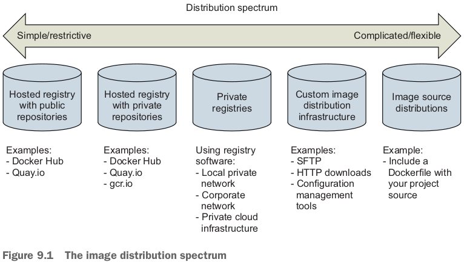

## Selecting criteria

- Cost
- Visibility
- Transport speed or bandwidth overhead
  - High transportation speeds or low installation latency is critical for systems that use **just-in-time deployment** to service synchronous requests.
- Longevity(長寿、ちょうじゅ、長生き、長命) control
  - Hosted distribution methods are subject to other people's or companies' business concerns.
- Availability control
  - Hosted solutions provide no availability control.
  - Private registries or custom solutions put both the control and responsibility in your hands.
- Access control
  - Access control protects your images from modification or access by unauthorized parties.
- Artifact integrity
  - Artifact integrity is trustworthiness and consistency of your files and images.
- Artifact confidentiality
- Requisite(必要な) expertise(専門知識)

# 9.2 Publishing with hosted registries

## Publishing with public repositories: "Hello World!" via Docker Hub

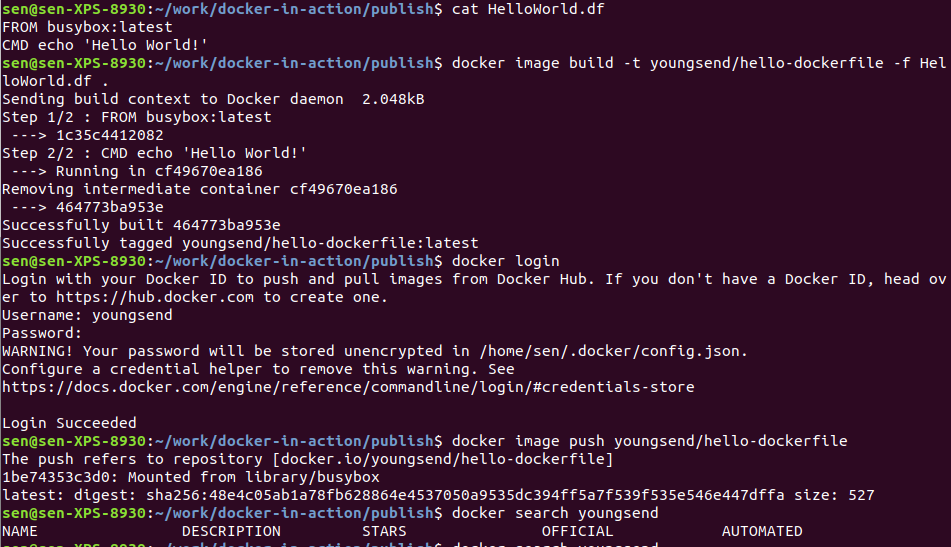

- `docker search youngsend`は何も出てこないが、Docker Hubには反映されている：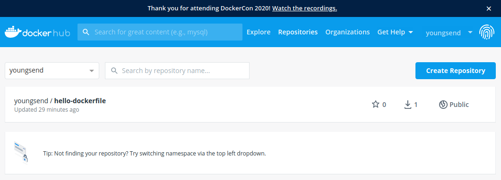

## Private hosted repositories

- push以外、pullも認証が必要。
- Cost: Users or organizations that require more than 50 repositories may find it more appropriate to run their own private registry.

- Individuals and small teams will find the most utility in private hosted repositories.

# 9.3 Introducing private registries

- GitLabみたいだ。
- People can interact with a private registry exactly as they would with a hosted registry.
- **registry software**を利用！例えばDocker's registry software *Distribution*.

- Cost: Whereas the cost of hosted repositories scales with raw repository count, the cost of private registries scales with **transaction rates** and storage usage.
- Requisite experience: Generally, you'll want to be familiar with **NGINX to build a proxy, LDAP or Kerberos to provide authentication, and Redis for caching**.
  - Many commercial product solutions are available for running a private Docker registry, ranging from traditional artifact repositories such as Artifactory and Nexus to software delivery systems like GitLab.

## Using the registry image

- The Distribution software is available on Docker Hub in a repository named `registry`.
- `registry`をrunする：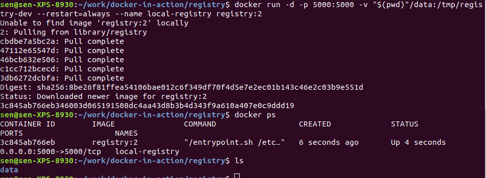
  - `data`フォルダはこのregistryのstorageになる。
- **The registry location is `localhost:5000`**.
- `registry`を利用するarchitectureは：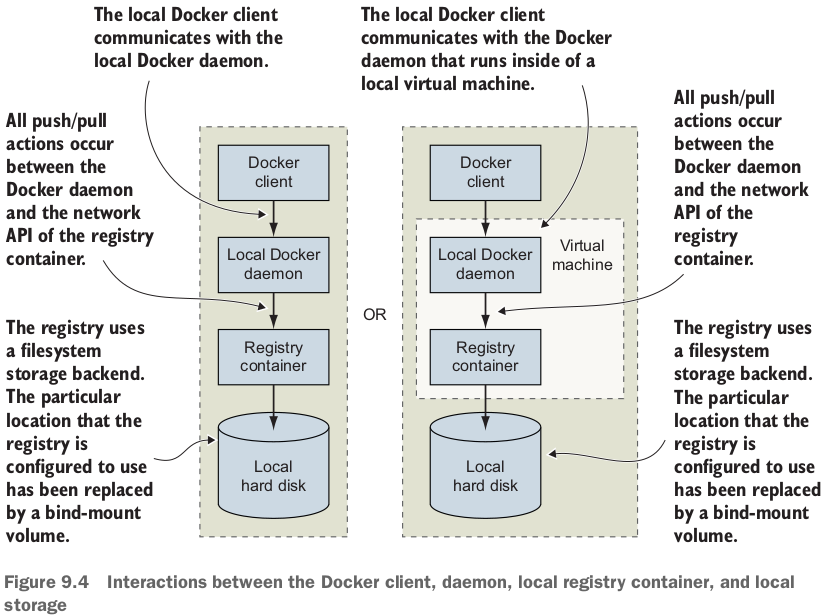
- Companies that want **tight version control** on their **external image dependencies** will pull images from external sources such as Docker Hub and **copy them into their own registry**.
- 例：copy images from Docker Hub into your new registry. 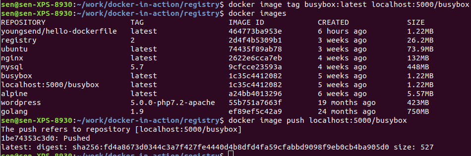
  - tagが`localhost:5000`のprefixがあったら、自動的に`localhost:5000`にあるregistryにpushされた！しかし`data`フォルダは空。。。多分見えないだけ、なぜなら、下の例から

## Consuming images from your registry

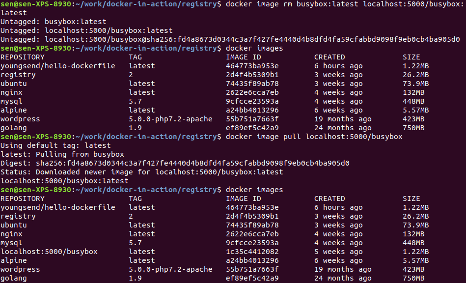

# 9.4 Manual image publishing and distribution

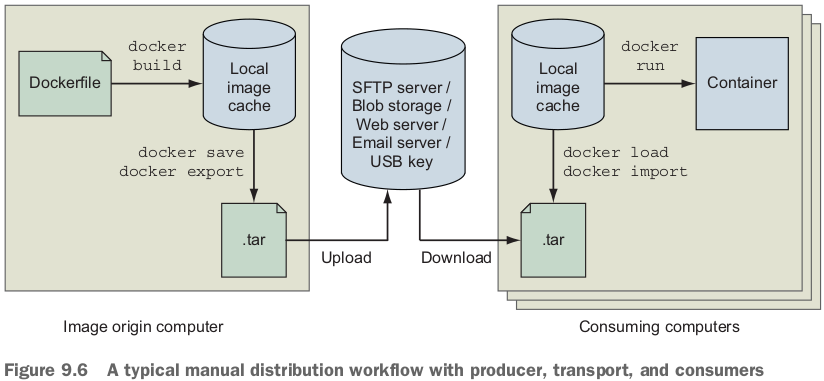

- 復習：exporting and importing full filesystems as flattened images. 僕の理解、exportの対象はcontainerです。exportはcontainerのfilesystemを丸ごとimage fileにする（containerのベースimageの履歴は全部なくなる）。importするとき、実はfilesystemをimportして、**imageを作る**。このimageのlayerは１つしかない。
  - exportは：container -> image tar.
    - import: image tar -> image. layerは１つしかない。
  - saveは：image -> image tar.
    - load: image tar -> image. saveした時の履歴全部回復。

- Layered images or flattened images.
  - Layered images maintain the history of the image, container-creation metadata, and old files that might have been deleted or overridden.
  - Flattened images contain only the current set of files on the filesystem.

## A sample distribution infrastructure using FTP

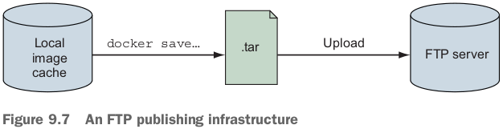

- Step1: Run an FTP server (Build your image distribution infrastructure). Step2: Export an image to the file format (At this point, you could inject all sorts of phases, such as checksum generation or file encryption). 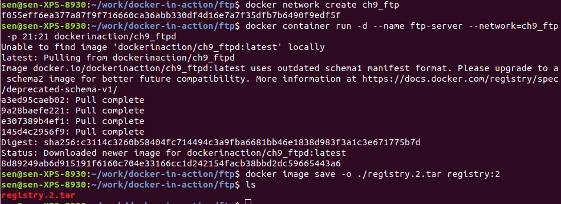
  - The `ftp-server` container is attached to a user-defined bridge network named `ch0_ftp`, and **other containers attached to the `ch9_ftp` network will be able to connect to `ftp_server`**.

- Step3: ftp-clientを立ち上げて、ftp-serverにtar fileをuploadする(distribution)：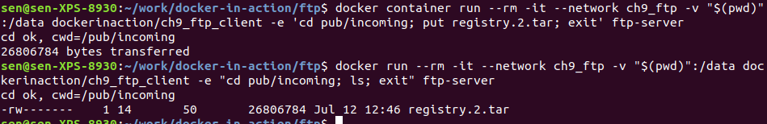
- Step4: ftp-serverにあるimage tarをget&loadする：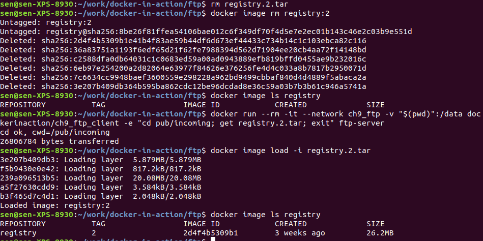
- ftp-server image: centos:6 + vsftpd (an FTP daemon).
- ftp-client image: minimal Alpine Linux + LFTP (an FTP client).

# 9.5 Image source-distribution workflows

- When you distribute image sources instead of images, you **cut out all the Docker distribution workflow and rely solely on the Docker image builder**.

## Distributing a project with Dockerfile on GitHub

- producerの流れ：

  ```bash
  git init
  git config --global user.email "you@example.com"
  git config --global user.name "Your Name"
  git add Dockerfile
  # git add *whatever other files you need for the image*
  git commit -m "first commit"
  git remote add origin https://github.com/<your username>/<your repo>.git
  git push -u origin master
  ```

- consumerの流れ：

  ```bash
  git clone https://github.com/<your username>/<your repo>.git
  cd <your-repo>
  docker image build -t <your username>/<your repo> .
  ```

- Transport speed/size: By distributing image sources, you can **leverage other registries for base layers**.
  - **GitHub also provides a content delivery network (CDN)**.

- **Image source distribution is divorced from all Docker distribution tools**.

# 復習項目

1. Having a spectrum of choices illustrates your range of options.
2. You should use a consistent set of selection criteria in order to evaluate your distribution options and determine which method you should use.
3. Hosted public repositories provide excellent project visibility, are free, and require little experience to adopt.
4. Consumers will have a higher degree of trust in images generated by automated builds because a trusted third party builds them. automated buildsとtrusted third party関係ある？official imageの話でしょう。
5. Hosted private repositories are cost-effective for small teams and provide satisfactory access control.
6. Running your own registry enables you to build infrastructure suitable for special use cases without abandoning the Docker distribution facilities.
7. Distributing image as files can be accomplished with any file-sharing system.
8. Image source distribution is flexible but only as complicated as you make it. Using popular source-distribution tools and patterns will keep things simple.