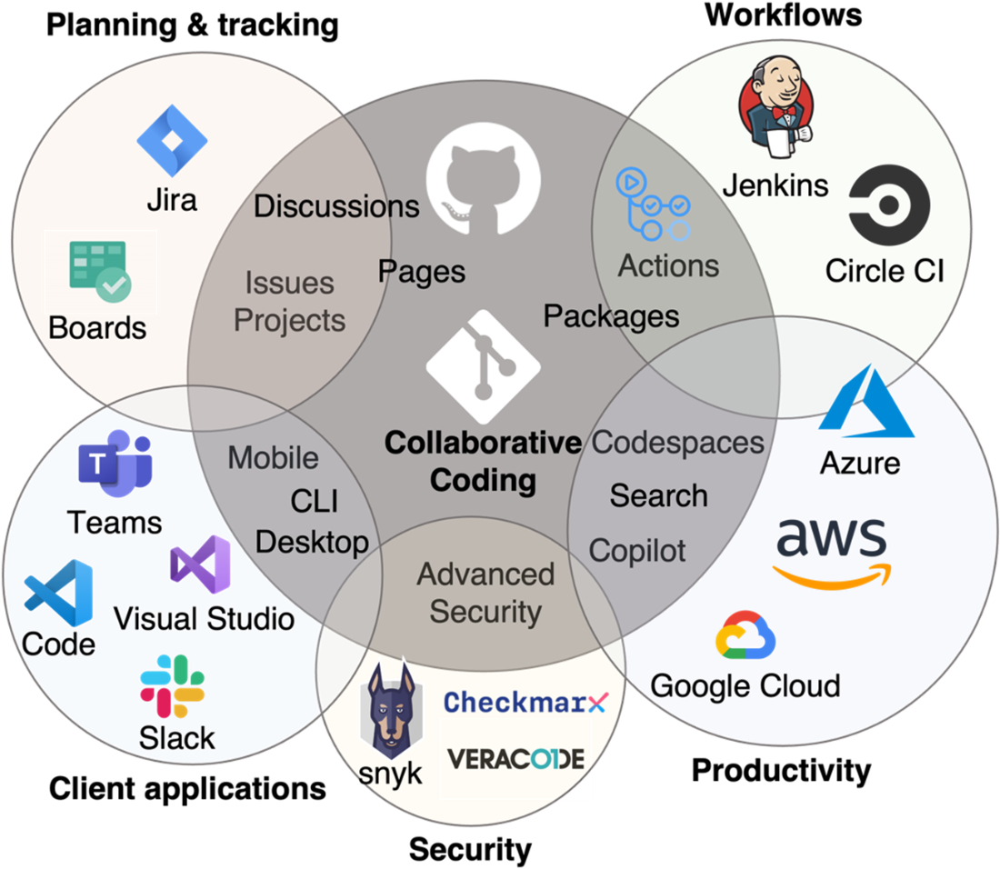
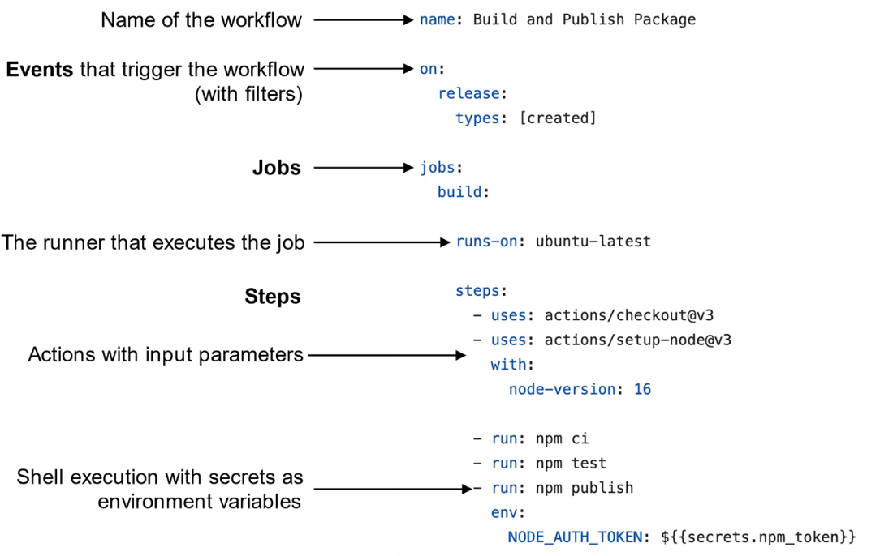
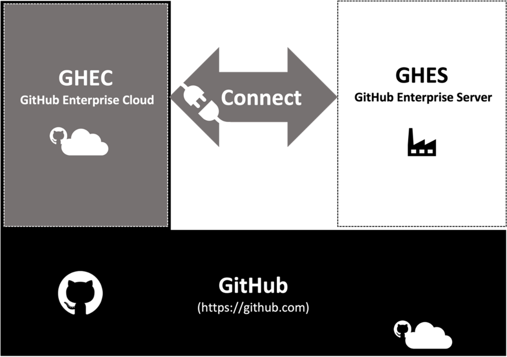

- Github ecosystem

- Jobs are executed on a **workflow runner**, which can be **a machine or container** with an installed runner service. 
  - GitHub offers runners with Linux, macOS, and Windows operating systems in  various machine sizes, but you can also host your own runners.

- a Github Actions workflow: 
  - GitHub Action workflows are YAML files in a repository in the folder `.github/workflows` and contain triggers, jobs, and **steps**.
  - A GitHub Action is reusable **workflow step** that can be easily shared through the GitHub marketplace.

- Github cloud: 
  - GHEC guarantees a monthly uptime Service Level Agreement (SLA) of 99.9%, which translates to a maximum downtime of 45 minutes per month.
- 各OSのビルドコストが違う：It is important to note that jobs running on Windows and macOS runners consume more build minutes than those running on Linux. Windows consumes build minutes at a rate of 2x and macOS consumes build minutes at a rate of 10x, meaning that using 1,000 Windows minutes would use up 2,000 of the minutes included in your account, while using 1,000 macOS minutes would use up 10,000 minutes included in your account. This is due to the higher cost of build minutes on these operating systems.
- 勉強用ならopenリポでやる：**It is important that you are aware of the costs when playing around with workflows. Especially if you try certain triggers**. Best is to just use public repos for training purposes – in this case the workflows are free of charge in any case.