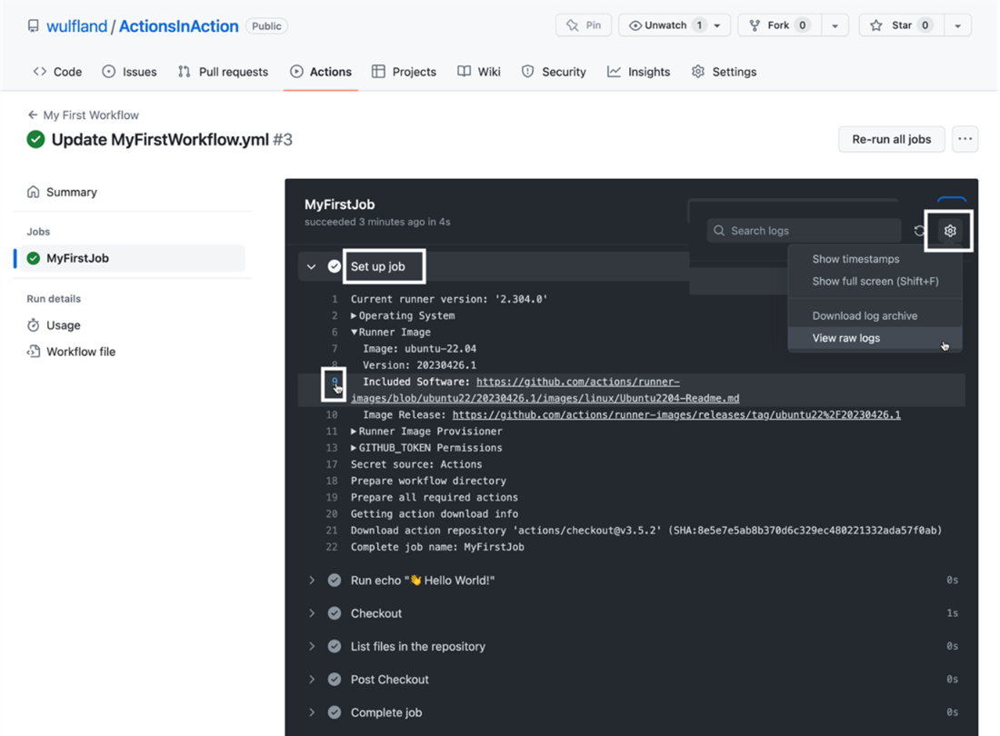

- a `workflow_dispatch` trigger, which will enable you to trigger the workflow manually. 

- Choose `runs-on` and enter `ubuntu-latest`, which will execute the job on the **latest Ubuntu machine hosted by GitHub**.
- Use actions from the marketplace: blue badgeは既になさそう。20240501時点で新規したリポのブランチはmainになっている。もうmasterじゃなくなった？

- use a **multi-line** script using the pipe operator `|` and a two-blank indentation for the script.

- commit the new workflow file: 

- the job details containing the workflow run log:  

- trigger a workflow manually (**select the workflow from the left-hand side**): 

- Summary:
  - The workflow editor contains documentation and the marketplace.
  - You can simply copy and paste actions from the marketplace into you workflow to use them.
  - The workflow has a live-log with deep-linking that provides all the information for the workflow run.
