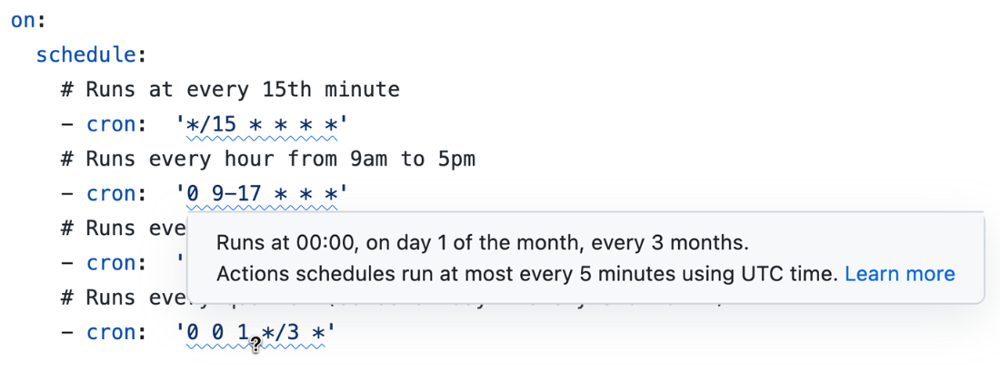
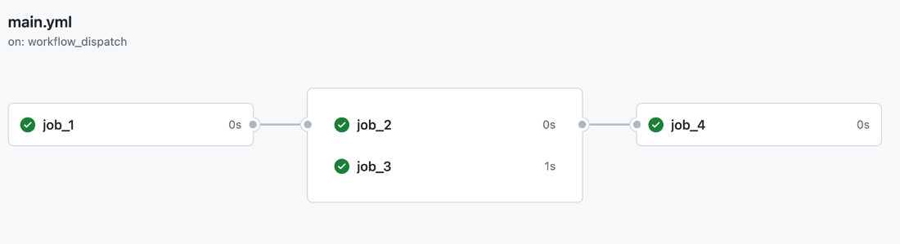
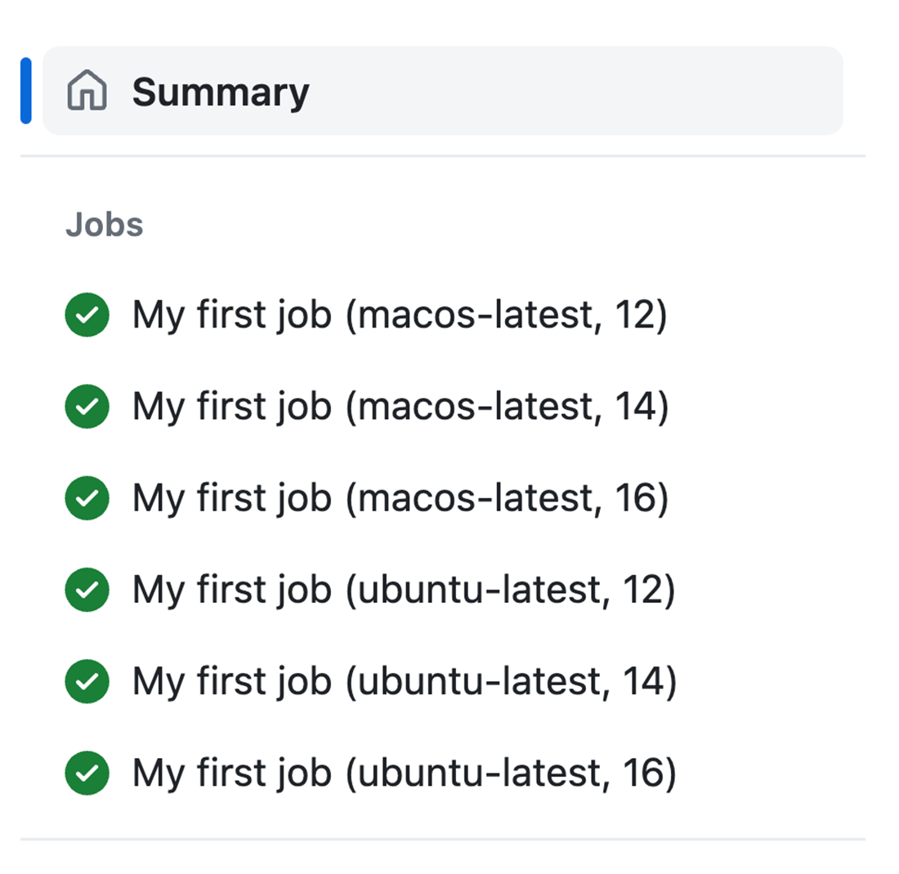
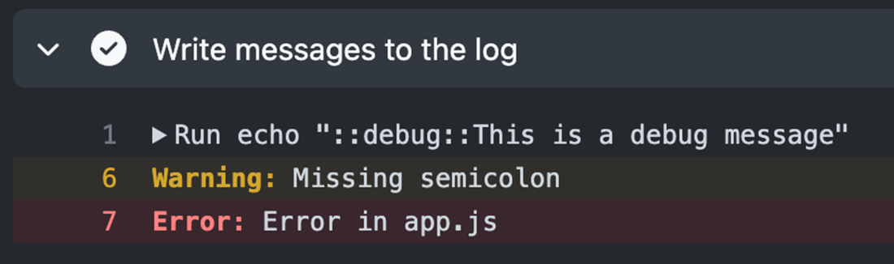
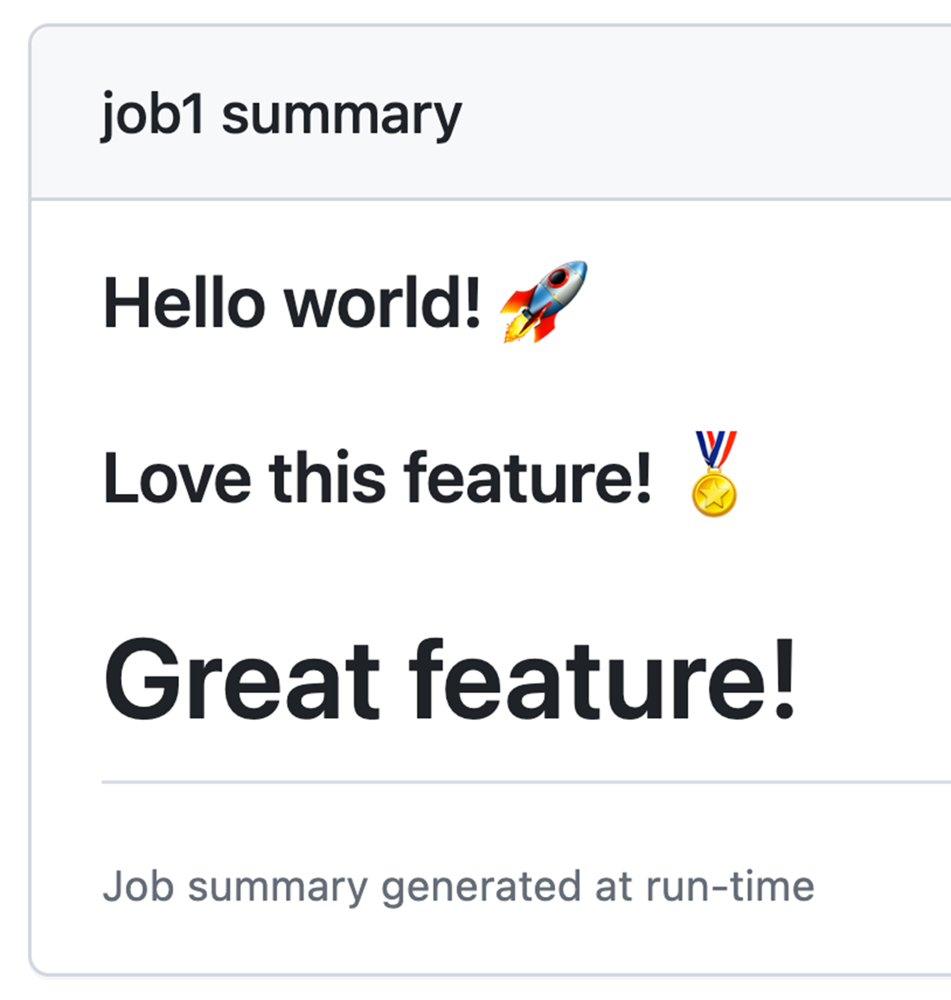
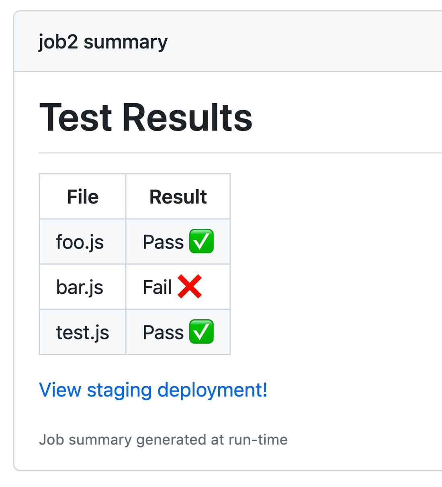
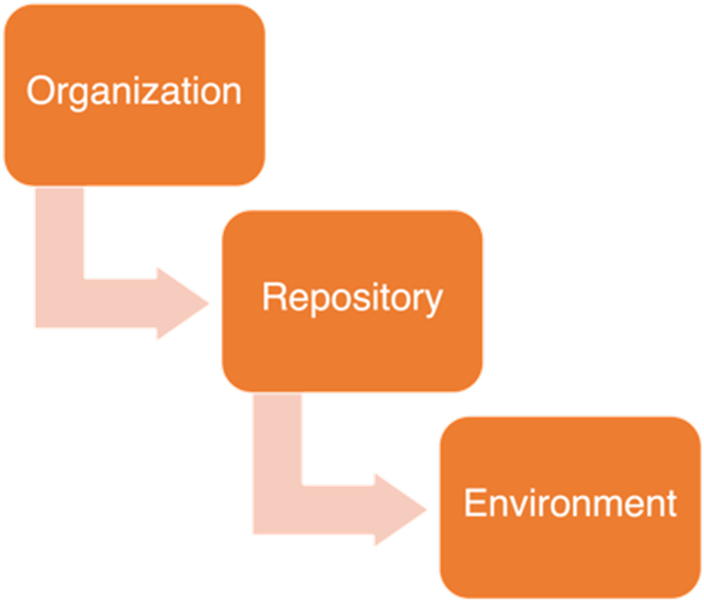
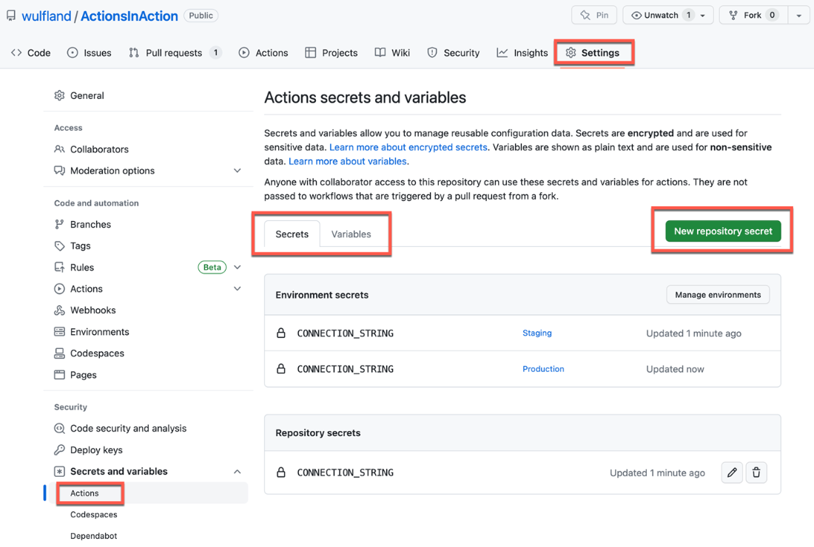
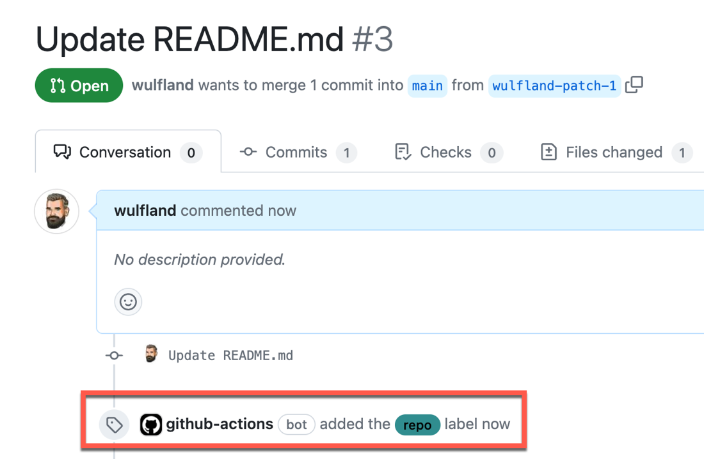
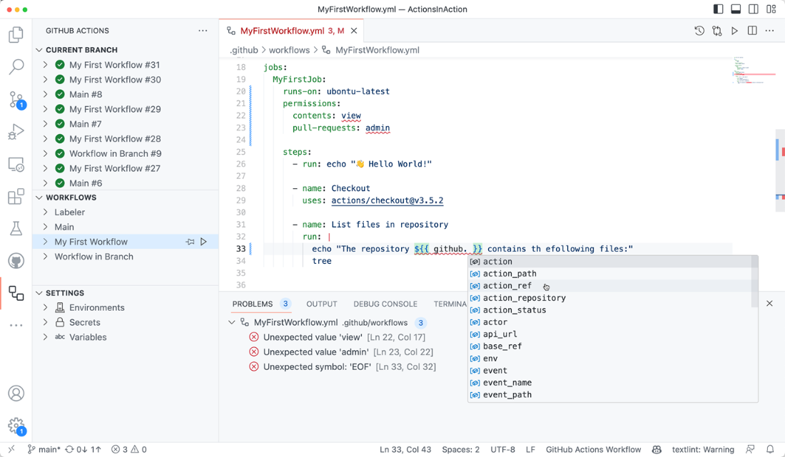

- [ ] リポのコピーはforkを使ってみないと井上さんに相談、特に上流の変更が更新できる点。でも同じ組織内のリポをforkできるか試す。
- [ ] VSCodeのGitHub Actions拡張機能を試す。
- [ ] workflowの開発は、forkリポにやったほうがよい。チームに提言。

### 3.1 YAML

- Note that keys *and* values *can contain spaces and do not need quotation*!
  - You can quote keys and values with single or double quotes, but you only have to do so if they contain some special characters or if the  characters would indicate to YAML a wrong data type. 
  - Double quotes use the backslash as the escape pattern, single quotes use an additional single quote for this

- Multiple lines: String variables can also span multiple lines using the **pipe operator**  and a **four spaces indentation**. The multi-line text block can also  contain line breaks and empty lines and continues until the next  element:

  ```yaml
  literal_block: |
      Text blocks use four spaces as indentation. The entire
      block is assigned to the key 'literal_block' and keeps
      line breaks and empty lines.
   
      The block continuous until the next YAML element with the same
      indentation as the literal block.
  ```

- map / nested type:

  ```yaml
  parent:
    key1: value1
    key2: value2
    child:
      key1: value1
  ```

- sequence / list: 

  ```yaml
  sequence:
    - item1
    - item2
    - item3
  ```


### 3.2 Events and triggers

- **Webhook triggers** start the workflow based on an event in GitHub.

  - You can, for example, start a workflow only when pushing to certain `branches`, or pushing when certain files in a path (`paths`) have been updated. The following example will only trigger the workflow, when files in the `doc` folder have changed and the changes are pushed to the `main` branch or a branch starting with `release/`:

    ```yaml
    on:
      push:
        branches:
          - 'main'
          - 'release/**'
        paths:
          - 'doc/**'
    ```

  - you could run a workflow on an `issues` event. Supported activity type filters are: opened, edited, deleted, transferred, pinned, unpinned, closed, reopened, assigned, unassigned, labeled, unlabeled, locked, unlocked, milestoned, and demilestoned.

  - You can also run a workflow when your repository is starred (`watch`), a `branch_protection_rule` is created, edited, or deleted, or when you repository visibility is changed from private to `public`. 

  - events that trigger workflows: https://docs.github.com/en/actions/using-workflows/events-that-trigger-workflows

- Scheduled workflows: 

  ```yaml
  on:
    schedule:
      # Runs at every 15th minute
      - cron:  '*/15 * * * *'
      # Runs every hour from 9am to 5pm
      - cron:  '0 9-17 * * *'
      # Runs every Friday at midnight
      - cron:  '0 0 * * FRI'
      # Runs every quarter (00:00 on day 1 every 3rd month)
      - cron:  '0 0 1 */3 *'
  ```

  - you can combine multiple schedule triggers in the same workflow, which can be helpful if you have a combination of multiple timings.
  - workflow designerが人間が読める言葉を変換してくれる：

- custom inputs for the **workflow_dispatch trigger** (まだよくわかっていない):

  ```yaml
  workflow_dispatch:
    inputs:
      homedrive:
        description: 'The home drive on the machine'
        required: true
      logLevel:
        description: 'Log level'
        default: 'warning' 
        type: choice
        options:
        - info
        - warning
        - debug 
      tag:
        description: 'Apply tag after successfull test run'
        required: true 
        type: boolean 
      environment:
        description: 'Environment to run tests against'
        type: environment
        required: true
  ```

  - For choice you provide a fix list of values that are allowed.
  - environmentはよくわかっていない。Environments have to be created manually in the repository. 

- **repository_dispatch trigger**: start all workflows in the repository that listen to that trigger **using the GitHub API**. https://docs.github.com/en/rest

  ```yaml
  on:
    repository_dispatch:
      types: [event1, event2]
  ```

  - 馴染んできたevent trigger。REST APIやラムダのことと似てる。

  - Github APIをコールする方法はいくつかある：例えばcurl:

    ```shell
    $ curl \
      -X POST \
      -H "Accept: application/vnd.github.v3+json" \
      https://api.github.com/repos/{owner}/{repo}/dispatches \
      -d '{"event_type":"event1"}'
    ```

  - もしくはGitHub CLI:

    ```shell
    $ gh api -X POST -H "Accept: application/vnd.github.v3+json" \
      /repos/{owner}/{repo}/dispatches \
      -f event_type=event1 \
      -f 'client_payload[passed]=false' \
      -f 'client_payload[message]=Error: timeout'
    ```

### 3.4 Workflow jobs and steps

- run **in parallel** per default. chain them in a sequence by depending a job on the successful output of one or multiple other jobs using the `needs` keyword.

  ```yaml
  jobs:
    job_1:
      runs-on: ubuntu-latest
      steps:
        - run: "echo Job: ${{ github.job }}"
   
    job_2:
      runs-on: ubuntu-latest
      needs: job_1
      steps:
        - run: "echo Job: ${{ github.job }}"
  
    job_3:
      runs-on: ubuntu-latest
      needs: job_1
      steps:
        - run: "echo Job: ${{ github.job }}"
  
    job_4:
      runs-on: ubuntu-latest
      needs: [job_2, job_3]
      steps:
        - run: "echo Job: ${{ github.job }}"
  ```

  

- **A job contains a sequence of steps**, and each step can run a command. 

- stepの中に、shellの指定もできる。python shellもある、そうすると、python scriptも実行できる。

- **using GitHub Actions**: Most of the time you want to use reusable steps – called ***GitHub Actions***. 

  ```yaml
  {owner}/{repo}@{ref}
  {owner}/{repo}/{path}@{ref} # multiple actions in a repository
  ```

  - The `{owner}/{repo}` is the path to the actions repository in GitHub.

  - The reference `{ref}` is the **version** of the action.

    ```yaml
    # Reference a version using a tag
    - uses: actions/checkout@v3
    - uses: actions/checkout@v3.5.2
    
    # Reference the current head of a branch
    - uses: actions/checkout@main
    
    # Reference a specific commit
    - uses: actions/checkout@8e5e7e5ab8b370d6c329ec480221332ada57f0ab
    ```

- Every **docker container** stored in a container registry like Docker Hub or GitHub Packages can be used as a step in the workflow using the syntax `docker://{image}:{tag}`:

  ```yaml
  uses: docker://alpine:3.8
  ```

  - This is very handy if you want to **integrate existing solutions in docker into your workflows**. Only limitation is that the container registry  must be accessible for the workflow without credentials.

- **The strategy matrix**: the matrix can consist of multiple arrays and the workflow will execute a job for all combinations of all values in the matrix. https://docs.github.com/en/actions/using-jobs/using-a-matrix-for-your-jobs

  ```yaml
  jobs:
    job_1:
      strategy:
        fail-fast: false
        max-parallel: 3
        matrix:
          os_version: [macos-latest, ubuntu-latest]
          node_version: [12, 14, 16]
  
      name: My first job
      runs-on: ${{ matrix.os_version }}
      steps:
        - uses: actions/setup-node@v3.6.0
          with:
            node-version: ${{ matrix.node_version }}
  ```

  - run the same job for the NodeJS versions 12, 14, and 16 on ubuntu and macOS. 

### 3.5 Expressions and Contexts

- With `github.sha`, for example, you can access the commit SHA that had triggered the workflow. With `runner.os` you can get the operating system of the runner and with `env` you can access environment variables. https://docs.github.com/en/actions/learn-github-actions/contexts#contexts

- The following example will only execute the job `deploy` if the workflow was triggered by a push to `main`:

  ```yaml
  jobs:
    deploy:
      if: ${{ github.ref == 'refs/heads/main' }}
      runs-on: ubuntu-latest
      steps:
        - run: echo "Deploying branch ${{ github.ref }} "
  ```

### 3.6 Workflow commands

- 目的：communicate with the workflow and the runner machine

  ```yaml
  echo "::workflow-command parameter1={data},parameter2={data}::{command value}"
  ```

  - They can be used to write messages to the workflow log, pass values to  other steps or actions, set environment variables, or write debug  messages.
  - available workflow commands: https://docs.github.com/en/actions/using-workflows/workflow-commands-for-github-actions

- **write a debug message**:

  ```yaml
  ::debug::{message}
  ```

  - To see the debug messages set by this command in the log, you must create a variable named `ACTIONS_STEP_DEBUG` with the value `true`. 

- **error or warning message**: よくわかっていないのが、file, line, colなど手動設定するのは大変ではないか？

  ```yaml
  ::warning file={name},line={line},endLine={el},title={title}::{message}
  ::error file={name},line={line},endLine={el},title={title}::{message}
  ```

  ```yaml
  echo "::warning file=app.js,line=1,col=5,endColumn=7::Missing semicolon"
  echo "::error file=app.js,line=1,col=5,endColumn=7::Error in app.js"
  ```

  

- **pass output to subsequent steps and jobs**:

  ```yaml
  echo "{name}={value}" >> "$GITHUB_OUTPUT"
  ```

  ```yaml
  - name: Set color
    id: color-generator
    run: echo "SELECTED_COLOR=green" >> "$GITHUB_OUTPUT"
  
  - name: Get color
    run: echo "${{ steps.color-generator.outputs.SELECTED_COLOR }}"
  ```

- **environment files**: 

  ```yaml
  echo "{environment_variable_name}={value}" >> "$GITHUB_ENV"
  ```

  ```yaml
  steps:
    - name: Set the value
      id: step_one
      run: |
        echo "action_state=yellow" >> "$GITHUB_ENV"
   
    - run: |
        echo "${{ env.action_state }}" # This will output 'yellow'
  ```

- **job summary**: You can set some custom Markdown for each workflow job. The **rendered  markdown** will then be **displayed on the summary page** of the workflow run. You can use job summaries to display content, such as **test or code  coverage results**, so that someone viewing the result of a workflow run  doesn't need to go into the logs or an external system.

  - **Add results from your step** to the job summary by appending markdown to the following file:

    ```yaml
    echo "{markdown content}" >> $GITHUB_STEP_SUMMARY
    ```

  - malformed Markdown from a single step cannot break Markdown rendering for subsequent steps.

    ```yaml
    - run: echo '### Hello world! :rocket:' >> $GITHUB_STEP_SUMMARY
    - run: echo '### Love this feature! :medal_sports:' >> $GITHUB_STEP_SUMMARY
    - run: echo '<h1>Great feature!</h1>' >> $GITHUB_STEP_SUMMARY
    ```

    

  - **write a job summary using the toolkit**:

    ```yaml
    - name: Write Summary from Action
      uses: actions/github-script@v6.1.0
      with:
        script: |
          await core.summary
          .addHeading('Test Results')
          .addTable([
            [{data: 'File', header: true}, {data: 'Result', header: true}],
            ['foo.js', 'Pass ✅'],
            ['bar.js', 'Fail ❌'],
            ['test.js', 'Pass ✅']
          ])
          .addLink('View staging deployment!', 'https://github.com')
          .write()
    ```

    

### 3.7 Secrets and variables

- the hierarchy for configuration variables and secrets. 

- **secrets**: A special form of **configuration variables** are secrets. They are stored  encrypted and are **only decrypted at runtime**. They are also **protected and masked in the workflow log**.

- Secrets and variables can be set using the UI or CLI. 
  - secrets, variablesのネーミング：Best practice is to name the secrets with upper-case words separated by the underscore character.

### 3.8 Workflow permissions

- The token can be used to authenticate the workflow when accessing GitHub resources. 

  ```yaml
  on: pull_request_target
   
  permissions:
    contents: read
    pull-requests: write
   
  jobs:
    triage:
      runs-on: ubuntu-latest
      steps:
        - uses: actions/labeler@v4
  ```

  - The workflow needs read permissions for content to read the configuration and it needs write permissions for pull-requests to apply the label. All other permissions will be non.

- Actions performed with the `GITHUB_TOKEN` will be in the history as performed by the *github-actions bot*: 

### 3.9 Authoring and debugging workflows

- **If your workflow needs webhook triggers like push, pull_request, or pull_request_target, it is best to create the workflow in a fork of the repository. This way you can test and debug the workflow without interfering with the  developers work, and once you are done you can merge it back to the  original repository.** forkでのプルリクはまだ経験したことがない。

- forkの目的や使い方：Forks let you make changes to a project **without affecting the original  repository**, also known as the "upstream" repository. After you fork a  repository, you can fetch updates from the upstream repository to keep  your fork up to date, and you can **propose changes from your fork to the  upstream repository with pull requests**.  リポをコピーしたいときは、forkを考慮したほうがよい！井上さんに相談！
  - forkとduplicate a repositoryの区別：https://docs.github.com/en/pull-requests/collaborating-with-pull-requests/working-with-forks/about-forks#forking-a-repository-versus-duplicating-a-repository
    - You can use a pull request to suggest changes from your fork to the upstream repository.
    - **You can bring changes from the upstream repository to your fork by synchronizing your fork with the upstream repository.**
    - Forks have their own members, branches, tags, labels, policies,  issues, pull requests, discussions, actions, projects, and wikis.
    - Forks inherit the restrictions of their upstream repositories. For  example, branch protection rules cannot be passed down if the upstream  repository belongs to an organization on a GitHub Free plan.

- VSCodeのGitHub Actions拡張機能を使ってみましょう！！機能は下記：https://marketplace.visualstudio.com/items?itemName=GitHub.vscode-github-actions

  - Managing workflows and monitoring workflow runs

  - Manually triggering workflows

  - Syntax highlighting for workflows and expressions

  - Integrated documentation

  - Validation and code completion

  - **Smart validation**

    - Especially the smart validation is a great help. It supports code  completion for referenced actions and reusable workflows and will parses parameters, inputs, and outputs for referenced actions and provides  validation, code completion, and inline documentation. **Together with GitHub Copilot this increases quality and speed for authoring workflows tremendously.**

    

- workflowの一般的な開発流れ：
  - **In general, it is normally the best approach to first run and debug  deployment scripts locally or on a virtual machine first and move them  to the workflow when you know they will work.** 
  - But even then, you might experience strange behavior. In this case you can enable debug logging by adding a variable ACTIONS_STEP_DEBUG to your repository and set the value to true. This will add a very verbose output to your workflow log and all debug messages from all actions will be displayed. https://docs.github.com/en/actions/monitoring-and-troubleshooting-workflows/enabling-debug-logging

### 3.11 Summary

- A workflow step can be a command line that is executed in a shell or a reusable action.
- The GITHUB_TOKEN can be used to authenticate the workflow when accessing GitHub resource and you can set the permissions in a job or workflow.
- **You can author your workflows in a branch – but sometimes it’s better to create the workflow in a fork to not get in the way with developing the application.**
