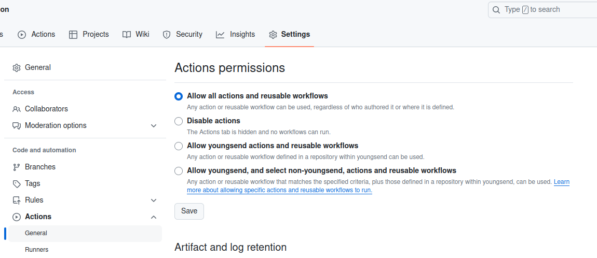

### TO DO

- [ ] 今のプロジェクトにどのタイプのactionsが使われているかチェック
- [ ] githubのcodespaceを試す。dockerから開ける？共同codingはできたらいいね。liveshareがいらなくなる。

### 4.1 Types of Actions

- **Docker container Actions** only run on Linux whereas **JavaScript and composite Actions** can be used on any platforms.

#### 4.1.1 Docker container actions

- The docker container actions **contain all their dependencies** and are therefore very consistent.

- Docker container actions are **slower** then JavaScript actions because of  the time **retrieving or building the image and starting the container**.

  ```yaml
  name: 'Your name here'
  description: 'Provide a description here'
  author: 'Your name or organization here'
  inputs:
    input_one:
      description: 'Some info passed to the container
      required: false
    input_two:
      default: 'some default value'
      description: 'Some info passed to the container'
      required: false
  runs:   
    using: 'docker'
    image: 'docker://ghcr.io/wulfland/container-demo:latest'
    args: 
      - ${{ inputs.input_one }}
      - ${{ inputs.input_two }}
    env:  
        VARIABLE1: ${{ inputs.input_one }}
        VARIABLE2: ${{ inputs.input_two }}
  ```

  - You can pass inputs of the action to the container by either specifying  them as arguments to the container or setting them as environment  variables. 

#### 4.1.2 JavaScript actions

- JavaScript actions run directly on the runner and are executed in NodeJS. 

- A TypeScript action running on NodeJS 16: ウェブアプリ専用（違う）？

  ```yaml
  name: 'Your name here'
  description: 'Provide a description here'
  author: 'Your name or organization here'
  inputs:
    input_one:
      required: true
      description: 'input description here'
      default: 'default value if applicable'
  runs:
    using: 'node16'
    main: 'dist/index.js'
  ```

#### 4.1.3 Composite actions

- a **wrapper** for other steps or actions. use them to bundle together multiple run commands and actions, or to  provide default values for other actions to the users in your  organization. 特別なところはあんまりないね：

  ```yaml
  name: 'Hello World'
  description: 'Greet someone'
  inputs:
    who-to-greet:
      description: 'Who to greet'
      required: true
      default: 'World'
  outputs:
    random-number:
      description: "Random number"
      value: ${{ steps.random-number-generator.outputs.random-id }}
  runs:
    using: "composite"
    steps:
      - run: echo "Hello ${{ inputs.who-to-greet }}."
        shell: bash
        
      - id: random-number-generator
        run: echo "random-id=$(echo $RANDOM)" >> $GITHUB_OUTPUT
        shell: bash
        
      - run: echo "Goodbye $YOU"
        shell: bash
        env:
          YOU: ${{ inputs.who-to-greet }}
  ```


- actionsはworkflow内で実際の処理を行うためのユニット。

### 4.2 Authoring Actions

- actionを選ぶ：
  - If you already know NodeJS and TypeScript than this is probably your natural choice.

- Independent of the type of action you want to write – the best thing is to **get started with a template**. https://github.com/actions/ 
  - JavaScript: https://github.com/actions/javascript-action
  - TypeScript: https://github.com/actions/typescript-action
  - Docker container: https://github.com/actions/hello-world-docker-action
  - An example for a composite action: https://github.com/actions/upload-pages-artifact

- actions can be stored in a repository or a folder: 

- **release management**: Best practice is to use tags together with GitHub releases (see https://docs.github.com/en/repositories/releasing-projects-on-github) together with sematic versioning.
  - Create a tag with a semantic version for every version of the action that you want to publish.
  - Mark the version latest if you publish the action to the marketplace.
  - **Create a CI build that tests your action before releasing it**.
  - Make sure to add additional tags for major version and update these tags if  you provide a security or bug fix. For example, if you have a version  v3.0.0 – also provide a version v3 and update v3 to a new commit in case you release a version v3.0.1 with an important fix.

### 4.3 Hands-on: a docker container action in action

- 下記のリンクのtemplateからリポを作る：https://github.com/GitHubActionsInAction/ActionInAction 


- ステップ1: create the Dockerfile for the action: 

  ```dockerfile
  # Container image that runs your code
  FROM alpine:latest
   
  # Copies entrypoint.sh from your repo to the path ‘/’ of the container
  COPY entrypoint.sh /entrypoint.sh
   
  # Make the script executable
  RUN chmod +x entrypoint.sh
   
  # Executes ‘/entrypoint.sh’ when the docker container starts up
  ENTRYPOINT [“/entrypoint.sh”]
  ```

- ステップ2: create the action.yml file

  - GitHub identifies actions by looking for an `action.yml` manifest that defines the action.

  ```yaml
  name: "{GitHub username}'s Action in Action"
  description: 'Greets someone and returns always 42.'
  inputs:
    who-to-greet:  # id of input
      description: 'Who to greet'
      required: true
      default: 'World'
  outputs:
    answer: # id of output
      description: 'The answer to everything (always 42)'
  runs:
    using: 'docker'
    image: 'Dockerfile'
    args:
      - ${{ inputs.who-to-greet }}
  ```

  - The `runs` section is the part that defines the action type.

- ステップ3: create the entrypoint.sh script

  ```sh
  #!/bin/sh -l
   
  echo "Hello $1"
  echo "answer=42" >> $GITHUB_OUTPUT
  ```

  - This simple script writes Hello and the input `who-to-greet`.

- ステップ4: **create a workflow to test the container**. `.github/workflows/test-action.yml`

  ```yaml
  name: Test Action
  on: [push]
   
  jobs:
    test:
      runs-on: ubuntu-latest
      steps:
        - name: Checkout repo to use the action locally
          uses: actions/checkout@v3.5.3
  
        - name: Run my own container action
          id: my-action
          uses: ./
          with:
            who-to-greet: '@youngsend'
  
        - name: Output the answer
          run: echo "The answer is ${{ steps.my-action.outputs.answer }}"
  
        - name: Test the container
          if: ${{ steps.my-action.outputs.answer != 42 }}
          run: |
            echo "::error file=entrypoint.sh,line=4,title=Error in container::The answer was not expected"
            exit 1
  ```

  - In this workflow we use the local version of the action (`uses: ./`). In this case it is required to **check out the repository** first using the `checkout` action. This is not necessary if you reference an action by a git reference (`action-owner/action-name@reference`). 
  - The workflow will automatically run because of the push trigger after committing the file. 

### 4.4 Sharing Actions

- You can **share actions internally in your organization** from within private repositories or publicly in the GitHub marketplace.

#### 4.4.1 Sharing actions in your organization

- **Per default, workflows cannot access other repositories**. But by granting permissions for GitHub Actions it is easy to share actions and *reusable workflows* within your organization.
- composite actionやreusable workflowsの比較：reusable workflows give you control over multiple jobs and environments  that can run on different runners and have interdependencies. Composite  actions are always executed in one job and only give you control over  the steps inside the job.

- actionsに対するアクセス権限の設定：

#### 4.4.2 Share actions publicly

- GitHub automatically detects if you have an action.yml file in the root of the repository: 

- 「Draft a release」をクリックすると、

  - GitHub Marketplace Developer Agreementをacceptしたら、Two factor authenticationが要求される。two factor authenticationができたら、

  - iconとcolorをaction.yamlに追加して、更新すると：

    ```yaml
    branding:
      icon: 'alert-triangle'
      color: 'orange'
    ```

    

- 「Generate release notes」ボタン：**pick up your pull requests** and first-time contributors and automatically create good release notes. 

- 「Publish release」をクリックすると、

  - 「Latest」が表示され、「Marketplace」のリンクもあった。リリースノートは、まだpull requestがないため、ちょっとシンプルだが。

- 「Marketplace」リンクをクリックすると、actionのホームページに飛ぶ（右上に「Delist」ボタンあり、学習完了後削除）：

- 上記のactionはworkflow editorからも探せる。そのため、別のリポから新たなworkflowを作ってみる：

  ```yaml
  name: Test Action in Marketplace
  on: [workflow_dispatch]           
   
  jobs:
    test:
      runs-on: ubuntu-latest
      steps:
        - name: Run my own container action
          id: action
          uses: youngsend/MyActionInAction@v1.0.0
          with:
            who-to-greet: '@youngsend'
            
        - name: Output the answer
          run: echo "The answer is ${{ steps.action.outputs.answer }}"
  ```

  

- 手動で上記のworkflowを実行すると、

- delistされたら、marketplaceから検索できなくなる。ただし、既に使っているworkflowにも引き続き使える。実際は、delistされらactionはメンテされなくなるので、使わないほうがよい。

### 4.6 Best practices

- Small and focused
- write tests and a test workflow
  - Make sure to have sufficient tests for your code - and a test workflow  that runs the action as an action. Good tests will give you the  confidence to release frequently.
- semantic versioning（major version, minor version, patch versionのこと）
  - For example: if you release a version v3.0.0 – also add a tag v3 for the current major version. If you provide a bugfix (v3.0.1), move the tag  v3 to the fixed version.
- documentation
- proper action.yml metadata（name, description, inputs, outputs, runsのこと）
  - Provide good metadata in your action.yml and especially for  your inputs and outputs. Try to avoid required inputs and provide  default values whenever possible. 

- SDKs
  - Use the toolkit ([github.com/actions/toolkit](https://github.com/actions/toolkit)) or the other SDKs to interact with GitHub and the APIs.
- publish the action

### 4.8 Summary

- Docker container actions can retrieve an image from a Docker library like Docker Hub or build a Dockerfile.
- You publish actions to the marketplace by **placing them in their own repository and publishing a GitHub release**.
- You can share actions internally by granting access to workflows in your organization in a private repository.
- You can use the *octokit* SDK to interact with the GitHub APIs in your actions. これはまだ体感が薄い。