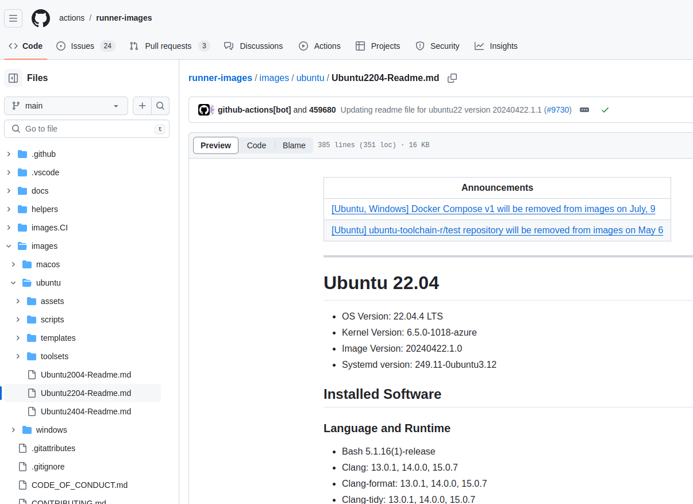
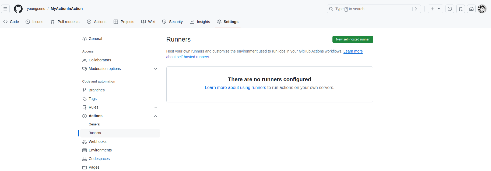
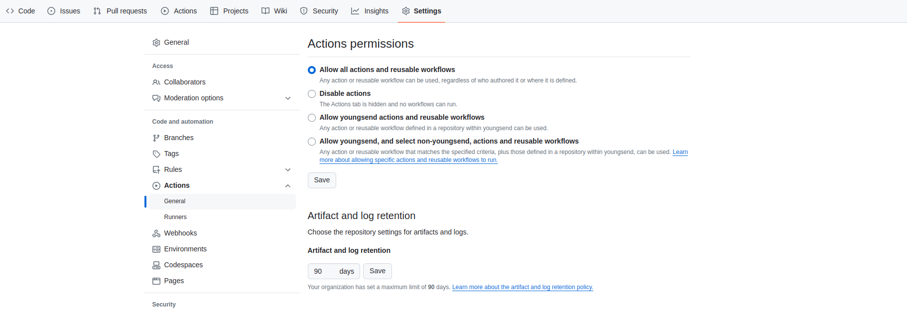

- Runners are standalone instances that continuously ask GitHub if there is work for them to execute.

### 5.2 Queuing jobs

- For GitHub hosted runners, the queuing of the job will fail if there are no runners available with the requested label(s) within **45 minutes**. 
- The most common reason the workflow does not start is because the **runner label does not exist or is not available for the current repository**. It could be for example that the label for a self-hosted runner is used,  which does not exist on GitHub hosted runners.

### 5.3 The runner application

- The runner application is based on .NET core and can be installed on a virtual machine, a container, or any other environment that can run .NET core code. つまりactionを実行するために、runner applicationをインストールする必要がある。

### 5.4 GitHub hosted runners

- information about the runner image (https://github.com/actions/runner-images): 

### 5.6 Installed software

- GitHub works together with the user community to define what software will get installed on the environment. They focus on the most used SDK’s, shells, package ecosystems, etc. If you have the need for software that is missing, you can create an issue in the runner-images repository and propose it for adoption. 

- When you know your job is dependent on having for example Node 14 installed, then specify that in the job definition itself.

  ```yaml
  steps:
    name: Install node with correct version
    uses: actions/setup-node@v3
    with:
      node-version: 14
   
    name: build you node application
    run: |
      npm install
      npm run build
  ```

- There are **setup actions available for widely used SDK’s** and maintained by GitHub in their ‘actions’ organization, for example:
  - actions/setup-dotnet
  - actions/setup-java
  - actions/setup-go
  - actions/setup-node
  - actions/setup-python

- If the version is no longer in the ‘hostedtoolscache’ directory, the setup actions will download it from the corresponding GitHub repository and install it from there.

### 5.7 Default shells

- You can specify the shell to use for each run step.

  ```yaml
  steps:
      run: echo “Hello world”
      shell: pwsh
  ```

- You can also make the desired shell the **default** for all jobs in the workflow.

  ```yaml
  name: example-workflow
  on:
    workflow_dispatch:
  default:
  shell: pwsh
  ```

  - If a single step still needs a different shell, you can use the `shell` keyword at the step level to override the default.

### 5.11 Larger GitHub hosted runners

- Larger runners are only available in GitHub Enterprise Cloud and not on the server. 
- Larger runners are only available for organizations and enterprises using the GitHub Team or GitHub Enterprise Cloud plans (https://docs.github.com/en/actions/using-github-hosted-runners/about-larger-runners/about-larger-runners). だから自分のrunner設定画面には表示されないんだ：

### 5.13 Billing of GitHub hosted runners

- Running everything in parallel can save you time, to get feedback faster back to a developer, but can also cost more action minutes.
- Take this into account when creating workflows: depending on the trigger used, you might not need to run everything in parallel to get fast feedback to a developer.
  - 例えば、a pull request is often an asynchronous event that gives you more time to run all the checks you need to allow the pull request to be merged. Therefore, you do not need the fasted run duration and have time to run steps as a sequence, instead of running them in parallel across more than one job.

- Artifact retention settings at the organization level: 
  - The storage used by a repository is the total storage used by GitHub Actions artifacts and GitHub Packages.

### 5.15 Self-hosted runners

- Most often the use-case we see for self-hosted runners is having a runner inside of your company firewall, licensed software that need to be installed, or adding more powerful hardware combinations, like a GPU enabled environment.