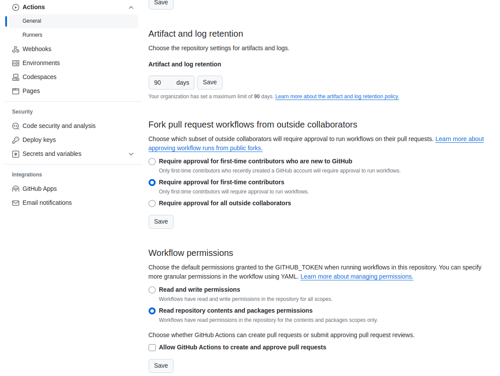

- self-hosted runnerを使うシーンの一つ：Or perhaps you have a need for certain (larger) Docker containers: installing a self-hosted runner on a machine that already has those containers downloaded and pre-cached can save a lot of time and network bandwidth.

### 6.1 Setting up self-hosted runners

#### 6.1.1 Runner communication

- Since the **runner communication is an outgoing channel from the runner to the GitHub environment**, there are events that happen when the communication stops. When there is no communication from the self-hosted runner to GitHub for more than 14 days, the runner will be removed from the listing and will need to be reconfigured before it is allowed to reconnect. 

#### 6.1.6 Runner capabilities

- A best practice for indicating runner capabilities is to add them as labels to the runners so that users can target the capabilities they need. An example could be that there is a GPU available, then add the label `gpu`. 

#### 6.1.9 Installing extra software

- For the job itself it should not matter where it is running: if the job is **self-contained**, it will install the software it needs itself, like for example downloading the latest version of the Node and installing it.

  ```yaml
  steps:
   - name: Install Node with version
     uses: actions/setup-node@v3
     with:
       version: 18.*
   
   - uses: actions/checkout@v3
   
   - name: use the CLI
     run: node --version # check the installed version
  ```

#### 6.1.10 Runner service account

- For Linux and macOS the default setup is to run the service as root. 特にdocker containerのために。

### 6.2 Security risks of self-hosted runners

- As a general best practice, we always recommend to never run a job on a self-hosted runner without having full control over the job definition. Especially with public repos hosted on [https://github.com](https://github.com/), where **any authenticated user can craft a pull request to attack your setup**.
  - GitHub protects you for these types of attacks by limiting the GITHUB_TOKEN for the on: pull_request trigger and by **not running workflows automatically on incoming pull requests from new contributors**. 
- If you still have a need to run a job on your self-hosted runner, then either run it on a contained runner that is ephemeral (single use), does not have any networking connection options, and is only allowed to run after running stringent security checks, both manually and automated. 
  - You can for example run specific linters for GitHub Actions on your workflows to detect things like shell-injection attacks (running injected code from **run** commands). 

### 6.3 Single use runners

- Our recommendation is to **use ephemeral runners with Just-in-time tokens whenever possible**, because of the security concerns of **persisting data from job1 that then can be (mis)used in job2 on the same runner**. 
  - The GitHub hosted runners are configured the same way to **protect data being leaked between customers**. 

### 6.5 Autoscaling options

- For setting up runners in an automated way, we recommend looking at the curated list of solutions in this repository: https://github.com/jonico/awesome-runners.
- There are options to host runners on Amazon EC2 instances, AWS Lambdas, Kubernetes clusters, OpenShift, Azure VM’s and you can of course setup an Azure scale set yourself as well. 

- **Autoscaling with actions-runner-controller (ARC)**.
  - The *actions-runner-controller* (*ARC*) solution is owned by GitHub and gives you an option to host a scalable runner setup inside your own Kubernetes cluster (a setup where multiple computers share the workload and scheduling is handled for you). If you have the option to host you own Kubernetes cluster for this and be in control how the cluster is utilized and scales, then we recommend this solution over others. 

### 6.6 Summary

- Self-hosted runners can be configured in any environment that supports **.NET core, git, and node**.
- The best way to setup a runner is by configuring it as ephemeral. Then it will only run a single job and deregister itself and not accept any more jobs. That gives you the option to clean up the environment and prevent a lot of security risks.
- There are several autoscaling options available, and the one that is managed and supported by GitHub is the actions runner controller. This can scale based on time, runner utilization, and just in time by configuring a webhook in GitHub that triggers whenever a workflow job is queued.
