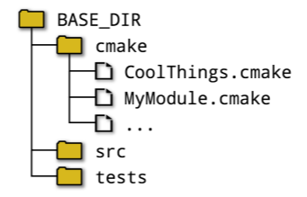

- 今までの内容はCMake language。Modulesは**pre-built chunks of CMake code** built on top of the core language features.

- Modules are collected together and provided in a single directory as **part of a CMake release**.

- 2つ利用方法：

  - ```cmake
    include(module [OPTIONAL] [RESULT_VARIABLE myVar] [NO_POLICY_SCOPE])
    ```

    - `include(FooBar)` would result in CMake looking for a file called **`FooBar.cmake`**.

    - CMakeは`CMAKE_MODULE_PATH`のdirectory listからmoduleを探す。次はits own internal module directory（つまりpart of a CMake releaseのmodule、official module）。

    - A useful pattern is to collect together a project's module files in a single directory（下記の図のcmakeフォルダー） and add it to the CMAKE_MODULE_PATH somewhere near the **beginning of the top level CMakeLists.txt** file. 

      ```cmake
      cmake_minimum_required(VERSION 3.0)
      project(Example)
      
      list(APPEND CMAKE_MODULE_PATH "${CMAKE_SOURCE_DIR}/cmake")
      
      # Inject code from project-provided modules
      include(CoolThings)
      include(MyModule)
      ```

  - ```cmake
    find_package(PackageName)
    ```

    - `FindPackageName.cmake`を探す。`include(PackageName)`だったら、`PackageName.cmake`を探す。
    - This is the method by which **details about an external package** are often brought into the build.

## 11.1 Useful Development Aids

- `CMakePrintHelpers` module: two macros, make printing the values of properties and variables more convenient during development.

  ```cmake
  cmake_print_properties([TARGETS target1 [target2...]]
  						[SOURCES source1 [source2...]]
  						[DIRECTORIES dir1 [dir2...]]
  						[TESTS test1 [test2...]]
  						[CACHE_ENTRIES var1 [var2...]]
  						PROPERTIES property1 [property2])
  ```

  - particularly convenient when logging information for **multiple entities and/or properties**.

    ```cmake
    add_executable(myApp main.c)
    add_executable(myAlias ALIAS myApp)
    add_library(myLib STATIC src.cpp)
    
    include(CMakePrintHelpers)
    cmake_print_properties(TARGETS myApp myLib myAlias
    						PROPERTIES TYPE ALIASED_TARGET)
    
    # 結果
    Properties for TARGET myApp:
      myApp.TYPE = "EXECUTABLE"
      myApp.ALIASED_TARGET = <NOTFOUND>
    Properties for TARGET myLib:
      myApp.TYPE = "STATIC_LIBRARY"
      myApp.ALIASED_TARGET = <NOTFOUND>
    Properties for TARGET myAlias:
      myApp.TYPE = "EXECUTABLE"
      myApp.ALIASED_TARGET = "myApp"
    ```

  ```cmake
  cmake_print_variables(var1 [var2...])
  ```

  - ```cmake
    set(foo "My variable")
    unset(bar)
    
    include(CMakePrintHelpers)
    cmake_print_variables(foo bar CMAKE_VERSION)
    
    # 結果
    foo="My variable" ; bar="" ; CMAKE_VERSION="3.8.2"
    ```

## 11.2 Endianness

- `TestBigEndian` module: true means the system is big endian

  ```cmake
  include(TestBigEndian)
  test_big_endian(isBigEndian)
  message("Is target system big endian: ${isBigEndian}")
  ```

## 11.3 Checking Existence and Support

```cmake
# 裏にやっていること：compile and link a short test file into an executable and return a success/fail result.
include(CheckCSourceCompiles)
check_c_source_compiles(code resultVar [FAIL_REGEX regex])

include(CheckCXXSourceCompiles)
check_cxx_source_compiles(code resultVar [FAIL_REGEX regex])

include(CheckFortranSourceCompiles)
check_fortran_source_compiles(code resultVar [FAIL_REGEX regex] [SRC_EXT extension])
```

- `code`: a string containing source code that should **produce an executable** for the selected language.
- `regex`: If the output of the test compilation and linking matches the `regex` regular expression, the check will be deemed to have failed, even if the code compiles and links successfully.
- `extension`: Fortran, the file extension can affect how compilers treat source files.

```cmake
include(CheckCSourceCompiles)
check_c_source_compiles("
	int main(int argc, char* argv[])
	{
		int myVar;
		return 0;
	}" noWarnUnused FAIL_REGEX "[Ww]arn")
	
if(noWarnUnused) # noWarnUnusedがtrue,つまりwarnさえ出てない。
	message("Unused variables do not generate warnings by default")
endif()
```

```cmake
# test whether the built executable can be run successfully.
include(CheckCSourceRuns)
check_c_source_runs(code resultVar)

include(CheckCXXSourceRuns)
check_cxx_source_runs(code resultVar)

include(CheckFortranSourceRuns)
check_fortran_source_runs(code resultVar [SRC_EXT extension])
```

```cmake
# 裏にやっていること：update CMAKE_REQUIRED_DEFINITIONS to include flag in a call to the check_<LAND>_source_compilers() with a trivial test file.
include(CheckCCompilerFlag)
check_c_compiler_flag(flag resultVar)

include(CheckCXXCompilerFlag)
check_cxx_compiler_flag(flag resultVar)

include(CheckFortranCompilerFlag)
check_fortran_compiler_flag(flag resultVar)
```

- These macros assume that any flags already present in the relevant `CMAKE_<LANG>_FLAGS` variables do not themselves generate any compiler warnings. 意味分からない。

```cmake
include(CheckSymbolExists)
check_symbol_exists(symbol headers resultVar)

include(CheckCXXSymbolExists)
check_cxx_symbol_exists(symbol headers resultVar)
```

- symbolの３つ可能性：

  - **pre-processor symbol**, something that can be **tested via an `#ifdef`** statement.
  - function
  - variable

  ```cmake
  include(CheckSymbolExists)
  check_symbol_exists(sprintf stdio.h HAVE_SPRINTF)
  
  # function or variable is provided by a libraryの場合
  include(CheckCXXSymbolExists)
  set(CMAKE_REQUIRED_LIBRARIES SomeCxxSDK)
  check_cxx_symbol_exists(SomeCxxInitFunc somecxxsdk.h HAVE_SOMECXXSDK)
  ```

  - checkできないsymbol：
    - scoping(`::`) or template markers(`<>`) を含むsymbol。 (not valid for a preprocessor symbol)
      - Only those symbols that satisfy the naming requirements for a preprocessor symbol.
    - different overloads of the same functionもチェックできない。

```cmake
cmake_push_check_state([RESET])
cmake_pop_check_state()
cmake_reset_check_state() # 現在scope内のCMAKE_REQUIRED_...変数をクリア、stackのクリアではない。しかもクリアできない。１つずつpopするしかない。
```

- `CMAKE_REQUIRED_...`変数をstackのように管理する。

  ```cmake
  include(CheckSymbolExists)
  include(CMakePushCheckState)
  
  # Start with a know state we can modify and undo later
  cmake_push_check_state()
  cmake_reset_check_state()
  
  set(CMAKE_REQUIRED_FLAGS -Wall)
  
  check_symbol_exists(FOO_VERSION foo/version.h HAVE_FOO)
  
  if(HAVE_FOO)
  	# Preserve -Wall and add more things for extra checks。pushの後resetを呼ばない、つまり前scopeのCMAKE_REQUIRED_...変数も現scopeに流用する。
  	cmake_push_check_state()
  	set(CMAKE_REQUIRED_INCLUDES foo/inc.h foo/more.h)
  	set(CMAKE_REQUIRED_DEFINES -DFOOBXX=1)
  	check_symbol_exists(FOOBAR "" HAVE_FOOBAR)
  	check_symbol_exists(FOOBAZ "" HAVE_FOOBAZ)
  	check_symbol_exists(FOOBOO "" HAVE_FOOBOO)
  	cmake_pop_check_state()
  	# Now back to just -Wall
  endif()
  
  # Clear all the CMAKE_REQUIRED_... variables for this last check
  cmake_reset_check_state()
  check_symbol_exists(__TIME__ "" HAVE_PPTIME)
  
  # 今の状態は、前回resetを呼んだ後の状態
  
  # Restore all CMAKE_REQUIRED_... variables to their original values from the top of this example
  cmake_pop_check_state()
  ```

## 良い実践

- The use of **`CMAKE_MODULE_PATH`** should be **preferred** over hard-coding absolute or relative paths across complex directory structures in `include()` calls, since this will encourage generic CMake logic to be decoupled from the places where that logic may be applied.
- Over time, a developer will typically be exposed to an increasing number of interesting scenarios for which a CMake module may provide useful shortcuts or ready-made solutions.
- Developers can be tempted to get too over-zealous with checking all manner of things, which can result in slowing down the configure stage for sometimes questionable gains.
  - Sometimes a few judicious checks are sufficient for covering the most useful cases, or to catch a subtle problem that might otherwise cause hard to trace problems later.
- If using any of the `Check...` modules, aim to **isolate the checking logic from the scope in which it may be invoked**.
  - Use of the `CMakePushCheckState` module is highly recommended.